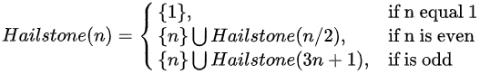
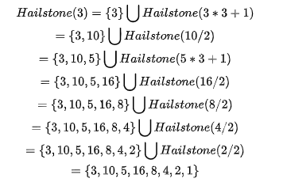

# 绪论

## 计算

- 计算 = 信息处理

- > 借助某种工具，遵照一定规则，以明确而机械的形式进行

- 计算模型 = 计算机 = 信息处理工具

- > 所谓算法，即特定计算模型下，旨在解决特定问题的指令序列
  >
  > 输入    待处理的信息（问题）
  >
  > 输出    经处理的信息（答案）
  >
  > 正确性    的确可以解决指定的问题
  >
  > 确定性    任一算法都可以描述为由一个基本操作组成的序列
  >
  > 可行性    每一个基本操作都可实现，且在常数时间内完成
  >
  > 有穷性    对于任何输入，经有穷次基本运算，都可以得到输出

## 算法：有穷性

> 希尔顿序列（Hailstone Sequence），希尔顿序列问题是一个著名的数学问题，即任何一个正整数N，如果是偶数的话就处2，如果是奇数的话就乘3加1，最后这个数都会变成1
>
> 
>
> 从中我们可以通过递归发现，每次对n这个数字进行判断奇偶性，采用不同的计算公式
>
> 
>
> 