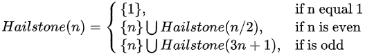
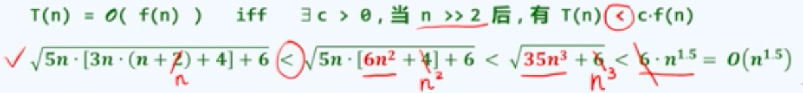
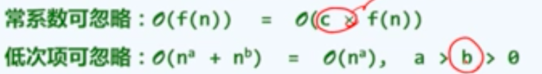
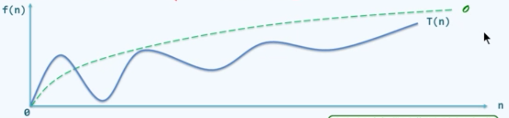

# 绪论

## 计算

计算 = 信息处理

> 借助某种工具，遵照一定规则，以明确而机械的形式进行

计算模型 = 计算机 = 信息处理工具

> 所谓算法，即特定计算模型下，旨在解决特定问题的指令序列
>
> 输入    待处理的信息（问题）
>
> 输出    经处理的信息（答案）
>
> 正确性    的确可以解决指定的问题
>
> 确定性    任一算法都可以描述为由一个基本操作组成的序列
>
> 可行性    每一个基本操作都可实现，且在常数时间内完成
>
> 有穷性    对于任何输入，经有穷次基本运算，都可以得到输出

### 算法：有穷性

希尔顿序列（Hailstone Sequence），希尔顿序列问题是一个著名的数学问题，即任何一个正整数N，如果是偶数的话就处2，如果是奇数的话就乘3加1，最后这个数都会变成1



从中我们可以通过递归发现，每次对n这个数字进行判断奇偶性，采用不同的计算公式


```python
init_num = 27
sum = 0
sum_list = [init_num]
while sum != 1:
    sum = init_num * 3 + 1 if init_num % 2 == 1 else init_num / 2
    sum_list.append(sum)
    init_num = sum
print(sum_list)
print(sum)
```

```go
package main

import "fmt"

func main() {
	init_num := 27
	sum_num := 0
	slice_num := make([]int, 0, 10)
	slice_num = append(slice_num, init_num)
	for sum_num != 1 {
		switch {
		case init_num%2 == 1:
			sum_num = init_num*3 + 1
		default:
			sum_num = init_num / 2
		}
		slice_num = append(slice_num, sum_num)
		init_num = sum_num
	}
	fmt.Println(slice_num)
	fmt.Println(sum_num)
}
```

### 好算法

正确：复合语法，能够编译、链接

> 能够正确处理***简单的***、***大规模***、***一般性的***、***退化的***、***任意合法的***输入

健壮：能辨识不合法的输入并做适当处理，而不至于非正常退出

可读性：结构化 + 准确命名 + 注释 + ...

效率：速度尽可能的块，存储尽可能的少，***效率是一个好的算法最重要的***


## 计算模型

### 算法分析

两个主要方面

- 正确性：算法功能和问题要求一致？
- 成本：运算时间 + 所需存储空间

考察：TA(P) = 算法A求解问题实例P的计算成本

- 意义不大，毕竟可能出现的问题实例太多了，需要进行一个归纳概括

观察：问题实例的***规模***，往往是决定计算成本的主要因素

通常：

- 规模接近，计算成本也接近
- 规模扩大，计算成本也上升

### 特定算法 + 不同实例

令TA(n) = 用算法A求解某一问题规模为n的实例，所需的计算成本；若讨论特定算法A（算法固定），简计为T(n)

然而，这一定义还是存在问题，对于同一问题等规模的不同实例，计算成本也不尽相同，甚至有实质差别

例如：在平面的n个点中，找到所组成的三角形面积最小的三个点，如果使用蛮力进行计算，最坏的情况下需要枚举C(n,3)种组合

稳妥起见：取T(n) = max {T(P) | |p| = n}，在规模同为n的所有实例中，只关注最坏（成本最高）者

### 特定问题 + 不同算法

同一个问题通常有多种算法，如何评价其优劣？

> 实验统计是最直接的方式，但是不足够
>
> > 不同的算法，可能更适应于***不同规模***的输入
> >
> > 不同的算法，可能更适应于***不同类型***的输入
> >
> > 同一算法，可能由***不同程序员***、***不同程序语言***、经过***不同编译器***实现
> >
> > 同一算法，可能实现并运行于不同的***体系结构、操作系统...***
>
> 为给出***客观***的评判，需要抽象出一个***理想***的平台或模型
>
> > 不再依赖上述种种具体的因素
> >
> > 从而直接而准确地描述、测量并评价算法

### Turing Machine（图灵机）


**Tape**：依次均匀地划分为单元格，各注有某一字符，默认为"#"

**Alphabet**：字符的种类有限

**Head**：总是对准某一单元格，并可读取和改写其中的字符，每经过一节拍，可转向左侧或右侧的邻格

**State**：TM总是处于有限种状态中的某一种，每经过一个节拍，可（按照规则）转向另一种状态

**Transition Function**：(q, c; d, L/R, p)，若当前状态为q且当前字符为c，则将当前字符***改写***为d；***转向***左侧/右侧的临格；***转入***p状态，一旦转入特定的状态***h***，则***停机***

>  这里进行一个通俗的理解：这里的Head可以当作一个人，当前状态是非常的饿，对应的字符可以看作是一个苹果，这个人将这个苹果吃掉了，对应的字符也就变了，同时这个人的状态也从饥饿转为了饱的状态

### RAM：Random Access Machine

寄存器顺序编号，总数没有限制

> R[0]、R[1]、R[2]、R[3]......

每一个基本操作仅需常数时间

> R[i] <- c	R[i] <- R[R[j]]	R[i] <- R[j] + R[k]
>
> R[i] <- R[j]	R[R[i]] <- R[j]	R[i] <- R[j] - R[k]
>
> IF R[i] = 0 GOTO 1	IF R[i] > 0 GOTO 1	GOTO 1	STOP

与TM模型一样，RAM模式也是一般计算工具的简化与抽象，使我们可以独立于具体的平台，对算法的效率作出可信的比较与评判

在这个模型中，算法的运行时间转换为算法需要执行的基本操作次数，T(n) = 算法为求解规模为n的问题，所需执行的基本操作次数

### 大O记号

回到原来的问题：随着问题规模的增长，计算成本如何增长？

注意：这里更关心***足够大***的问题，注重考察成本的增长趋势

渐进分析：在问题规模足够大后，计算成本如何增长？



与T(n)相比，f(n)更为简洁，但依旧反应了前置的增长趋势






