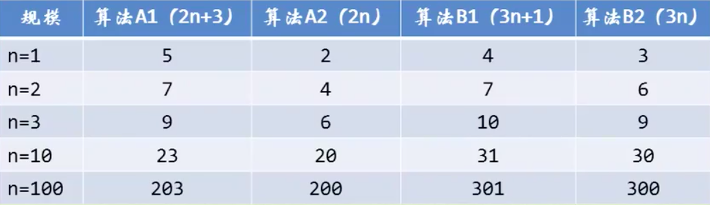
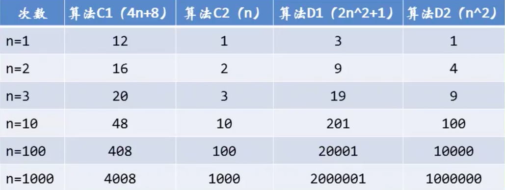
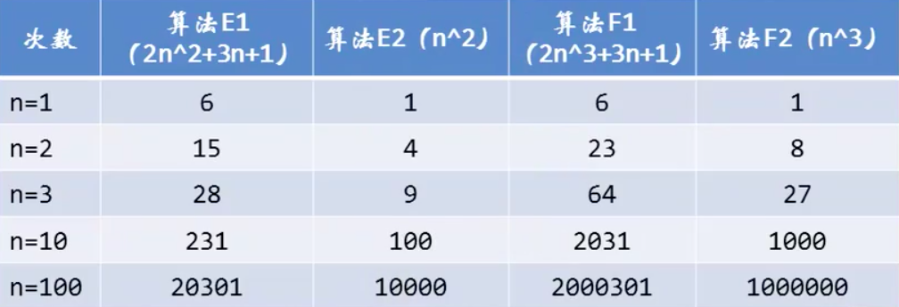
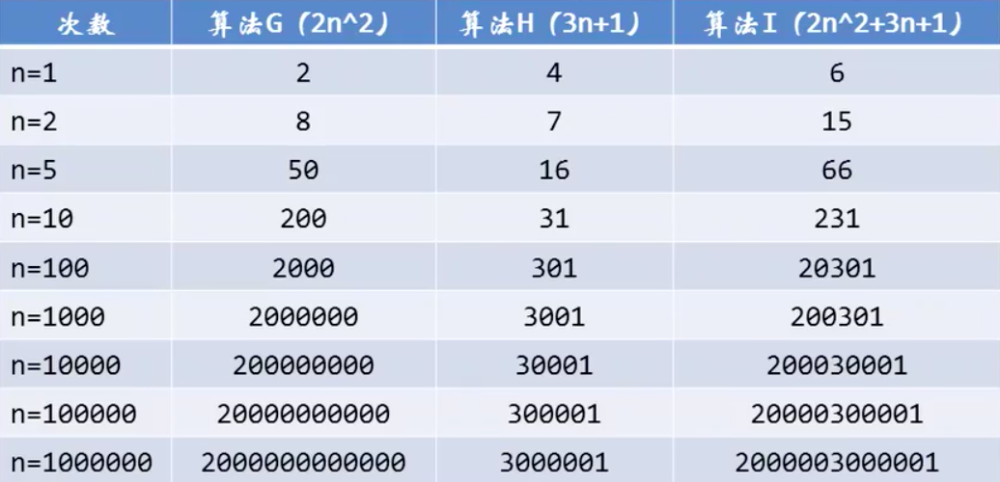
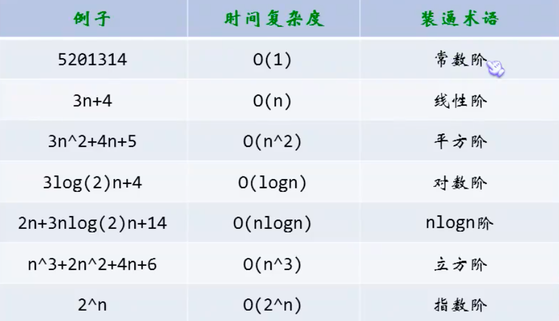

## 初识算法

### 算法的特性

- 输入：算法具有零个或多个输入
- 输出：算法至少有一个或多个输出（算法是一样要有输出的，如果没有输出，那要算法也就没有什么用了，输出的形式可以是打印形式输出，也可以是返回一个值或多个值等）
- 有穷性：指算法在执行有限的步骤后，自动结束而不会出现无限循环，并且每一个步骤在可接受的时间内完成
- 确定性：算法的每一个步骤就具有确定的含义，不会出现二义性；算法在一定的条件下，只有一条执行路径，相同的输入只能有唯一的输出结果；算法的每一步都应该被精确定义而无歧义
- 可行性：算法的每一步都必须是可行的，也就是说，每一步都能够通过执行有限次数完成

### 算法设计的要求

- 算法并不是唯一的，也就是说同一个问题，可以有多种解决问题的算法
- 正确性
  - 算法的正确性是指算法至少应该具有输入、输出和加工处理无歧义性、能正确反映问题的需求、能够得到问题的正确答案
  - 大体可以分成4个层次：
    - 算法程序没有语法错误
    - 算法程序对于合法输入能够产生满足要求的输出
    - 算法程序对于非法输入能够产生满足规格的说明
    - 算法程序对于故意刁难的测试输入都有满足要求的输出结果
- 可读性
  - 算法设计另一目的是为了便于阅读、理解和交流
  - 我们写代码的目的，一方面是为了让计算机执行，但还有一个重要目的是为了便于他人阅读和自己日后阅读修改
- 健壮性
  - 当输入的数据不合法时，算法也能够作出相应处理，而不是产生异常、崩溃或莫名其妙的结果
- 时间效率高和存储量低


## 算法效率的度量方法

前面提到设计算法要尽量的提高效率，这里的效率高一般指的是算法的执行时间

### 事前分析估算方法

> 在计算机程序编写前，根据统计方法对算法进行估算

经过总结，我们发现一个高级语言编写的程序在计算机上运行时所消耗的时间取决于下列因素：

- 算法采用的策略、方案
- 编译产生的代码质量
- 问题的输入规模
- 机器执行指令的速度

> 由此可见，抛开这些与计算机硬件、软件相关的因素，一个程序的运行时间依赖于算法的好坏和问题的输入规模（所谓的问题输入规模是指输入量的多少）

**我们研究算法的复杂度，侧重的是研究算法随着输入规模的扩大增大量的一个抽象，而不是精确的定位需要执行多少次**

### 函数的渐进增长

> **例1**：假设两个算法的输入规模都是n，算法A要做2n+3次操作，可以这样理解：先执行n次循环，再执行n次循环，最后还有3次操作；算法B要执行3n+1次操作，理解同上
>
> 
>
> 当n=1时，算法A1效率不如算法B1，当n=2时，两者效率相同；当n>2时，算法A1就开始优于算法B1了，随着n的继续增加，算法A1比算法B1逐步拉开距离，所以总体上算法A1比算法B1要优秀

- 函数的渐进增长：给定两个函数f(n)和g(n)，如果存在一个整数N，使得对于所有的n>N，f(n)总是比g(n)大，那么，我们说f(n)的增长渐进快于g(n)
- 从刚才的对比中还能够发现，随着n的增大，后面的+3和+1其实是不影响最终的算法变化曲线的

> **例2**：算法C是4n + 8，算法D是2n^2 + 1
>
> 
>
> 我们观察发现，哪怕去掉与n相乘的常数，两者的结果还是没有改变，算法C2的次数随着n的增长还是远远小于算法D2

- 与最高次项相乘的常数并不重要，也可以忽略

> **例3**：算法E是2n^2 + 3n + 1，算法F是2n^3 + 3n + 1
>
> 
>
> 我们通过观察又发现，最高次项的指数大的，函数随着n的增长，结果也会变得增长的特别快

- 最高次项的指数大的，函数随着n的增长，结果也会变得增长的特别快

> **例4**：算法G是2n^2 ，算法H是3n +1，算法I是2n^2 + 3n + 1
>
> 
>
> 在这里就能够看的很清楚了，当n的值变的很大的时候，3n + 1已经没法和2n^2的结果相比较，最后结果可以忽略不计，而算法G和算法I基本是重合的状态


***判断一个算法的效率时，函数中的常数和其他次要项常常可以忽略，而更应该关注主项（最高项）的阶数***

***注意：判断一个算法好不好，我们只通过少量的数据是不能做出准确判断的，很容易以偏概全***


## 算法时间复杂度

> 算法时间复杂度的定义：在进行算法分析时，语句总的执行次数T(n)是关于问题规模n的函数，进而分析T(n)随n的变化情况并确定T(n)的数量级。算法的时间复杂度，也就是算法的时间度量，记作：T(n) = O(f(n))，它表示随着问题规模n的增大，算法执行时间的增长率和f(n)的增长率相同，称作算法的渐进时间复杂度，简称为时间复杂度。其中f(n)是问题规模n的某个函数

这样用大写O()来体现算法时间复杂度的记法，我们称之为大O记法

- 一般情况下，随着输入规模n的增大，T(n)增长最慢的算法为最优算法
- 显然，由此算法时间复杂度的定义可知，我们的三个求和算法的时间复杂度分别是O(1)、O(n)、O(n^2)

**那么如何分析一个算法的时间复杂度呢？即如何推导大O阶呢？**

- 用常数1取代运行时间中所有的加法常数
- 在修改后的运行次数函数中，只保留最高阶项
- 如果最高阶项存在且不是1，则去除与这个项相乘的常数
- 得到的最后结果就是大O阶

### 常数阶

O(1)，这里是明确的执行次数是一个常数

### 线性阶

O(n)，这里相当于是循环了n次

### 平方阶

*O(n^2)，这里相当于是嵌套循环；比如存在一个循环，n为100，外层循环一次，内层循环就执行100次，那么总共就需要执行100*100次；如果存在3个这样的循环呢？其实是一样的，对应的就是O(n^3)，通过这里很容易就能够得出，循环的时间复杂度等于循环体的复杂度乘以该循环运行的次数

### 对数阶

O(logn)，每次循环都进行i * 2，且将这个结果和n进行比较，于是由 2^x = n 得到 x = log(2)n，所以这个循环的时间复杂度为O(logn)


## 函数调用的时间复杂度分析

> 首先来看下下面的这个例子
>
> ```c
> int i, j;
> for(i=0; i<n; i++){
>   function(i);
> }
> void function(int count){
>   printf("%d",count);
> }
> ```
>
> 对于上面的这段代码，函数体只是打印这个参数，这很好理解。function函数的时间复杂度是O(1)，所以整体的时间复杂度就是循环的次数O(n)
>
> 如果针对与上面的function改成如下的，是怎样的结果呢？
>
> ```c
> void function(int count){
>   int j;
>   for(j=count; j<n; j++){
>     printf("%d",j);
>   }
> }
> ```
>
> 事实上，这里和前面介绍的平方阶的第二个例子一样：function内部的循环次数随count的增加（接近n）而减少，所以算法的时间复杂度为O(n^2)

### 常见的时间复杂度



**常见的时间复杂度所耗费的时间从小到大顺序如下**

- ***O(1) < O(logn) < O(n) < O(nlogn) < O(n^2) < O(n^3) < O(2^n) < O(n!) < O(n^n)***


## 算法的空间复杂度

我们在写代码时，完全可以用空间来换取时间

> 举个例子，要判断某年是不是闰年，可以回花一些心思来写一个算法，每给一个年份，就可以根据这个算法计算得到是否是闰年的结果；另外一个算法，事先建立一个由2050个元素的数组，然后把所有的年份按下标的数字对应，如果是闰年，则此数组元素的值是1，如果不是则是0。这样，所谓判断某一年是否为闰年就变成了查找这个数组中某一个元素值的问题
>
> 第一种方法相比于第二种来说很明显节省空间，但每一次查询都需要经过一系列的计算才能知道是否是闰年。第二种方法虽然在内存中存储了2050个元素，但是每次查询只需要一次索引判断即可

算法的空间复杂度通过计算算法所需的存储空间实现，算法的空间复杂度的计算公式为：***S(n) = O(f(n))***，其中，n为问题的规模，f(n)为语句关于n所占存储空间的函数

通常，我们都是用“时间复杂度”来指运行时间的需求，用“空间复杂度”来指空间需求；当让我们直接求“复杂度”，通常指的是时间复杂度

