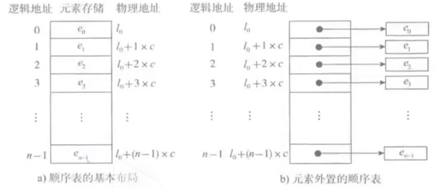
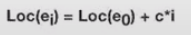
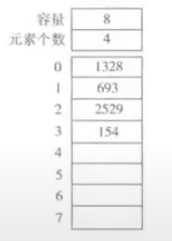
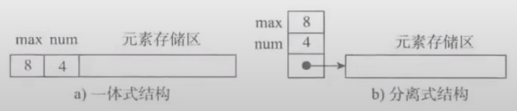
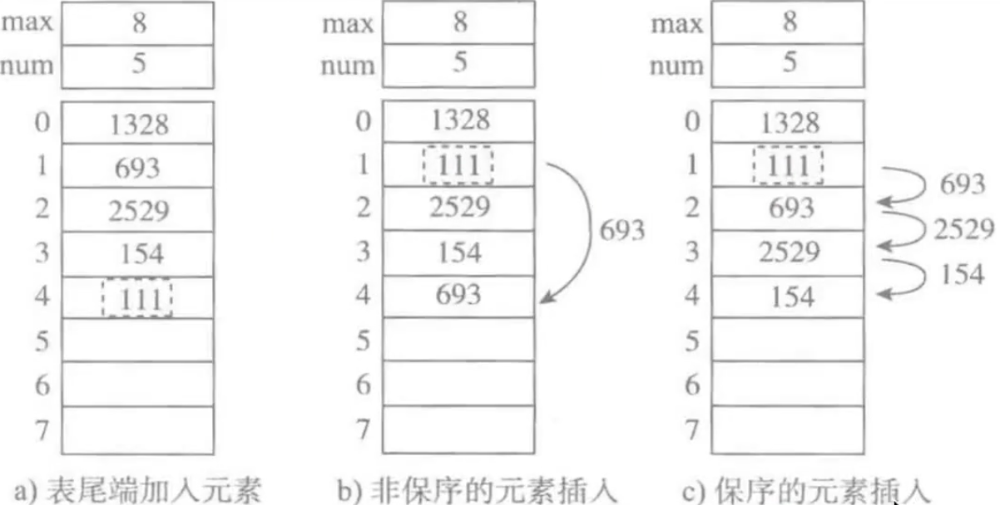
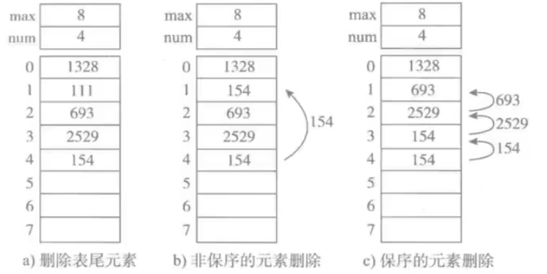

## 4、顺序表

在程序中，通常需要将一组（通常是同为某个类型的）数据元素作为整体管理和使用，需要创建这种元素组，用变量记录它们，传进传出函数等，一组数据中包含的元素个数可能发生变化（可能增加或删除元素）

对于这样的需求，最简单的解决方案便是将这样的一组元素看成一个序列，用元素在序列里的位置和顺序，表示实际应用中的目中有意义的信息，或者表示数据之间的某种关系

这样的一组序列的组成形式，可以将其抽象为**线性表**。一个线性表是某类元素的一个集合，还记录这元素之间的一种顺序关系，线性表是最基本的数据结构之一，在实际程序中应用非常广泛，它还经常被用作更复杂的数据结构的实现基础

根据线性表的实际存储方式，分为两种实现模型：

- **顺序存储结构**：将元素顺序地存放在一块连续的存储区里，元素间的顺序关系由他们的存储顺序自然表示
- **链式存储结构**：将元素存放在通过链接构造起来的一系列存储块中

### 4.1、顺序表的基本形式

图a表示的是顺序表的基本形式，数据元素本身连续存储，每个元素所占的存储单元大小固定相同，元素的下标是其逻辑地址，而元素存储的物理地址（实例内存地址）可以通过存储区的起始地址Loc(e0)加上逻辑地址（第i个元素）与存储单元大小(c)的乘积计算而得，即：

故，访问指定元素时无需从头遍历，通过计算便可获取到对应地址，其时间复杂度为O(1)

如果元素的大小不统一（比如python中的list，中间是可以存储不同的数据类型的），则须采用图b的元素外置的形式，将实际数据元素另行存储，而顺序表中各单元位置保存对应的地址信息（即链接）。由于每个链接所需的存储量相同，通过上述公式，可以计算出元素链接的存储位置，而后顺着链接找到实际存储的数据元素。**注意：图b中的c不再是数据元素的大小，而是存储一个链接地址所需的存储量，这个量通常很小**

图b这样的顺序表也被称为对实际数据的索引，这是最简单的索引结构

### 4.2、顺序表的结构与实现

#### 4.2.1、顺序表的结构

一个顺序表的完整信息包括两个部分，一部分是表中的元素集合，另一部分是为了实现正确操作而需记录的信息，即有关表的整体情况的信息，这部分信息主要包括元素存储区的**容量**和当前表中已有的**元素个数**两项

#### 4.2.2、顺序表的两种基本实现方式

图a为一体式结构，存储表信息的单元与元素存储区以连续的方式安排在一块存储区里，两部分数据的整体形成一个完整的顺序表结构

一体式结构整体性强，易于管理。但是由于数据元素存储区域是表对象的一部分，顺序表创建后，元素存储区就固定了

图b是分离式结构，表对象里只保存与整个表有关的信息（即容量和元素个数），实际数据元素存放在另一个独立的元素存储区里，通过链接与基本表对象关联

在实际的情况中，为了考虑后续的数据变动，通常采用的就是分离式

#### 4.2.3、元素存储区替换

一体式结构由于顺序表信息区与数据区连续存储在一起，所以若想更换数据区，则只能整体搬迁，即整个顺序表对象（指存储顺序表的结构信息的区域）改变了

分离式结构若想更换数据区，只需将表信息区中的数据区链接地址更新即可，而该顺序表对象不变

#### 4.2.4、元素存储区扩充

采用分离式结构的顺序表，若将数据区更换为存储空间更大的区域，则可以在不改变表对象的前提下对其数据存储区进行扩充，所有使用这个表的地方都不必修改。只要程序的运行环境（计算机系统）还有空闲存储，这种表结构就不会因为满了而导致操作无法进行，人们把采用这种技术实现的顺序表称为动态顺序表，因为其容量可以在使用中动态变化

**扩充的两种策略**

- 每次扩充增加固定数目的存储位置，如每次扩充增加10个元素位置，这种策略可称作线性增长。特点：节省空间，但是扩充操作频繁，操作次数多
- 每次扩充容量加倍，如每次扩充增加一倍空间。特点：减少了扩充操作的执行次数，但可能会浪费空间资源。以空间换时间，推荐的方式

#### 4.2.5、顺序表的操作

##### 4.2.5.1、增加元素

如图所示，为顺序表增加新元素111的三种方式

- 尾端加入元素，时间复杂度为O(1)
- 非保序的加入元素（不常见），时间复杂度为O(1)
- 保序的元素加入，时间复杂度为O(n)

##### 4.2.5.2、删除元素

- 删除表尾元素，时间复杂度为O(1)
- 非保序的元素删除（不常见），时间复杂度为O(1)
- 保序的元素删除，时间复杂度为O(n)

#### 4.2.6、python中的顺序表

python中的list和tuple两种类型采用了顺序表的实现技术，具有前面讨论的顺序表的所有性质

tuple是不可变类型，即不变的顺序表，因此不支持改变其内部状态的任何操作，而其他方面，则与list性质类似

