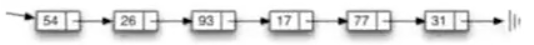
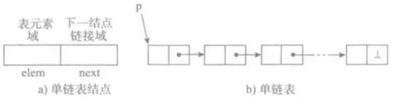
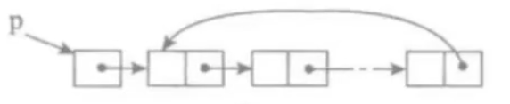
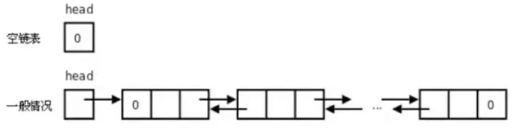
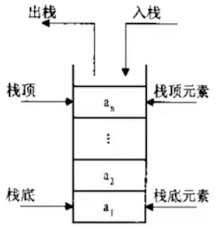

## 5、链表

链表和前面的顺序表统称为**线性表**

### 5.1、为什么需要链表

顺序表的构建需要预先知道数据大小来申请连续的存储空间，而在进行扩充时有需要进行数据的搬迁，所以使用起来并不是很灵活

链表结构可以充分利用计算机内存空间，实现灵活的内存动态管理

### 5.2、链表的定义

链表是一种常见的基础数据结构，是一种线性表。但不像顺序表一样连续存储数据，而是在每个节点（数据存储单元）里存放下一个节点的位置信息（即地址）



### 5.3、单向链表

单向链表也称单链表，是链表中最简单的一种形式，它的每个节点包含两个域，一个信息域（元素域）和一个链接域。这个链接指向链表中的下一个节点，而最后一个节点的链接则指向一个空值



- 表元素域elem用来存放具体的数据
- 链接域next用来存放下一个节点的位置（python中的标识）
- 变量p指向链表的头节点（首节点）的位置，从p出发能找到表中的任意节点

#### 5.3.1、节点实现

```python
class SingleNode(object):
    """
    单链表的节点
    """

    def __init__(self, item):
        # item 存放数据元素
        self.item = item
        # next 是下一个节点的标识
        self.next = None
```

#### 5.3.2、单链表的操作

- is_empty() 链表是否为空
- length() 链表长度
- travel() 遍历整个链表
- add(item) 链表头部添加元素
- append(item) 链表尾部添加元素
- insert(pos, item) 指定位置添加元素
- remove(item) 删除节点
- search(item) 查找节点是否存在

#### 5.3.3、链表和顺序表的对比

链表失去了顺序表随机读取的优点，同时链表增加了节点的指针域，空间开销比较大，但对存储空间的使用相对灵活

### 5.4、单向循环链表

单链表的一个变形是单向循环链表，链表中最后一个节点的next域不再为None，而是指向链表的头节点



### 5.5、双向循环链表

一种更复杂的链表是“双向链表”或“双面链表”。每个节点有两个链接：一个指向前一个节点，当此节点为第一个节点时，指向空值；而另一个指向下一个节点，当此节点为最后一个节点时，指向空值



## 6、栈

栈（stack），有的地方成为堆栈，是一种容器，可存入数据元素、访问元素、删除元素，它的特点在于只能允许在容器的一端（称为栈顶端指标，英语：top）进行加入数据（英语：push）和输出数据（英语：pop）的运算。没有了位置概念，保证任何时候可以访问、删除的元素都是此前最后存入的那个元素，确定了一个默认的访问顺序

由于栈数据结构只允许在一端进行操作，因而按照后进先出（LIFO）的原理运作




