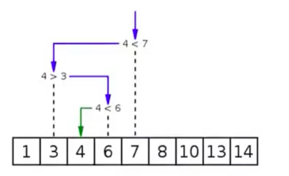

## 8、排序

排序算法，是一种能将一串数据按照特定顺序进行排序的一种算法

### 8.1、排序算法的稳定性

**稳定性**：稳定排序算法会让原本有相同键值的记录维持相对次序。也就是一个排序算法是稳定的，当有两个相同键值的记录R和S，且在原本的列表中R出现在S之前，在排序过的列表中R也出现在S之前

当相当的元素是无法分辨的，比如像是整数，稳定性并不是一个问题。然而，假设以下的数对将要以他们的第一个数字来排序

```
(4,1) (3,1) (3,7) (5,6)
```

在这样的情况下，有可能产生两种不同的结果，一个是让相等键值的记录维持相对的次序，而另外一个则没有

```
(3,1) (3,7) (4,1) (5,6)  # 维持次序
(3,7) (3,1) (4,1) (5,6)  # 次序被改变
```

不稳定排序算法可能会在相等的键值中改变记录的相对次序，但是稳定排序算法从来不会如此。不稳定排序算法可以被特别的实现为稳定，作这件事情的一个方式是人工扩充键值的比较

### 8.2、冒泡排序

冒牌排序是一种简单的排序算法。它重复的遍历需要排序的队列，一次比较两个元素，如果他们的顺序错误就将它们交换过来。遍历数组的工作是重复的进行直到没有再需要交换，也就是说该数列已经排序完成，这个算法的名字由来是因为越小的元素会经由变换慢慢“浮”到数列的顶端

冒泡排序算法的运作如下：

- 比较相邻的元素。如果第一个比第二个大（升序），就交换它们两个
- 对每一个相邻元素作同样的工作，从开始第一对到结尾的最后一对，这步做完后，最后的元素会是最大的数
- 针对所有元素重复以上的步骤，除了最后一个
- 持续每次对越来越少的元素重复上面的步骤，直到没有任何一个数字需要比较

交换过程图示（第一次）：


通过上面的方式进行排序的话，需要n-1次冒泡的过程

```python
def bubble_sort(alist):
    """
    冒泡排序
    :param alist:
    :return:
    """
    n = len(alist)
    for j in range(n - 1):  # 外层循环控制遍历多少次
        count = 0
        for i in range(0, n - 1 - j):  # 内存循环控制遍历的长度
            if alist[i] > alist[i + 1]:
                alist[i], alist[i + 1] = alist[i + 1], alist[i]
                count += 1
        if count == 0:
            break


if __name__ == '__main__':
    alist = [54, 24, 93, 17, 77, 31, 44, 55, 20]
    print(alist)
    bubble_sort(alist)
    print(alist)
    
[54, 24, 93, 17, 77, 31, 44, 55, 20]
[17, 20, 24, 31, 44, 54, 55, 77, 93]
```

如上就是一个冒泡排序的算法

#### 8.2.1、时间复杂度

- 最有时间复杂度：O(n)，表示遍历一次没有发现任何可以交换的元素，排序结束
- 最坏时间复杂度：O(n^2)
- 稳定性：稳定


### 8.3、选择排序

在选择排序算法中，可以理解是将整个序列拆分成了两部分，一部分是排序好的内容

工作原理：第一次从待排序的数据元素中选出最小（或最大）的一个元素，存放在序列的起始位置，然后从剩下的未排序元素中寻找最小（或最大）元素，然后放到已排序的序列的末尾。以此类推，知道全部待排序的数据元素的个数为零，选择排序是不稳定的排序方法

选择排序的主要优点与数据移动有关。如果某个元素位于正确的最终位置上，则它不会被移动。选择排序每次交换一对元素，它们当中至少有一个将被移到其最终位置上，因此对n个元素的表进行至多n-1次交换。在所有的完全依靠交换去移动元素的排序算法中，选择排序属于非常好的一种

```python
def select_sort(alist):
    """
    选择排序
    :param alist:
    :return:
    """
    n = len(alist)
    for j in range(n - 1):
        min_index = j
        for i in range(j + 1, n):
            if alist[min_index] > alist[i]:
                min_index = i
        alist[j], alist[min_index] = alist[min_index], alist[j]  # 将数据进行交换


if __name__ == '__main__':
    alist = [54, 24, 93, 17, 77, 31, 44, 55, 20]
    print(alist)
    select_sort(alist)
    print(alist)

[54, 24, 93, 17, 77, 31, 44, 55, 20]
[17, 20, 24, 31, 44, 54, 55, 77, 93]
```

#### 8.3.1、时间复杂度

- 最优时间复杂度：O(n^2)
- 最坏时间复杂度：O(n^2)
- 稳定性：不稳定（考虑升序每次选择最大的情况）


### 8.4、插入排序

插入排序是一种简单直观的排序算法。它的工作原理是通过构建有序序列，对于未排序数据，在已排序序列中从后向前扫描，找到相应位置并插入。插入序列在实现上，在从后向前扫描过程中，需要反复把已排序元素逐步向后挪位，为最新元素提供插入空间

```python
def insert_sort(alist):
    """
    插入排序
    :param alist:
    :return:
    """
    n = len(alist)
    # 从右边的无序序列中取出多少个元素执行这样的过程
    for j in range(1, n):
        # i 代表内层循环的起始值
        i = j
        # 执行从右边的无序序列中取出一个元素，即i位置的元素，然后j将其插入到前面的正确位置中
        while i > 0:
            if alist[i] < alist[i - 1]:
                alist[i - 1] = alist[i]
                i -= 1
            else:
                break


if __name__ == '__main__':
    alist = [54, 24, 93, 17, 77, 31, 44, 55, 20]
    print(alist)
    insert_sort(alist)
    print(alist)

[54, 24, 93, 17, 77, 31, 44, 55, 20]
[17, 17, 17, 17, 20, 20, 20, 20, 20]
```

#### 8.4.1、时间复杂度

最优时间复杂度：O(n)（升序排列，序列已经处于升序状态）

最坏时间复杂度：O(n^2)

稳定性：稳定


### 8.5、希尔排序

希尔排序是插入排序的一种，也称缩小增量排序，是直接插入排序算法的一种更高效的改进版本。希尔排序是非稳定排序算法。希尔排序是把记录按下标的一定增量分组，对每组使用直接插入排序算法排序；随着增量逐渐减少，每组包含的关键词越来越多，当增量减至1时，整个文件恰被分成一组，算法便终止

```python
def shell_sort(alist):
    """
    希尔排序
    :param alist:
    :return:
    """
    n = len(alist)
    gap = n // 2
    # gap 变化到0之前，插入算法执行的次数
    while gap > 0:
        # 希尔排序，与普通的插入算法的区别就是gap步长
        for j in range(gap, n):
            i = j
            while i > 0:
                if alist[i] < alist[i - gap]:
                    alist[i], alist[i - gap] = alist[i - gap], alist[i]
                    i -= gap
                else:
                    break
        # 缩短gap步长
        gap //= 2


if __name__ == '__main__':
    alist = [54, 24, 93, 17, 77, 31, 44, 55, 20]
    print(alist)
    shell_sort(alist)
    print(alist)

[54, 24, 93, 17, 77, 31, 44, 55, 20]
[17, 20, 24, 31, 44, 54, 55, 77, 93]
```


### 8.6、快速排序


## 9、搜索

搜索是在一个项目集合中找到一个特定项目的算法过程，搜索通常的答案是真的活假的，因为该项目是否存在，搜索的几种常见方法：顺序查找、二分法查找、二叉树查找、哈希查找

### 9.1、二分法查找

二分查找又称折半查找，优点是比较次数少，查找速度快，平均性能好；其缺点是要求待查表为有序表，且插入删除困难。因此，折半查找方法适用于不经常变动而查找频繁的有序列表。首先，假设表中元素是按升序排列，将表中间位置记录的关键字与查找关键字比较，如果两者相等，则查找成功；否则利用中间位置记录将表分成前、后两个子表，如果中间位置记录的关键字大于查找关键字，则进一步查找前一子表，否则进一步查找后一子表。重复以上过程，直到找到满足条件的记录，使查找成功，或直到子表不存在为止，此时查找不成功



```python
def binary_search(alist, item):
    """
    二分法查找
    :param alist:
    :return:
    """
    n = len(alist)
    if n > 0:
        mid = n // 2
        if alist[mid] == item:
            return True
        elif item < alist[mid]:
            return binary_search(alist[:mid], item)
        elif item > alist[mid]:
            return binary_search(alist[mid + 1:], item)
    return False
```

### 9.2、时间复杂度

- 最优时间复杂度：O(1)
- 最坏时间复杂度：O(logn)