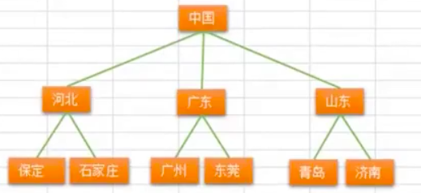
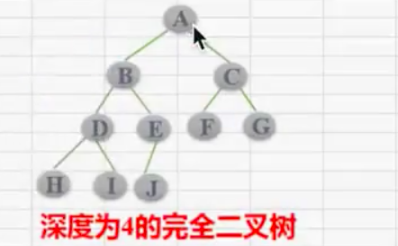
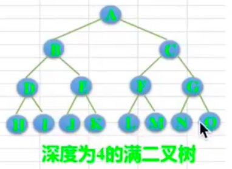
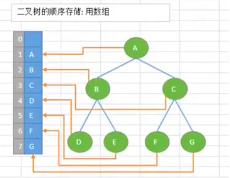
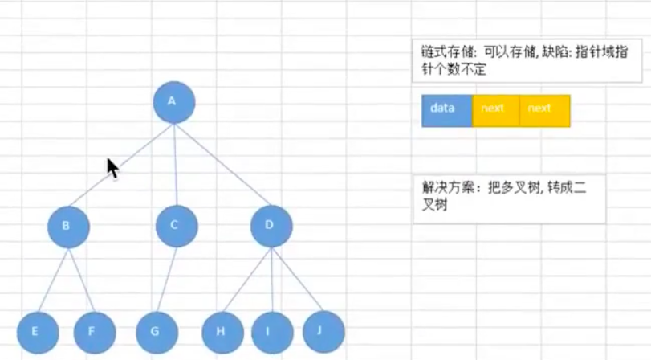
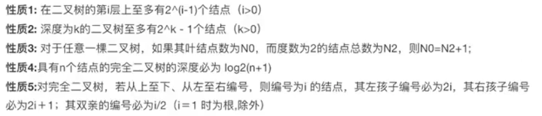

## 10、树

### 10.1、数据的概念

树是一种抽象数据类型（ADT），用来模拟具有树状结构性质的数据集合。它是由n（n>=1）个有限节点组成一个具有层次关系的集合。把它叫做“树”是因为它看起来像一颗倒挂的树，也就是说它是根朝上，而叶朝下的。它具有以下特点：

- 每个节点有零个或多个子节点
- 没有父节点的节点称为根节点
- 每个非根节点有且只有一个父节点
- 除了根节点外，每个子节点可以分为多个不相交的子树

### 10.2、树的术语

- **节点的度**：一个节点含有的子树的个数称为该节点的度
- **树的度**：一棵树中，最大的节点的度称为树的度
- **叶节点或终端节点**：度为零的节点
- **父亲节点或父节点**：若一个节点含有子节点，则这个节点称为其子节点的父节点
- **孩子节点或子节点**：一个节点含有的子树的节点称为该节点的子节点
- **兄弟节点**：具有相同父节点的节点称为兄弟节点
- **节点的层次**：从根开始定义起，根为第一层，根的子节点为第二层，以此类推
- **树的高度或深度**：树中节点的最大层次
- **堂兄弟节点**：父节点在同一层的节点互为堂兄弟节点
- **节点的祖先**：从根到该节点所经分支上的所有的节点
- **子孙**：以某节点为根的子树中任一节点都称为该节点的子孙
- **森林**：由m（m>=0）棵互不相交的树的集合称为森林

### 10.3、树的种类

- **无序树**：树中任意节点的子节点之间没有顺序关系，这种树称为无序树，也称为自由树
- **有序树**：树中任意节点的子节点之间有顺序关系，这种树称为有序树
  - **二叉树**：每个节点最多含有两个子树的树称为二叉树
    - **完全二叉树**：对于一棵二叉树，假设其深度为d(d>1)，除了第d层外，其他各层的节点数目均已达到最大值，且第d层所有节点从左向右连续的紧密排列，这样的二叉树称为完全二叉树，其中**满二叉树**的定义是所有叶节点都在最底层的完全二叉树
    - **平衡二叉树（AVL树）**：当且仅当任何节点的两颗子树的高度差不大于1的二叉树
    - **排序二叉树（二叉查找树）**：也称二叉搜索树、有序二叉树
  - **霍夫曼树（用于信息编码）**：带权路径最短的二叉树称为哈夫曼树或最优二叉树
  - **B树**：一种对读写操作进行优化的自平衡的二叉查找树，能够保持数据有序，拥有多余两棵子树

**完全二叉树**：

若一个二叉树的高度为h，除第h层外，其他各层（1到h-1层）的节点数都已达到最大个数，第h层有叶子节点，并且叶子节点都是从左到右依次排布，这就是完全二叉树

**满二叉树**：

除了叶子节点外每一个节点都有左右子叶且叶子节点都处在最底层的二叉树

### 10.4、树的存储与表示

**顺序存储**：将数据结构存储在固定的数组中，然在遍历的速度上有一定的优势，但所占空间比较大，是非主流二叉树。二叉树通常以链式存储

**链式存储**：

由于对节点的个数无法掌握，常见树的存储表示都转化为二叉树进行处理，子节点个数最多为2

### 10.5、常见的一些树的应用场景

1、xml、html等，那么编写这些东西的解释器的时候，不可避免的要用到树

2、路由协议就是使用到的树的算法

3、mysql数据库的索引

4、文件系统的目录结构

5、很多经典的AI算法都是树搜索，此外机器学习中的决策树也是树结构

## 11、二叉树

### 11.1、二叉树的基本概念

二叉树是每个节点最多有两个子树的树结构。通常子树称作“左子树”和“右子树”

### 11.2、二叉树的性质（特性）

