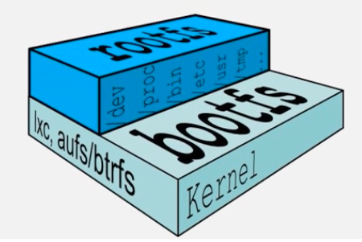
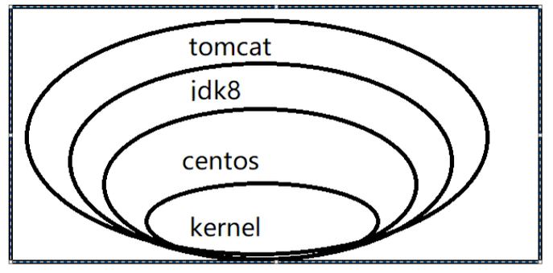
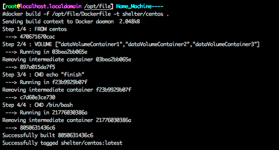
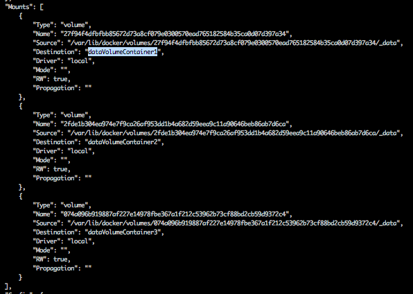
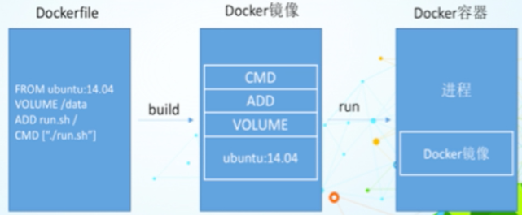
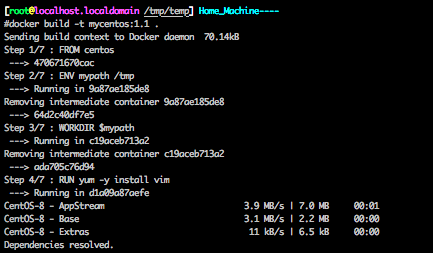
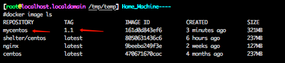
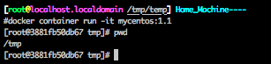
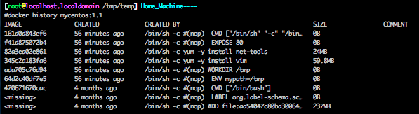
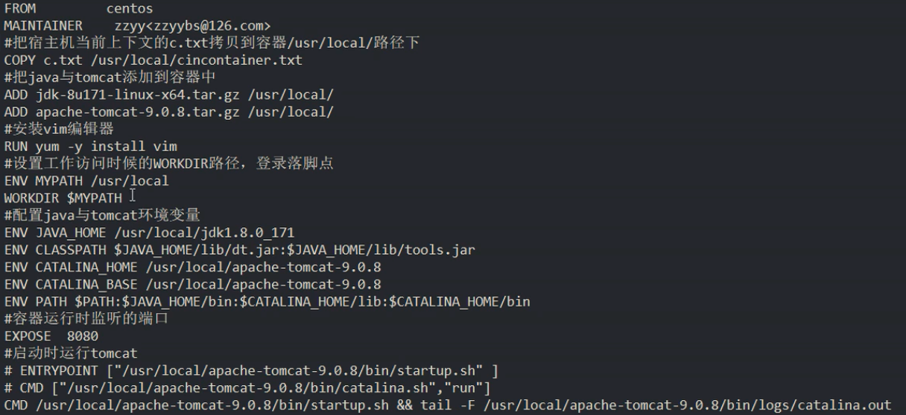

# Docker的架构图


# Docker的基本组成

## 镜像（image）

- Docker镜像（image）就是一个只读的模版，镜像可以用来创建docker容器，***一个镜像可以创建多个容器***
- 容器和镜像的关系类似于面向对象编程中的对象与类

## 容器（container）

- Docker利用容器（container）独立运行一个或一组应用。***容器是用镜像创建的运行实例***
- 它可以被启动、开始、停止、删除，每个容器都是相互隔离的、保证平台的安全
- ***可以把容器看作是一个简易版的Linux***（包括root权限、进程空间、用户空间和网络空间等）和运行在其中的应用程序，容器的定义几乎和镜像一摸一样，也是一堆层的统一视角，区别在于容器的最上面的那一层是可读可写的

## 仓库（repository）

- 仓库（repository）是***集中存放镜像文件的场所***
- 仓库（repository）和仓库注册服务器（registry）是有区别的。仓库组册服务器上往往存放着多个仓库，每个仓库又包含了多个镜像，每一个镜像有不同的标签（tag）
- 仓库分为公开仓库（public）和私有仓库（private）两种形式，最大的公开仓库是docker hub
- 存放着数量庞大的镜像供用户下载，国内的公开仓库包括阿里云、网易云等

## 小结

- 正确理解仓库、镜像、容器的概念：
- docker本身是一个容器的运行载体或称之为管理引擎。我们把应用程序和配置依赖打包好行程一个可交付的运行环境，这个打包好的运行环境就是image镜像文件，只有通过这个镜像文件才能生成docker容器，image文件可以看作是容器的模版。docker根据image文件生成容器的实例。同一个image文件，可以生成多个同时运行的容器实例
- image文件生成的容器实例，本身也是一个文件，称之为镜像文件
- 一个容器运行一种服务，当我们需要的时候，就可以通过docker客户端创建一个对应的运行实例，也就是我们的容器
- 至于仓库，就是放一堆镜像的地方，我们可以将镜像发布到仓库中，需要的时候从仓库中拉取出来就行了


# Docker环境安装

## CentOS6.8 安装Docker

- 首先需要安装epel库  ```yum -y install epel-release  ```
- 安装docker  ```yum -y install docker-io```
- 安装后的配置文件  ```/etc/sysconfig/docker```
- 启动docker服务  ```service docker start```
- docker验证  ```docker version```

## CentOS7 安装Docker

- https://docs.docker.com/engine/install/centos/


# 镜像加速

- 获取镜像加速地址
- 修改/etc/docker/daemon.json文件，来使用加速器


# Docker底层运行原理

- Docker是一个client-server结构的系统，Docker守护进程运行在主机上，然后通过socket连接从客户端访问，守护进程从客户端接受命令并管理运行在主机上的容器，***容器，是一个运行时的环境，就是前面说到的集装箱***
- Docker为什么比vm运行更快
  - docker有着比虚拟机更少的抽象层，由于docker不需要Hypervisor实现硬件资源虚拟化，运行在docker容器上的程序直接使用的都是实际服务器的硬件资源，因此在cpu、内存利用率上docker将会在效率上有明显优势
  - docker利用的是宿主机的内核，而不需要Guest OS，因此，当新建一个容器时，docker不需要和虚拟机一样重新加载一个操作系统内核，因此，创建一个docker容器只需要几秒钟

# Docker相关命令

- 帮助命名
  - ```docker version```
  - ```docker info```
  - ```docker --help```
- 镜像命令
  - 列出本地主机上的镜像  ```docker images  或 docker image ls（新版推荐使用命令）```，各个选项说明：REPOSITORY 镜像的仓库源，TAG 镜像的标签，IMAGE ID  镜像ID，CREATED 镜像创建时间，SIZE 镜像大小；同一仓库源可以有多个TAG，代表这个仓库源的不同版本，我们使用REPOSITORY:TAG来定义不同的镜像，如果不指定镜像的版本标签，例如只使用ubuntu，docker将默认使用ubuntu:latest镜像
    - -a  列出本地所有镜像（含中间映像层）
    - -q 只显示镜像ID
    - --digests 显示镜像的摘要信息
    - --no-trunc 显示完整的镜像信息
  - 查询镜像 ```docker search 某个镜像的名字``` ，通过这个命令去查询镜像的时候，是在docker hub上面进行查找的
    - --no-trunc 显示完整的镜像描述
    - -s 列出收藏数不小于指定值的镜像
    - --automated 只列出automated build 类型的镜像
  - 下载镜像 ```docker pull 某个镜像的名字``` ，通常采用的是 ```docker pull 镜像名字[:TAG] 在新版中间推荐使用 docker image pull```
  - 删除镜像```docker rmi 或者 docker image rm```
    - 删除单个 ```docker image rm 镜像ID 或 docker rmi 镜像ID```
    - 删除多个 ```docker image rm 镜像名1:TAG 镜像名2:TAG```
    - 删除全部 ```docker image rm $(docker image ls -a -q)```
    - 
- 容器命令
  - ***有镜像才能创建容器，这个是根本前提***
  - 新建并启动容器 ```docker container run ```
    - --name 为容器指定一个名字
    - -d 后台运行容器，并返回容器ID，即启动守护式容器
    - -i 以交互式模式启动容器，通常和-t同时使用
    - -t 为容器重新分配一个伪输入终端，通常和-i同时使用
    - -P 随机端口映射
    - -p 指定端口映射，有以下四种方式
      - ```ip:hostPort:containerPort```
      - ```ip::containerPort```
      - ```hostPort:containerPort```
      - ```containerPort```
  - 列出所有正在运行的容器 ```docker container ls 或 docker ps```
    - -a 列出当前所有的容器（运行中+退出的）
    - -l 显示最近创建的容器
    - -n 显示最近n个创建的容器
    - -q 静默模式，只显示容器编号
    - --no-trunc 不截断输出
  - 退出容器
    - exit 容器停止退出
    - ctrl + p + q 容器不停止退出
  - 启动容器 ```docker start 容器ID 或 容器名字 / docker container start 容器ID 或 容器名字```
  - 重启容器 ```docker restart 容器ID 或 容器名字 / docker container restart 容器ID 或 容器名字```
  - 停止容器 ```docker stop 容器ID 或 容器名字 / docker container stop 容器ID 或 容器名字```，使用这样的方式停止容器，是温柔停止
  - 强制停止容器 ```docker kill 容器ID 或 容器名字 / docker container kill 容器ID 或 容器名字``` ，使用这样的方式停止容器，是强制停止，相当于直接拔电源
  - 删除容器 ```docker rm 容器ID 或 容器名字 / docker container rm 容器ID 或 容器名字```，使用这个方式删除容器，是指删除已经停止的容器，如果该容器还在运行中，但是想直接进行删除，可以加上 -f 参数，表示强制删除；一次性删除多个容器，使用命令 ```docker rm -f $(docker ps -a -q) 或 docker ps -a -q | xargs docker rm```
  - ***重要！！！***
    - 启动守护式容器
      - ```docker container run -d 容器名 或 容器ID / docker run -d 容器ID 或 容器名```
        - 使用该方式有很重要的一点：***docker容器后台运行，就必须有一个前台进程***
        - 容器运行的命令如果不是那些***一直挂起的命令***（如top，tail），就会自动退出的
        - 这是docker的机制问题，比如你的web容器，我们以nginx为例，正常情况下，我们配置启动服务只需要启动响应的service即可，例如```service nginx start```，但是这样做的话，nginx是后台运行，会导致docker前台没有运行的应用，这样的容器后台启动后，会立刻被杀掉，因为docker认为没事儿可做了，所以，最佳的方案是，将运行的程序以前台的方式运行
    - 查看容器日志
      - ```docker container logs -f -t --tail 容器ID / docker logs -f -t --tail 容器ID```
        - -t 是加入时间戳
        - -f 跟随最新的日志打印
        - --tail 数字，显示最后多少条
    - 查看容器内运行的进程
      - ```docker container top 容器ID / docker top 容器ID```
    - 查看容器内部的细节
      - ```docker container inspect 容器ID / docker inspect 容器ID```
    - 进入正在运行的容器并以命令行交互
      - ```docker container exec -it 容器ID/容器名 bashShell```
      - 重新进入 ```docker container attach 容器ID/容器名```
      - 上述两个区别
        - attach：直接进入容器已经启动的命令的终端，不会启动新的进程
        - exec：是在容器中打开新的终端，并且可以启动新的进程
    - 从容器内拷贝文件到主机上
      - ```docker cp 容器ID:容器内的路径 目标主机路径```


# Docker镜像

## 是什么？

- 镜像是一种轻量级、可执行的独立软件包，***用来打包软件运行环境和基于运行环境开发的软件***，它包含运行某个软件所需的所有内容，包括代码、运行时、库、环境变量和配置文件

- UnionFS（联合文件系统）
  - 是一种分层、轻量级并且高性能的文件系统，它支持***对文件系统的修改作为一次提交来一层层的叠加***，同时可以将不同目录挂载在同一个虚拟文件系统下，Union文件系统是docker镜像的基础，镜像可以通过分层来进行继承，基于基础镜像（没有父镜像）可以制作各种具体的应用镜像
  - 特性：一次同时加载多个文件系统，但从外面看起来，只能看到一个文件系统，联合加载会将各层文件系统叠加起来，这样最终的文件系统会包含所有底层的文件和目录
- Docker镜像加载原理
  - docker的镜像实际上是由一层一层的文件系统组成，这种层级的文件系统是UnionFS
  - boofs（boot file system）主要包含bootloader和kernel，bootloader主要是引导加载kernel，Linux刚启动时会加载bootfs文件系统，在***docker镜像的最底层是bootfs***，这一层与我们典型的Linux/Unix系统是一样的，包含boot加载器和内核，当boot加载完后，整个内核就在内存中了，此时内存的使用权由bootfs转给内核，此时系统也会卸载bootfs
  - rootfs（root file system），在bootfs之上，包含的就是典型Linux系统中的/dev，/proc，/bin，/etc等标准目录和文件，rootfs就是各种不同的操作系统发行版，比如ubuntu，centos等
  - 
  - 对于一个精简的OS，rootfs可以很小，只需要包括最基本的命令、工具和程序库就可以了，因为底层直接使用Host的kernel，自己仅需要提供rootfs就可以了。由此可见对于不同的Linux发行版，bootfs基本是一致的，rootfs会有差别，因此不同的发行版可以公用bootfs
- 分层的镜像
  - 以我们的pull为例，在下载的过程中我们可以看到docker的镜像好像是在一层一层的下载
  - 
- 为什么Docker镜像要采用这种分层结构呢
  - 最大的好处就是共享资源：比如多个镜像都从相同的base镜像构建而来，那么宿主机只需要在磁盘上保存一份base镜像，同时内存也需要加载一份base镜像，就可以为所有的容器服务了，而且镜像的每一层都是可以被共享的

## 特点

- docker镜像是只读的，当容器启动时，一个新的可写层被加载到镜像的顶部，这一层通常被称为“容器层”，“容器层”之下的称为“镜像层”

## Docker镜像commit操作补充

- ```docker commit```提交容器副本使之成为新的镜像
- ```docker commit -m="提交的描述信息" -a="作者" 容器ID 要创建的目标镜像名:[标签名] ```


# Docker容器数据卷

## 是什么？

- docker容器产生的数据，如果不通过docker commit，生成新的镜像，使得数据做为镜像的一部分保存下来，那么当容器删除后，数据自然也就没了，但是我们是希望***数据持久化的，容器之间可以共享数据***

## 能干什么？

- 容器持久化，容器间继承+共享数据
- 卷就是目录或文件，存在于一个或多个容器中，由docker挂载到容器，但不属于联合文件系统，因此能够绕开Union File System 提供一些用于持续持续存储或共享数据的特性
- 卷的设计目的就是数据的持久化，完全独立于容器的生命周期，因此Docker不会在容器删除时删除其挂载的数据卷
- 特点：
  - 数据卷可在容器之间共享或重用数据
  - 卷中的更改可以直接生效
  - 数据卷中的更改不会包含在镜像的更新中
  - 数据卷的生命周期一致持续到没有容器使用它为止

## 数据卷

- 容器内添加

  - 直接命令添加

    - ```docker container run -it -v /宿主机绝对路径目录:/容器内的目录 镜像名 或 镜像ID```
    - 带权限：```docker container run -it -v /宿主机绝对路径目录:/容器内目录:ro 镜像名 或 镜像ID```；ro表示read only（只读）

  - DockerFile添加

    - 根目录下新建mydocker文件并进入

    - 可在DockerFile中使用***VOLUME指令***来给镜像添加一个或多个数据卷

      - ```VOLUME ["dataVolumeContainer1","dataVolumeContainer2","dataVolumeContainer3"]```
      - 说明：出于可移植和分享考虑，用 ```-v 主机目录:容器目录```这种方法不能够直接在DockerFile中实现，由于宿主句目录依赖于特定主机的，并不能保证所在的宿主机上都存在这样的特定目录

    - File构建

      - ```dockerfile
        FROM centos
        VOLUME ["dataVolumeContainer1","dataVolumeContainer2","dataVolumeContainer3"]
        CMD echo "finish"
        CMD /bin/bash
        ```

    - build后生成镜像（获得一个新的镜像）

      - ```docker build -f /opt/file/Dockerfile -t shelter/centos .```
      - 

    - run容器

      - ```docker container run -it shelter/centos```，如果使用该命令启动之后，发现docker容器中该目录没有权限，可以在run的时候加上 ```--privileged=true```即可

    - 通过上述步骤，容器内的卷目录地址已经知道，对应的主机目录地址在哪儿呢？

      - 

  - 备注

    - 在Dockerfile中使用```VOLUME```进行数据卷挂载的时候，并不能指定宿主机的需要挂载的目录

## 数据卷容器

- 命名的容器挂载数据卷，其他容器通过挂载这个（父容器）实现数据共享，挂载数据卷的容器，称之为数据卷容器
- 容器间传递共享（```--volumes-from```）
  - 使用数据卷容器的时候，其实是使用的数据卷容器中间的配置，一个新的容器起来之后，即使此时数据卷容器消亡了，也不会影响新起的docker数据卷的挂载
  - 容器之间配置信心的传递，数据卷的生命周期一直持续到没有容器使用它为止


# Dockerfile

## 是什么？

- Dockerfile是用来构建Docker镜像的构建文件，是由一系列命令和参数构成的脚本
- 构建三步骤
  - 编写Dockerfile文件
  - ```docker build```
  - ```docker run```

## Dockerfile构建过程解析

- Dockerfile内容基础知识
  - 每条保留字指令都必须为大写字母且后面要跟随至少一个参数
  - 指令按照从上到下，顺序执行
  - '#' 表示注释
  - 每条指令都会创建一个新的镜像层，并对镜像进行提交
- docker执行Dockerfile的大致流程
  - docker从基础镜像运行一个容器
  - 执行一条指令并对容器作出修改
  - 执行类似```docker commit```的操作提交一个新的镜像层
  - docker再基于刚提交的镜像运行一个新容器
  - 执行Dockerfile中的下一个指令直到所有的指令都执行完成
- 小总结
  - 从应用软件的角度来看，Dockerfile、docker镜像与docker容器分别代表软件的三个不同阶段
  - Dockerfile是应用软件的原材料
  - docker镜像是软件的交付品
  - docker容器则可以认为是软件的运行态
  - Dockerfile面向开发，docker镜像成为交付标准，docker容器则涉及部署与运维，三者缺一不可，合力充当docker体系的基石
  - 

## Dockerfile保留字指令

- FROM
  - 基础镜像，当前新镜像是基于哪个镜像的
- MAINTAINER
  - 镜像维护者的姓名和邮箱地址
- RUN
  - 容器构建时需要的命令
- EXPOSE
  - 当前容器对外暴露的端口
- WORKDIR
  - 指定创建容器后，终端默认登陆进来工作目录，一个落脚点
- ENV
  - 用来在构建镜像镜像过程中设置环境变量
    - ```ENV MY_PATH /usr/mypath```：这个指定环境变量可以在后续的任何RUN指令中使用，这就如同在命令前面指定了环境变量前缀一样，也可以直接在其他指令中直接使用这些环境变量
- ADD
  - 将宿主机目录下的文件拷贝进镜像且ADD命令会自动处理URL和解压tar压缩包
- COPY
  - 类似ADD，拷贝文件和目录到镜像中，将从构建上下文目录中<源路径>的文件/目录复制到新的一层镜像内的<目标路径>位置
    - ```COPY src dest ```
    - ```COPY ["src","dest"]```
- VOLUME
  - 容器数据卷，用于数据保存和持久化工作
- CMD
  - 指定一个容器启动时要运行的命令
  - Dockerfile中可以有多个CMD命令，但只有最后一个生效，CMD会被```docker container run```之后的参数替换
    - CMD 容器启动命令
    - CMD 指令的格式和 RUN 相似，也是两种格式
      - ```shell```格式：```CMD <命令>```
      - ```exec```格式：```CMD ["可执行文件","参数1","参数2",...]```
      - 参数列表格式：```CMD ["参数1","参数2"...]```，在指定的```ENTRYPOINT```指令后，用```CMD```指定具体的参数
- ENTRYPOINT
  - 指定一个容器启动时要运行的命令
  - ENTRYPOINT的目的和CMD一样，都是在指定容器启动程序及参数
- ONBUILD
  - 当构建一个被继承的Dockerfile是运行命令，父镜像在被子继承后父镜像的ONBUILD被触发

## Dockerfile案例

- Base镜像（scratch）

  - Docker Hub中99%的镜像都是通过在base镜像中安装和配置需要的软件构建出来的

- 自定义镜像

  - 编写

    - ```dockerfile
      FROM centos
      ENV mypath /tmp
      WORKDIR $mypath
      RUN yum -y install vim
      RUN yum -y install net-tools
      EXPOSE 80
      CMD /bin/bash
      ```

    - 

  - 构建

    - ```docker build -t 新镜像名字:TAG .  或 docker build -t 新镜像名字:TAG -f Dockerfile .```

  - 运行

    - 
    - 
    - 
    - 此时登陆到docker中间的初始目录就是我们定义的```WORKDIR```，并且当前的```ifconfig```和```vim```命令就已经默认安装好了

  - 列出镜像的变更历史

    - ```docker history 镜像名/镜像ID```列出镜像的变更历史
    - 

- CMD/ENTRYPOINT镜像案例

  - 都是指定一个容器启动时要运行的命令
  - CMD
    - Dockerfile中可以有多个CMD指令，但只有最后一个生效，CMD会被```docker container run```之后的参数替换
  - ENTRYPOINT
    - ```docker container run```之后的参数会被当作参数传递给ENTRYPOINT，之后形成新的命令组合

- 一份完整的Dockerfile

  - 


