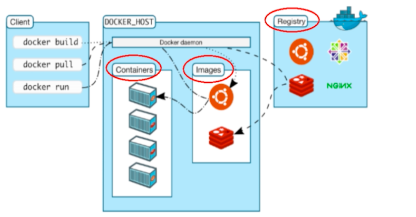

# Docker的架构图



# Docker的基本组成

## 镜像（image）

- Docker镜像（image）就是一个只读的模版，镜像可以用来创建docker容器，***一个镜像可以创建多个容器***
- 容器和镜像的关系类似于面向对象编程中的对象与类

## 容器（container）

- Docker利用容器（container）独立运行一个或一组应用。***容器是用镜像创建的运行实例***
- 它可以被启动、开始、停止、删除，每个容器都是相互隔离的、保证平台的安全
- ***可以把容器看作是一个简易版的Linux***（包括root权限、进程空间、用户空间和网络空间等）和运行在其中的应用程序，容器的定义几乎和镜像一摸一样，也是一堆层的统一视角，区别在于容器的最上面的那一层是可读可写的

## 仓库（repository）

- 仓库（repository）是***集中存放镜像文件的场所***
- 仓库（repository）和仓库注册服务器（registry）是有区别的。仓库组册服务器上往往存放着多个仓库，每个仓库又包含了多个镜像，每一个镜像有不同的标签（tag）
- 仓库分为公开仓库（public）和私有仓库（private）两种形式，最大的公开仓库是docker hub
- 存放着数量庞大的镜像供用户下载，国内的公开仓库包括阿里云、网易云等

## 小结

- 正确理解仓库、镜像、容器的概念：
- docker本身是一个容器的运行载体或称之为管理引擎。我们把应用程序和配置依赖打包好行程一个可交付的运行环境，这个打包好的运行环境就是image镜像文件，只有通过这个镜像文件才能生成docker容器，image文件可以看作是容器的模版。docker根据image文件生成容器的实例。同一个image文件，可以生成多个同时运行的容器实例
- image文件生成的容器实例，本身也是一个文件，称之为镜像文件
- 一个容器运行一种服务，当我们需要的时候，就可以通过docker客户端创建一个对应的运行实例，也就是我们的容器
- 至于仓库，就是放一堆镜像的地方，我们可以将镜像发布到仓库中，需要的时候从仓库中拉取出来就行了


# Docker环境安装

## CentOS6.8 安装Docker

- 首先需要安装epel库  ```yum -y install epel-release  ```
- 安装docker  ```yum -y install docker-io```
- 安装后的配置文件  ```/etc/sysconfig/docker```
- 启动docker服务  ```service docker start```
- docker验证  ```docker version```

## CentOS7 安装Docker

- https://docs.docker.com/engine/install/centos/


# 镜像加速

- 获取镜像加速地址
- 修改/etc/docker/daemon.json文件，来使用加速器


# Docker底层运行原理

- Docker是一个client-server结构的系统，Docker守护进程运行在主机上，然后通过socket连接从客户端访问，守护进程从客户端接受命令并管理运行在主机上的容器，***容器，是一个运行时的环境，就是前面说到的集装箱***
- Docker为什么比vm运行更快
  - docker有着比虚拟机更少的抽象层，由于docker不需要Hypervisor实现硬件资源虚拟化，运行在docker容器上的程序直接使用的都是实际服务器的硬件资源，因此在cpu、内存利用率上docker将会在效率上有明显优势
  - docker利用的是宿主机的内核，而不需要Guest OS，因此，当新建一个容器时，docker不需要和虚拟机一样重新加载一个操作系统内核，因此，创建一个docker容器只需要几秒钟

# Docker 相关命令

- 帮助命名

  - ```docker version```
  - ```docker info```
  - ```docker --help```

- 镜像命令

  - 列出本地主机上的镜像  ```docker images  或 docker image ls（新版推荐使用命令）```，各个选项说明：REPOSITORY 镜像的仓库源，TAG 镜像的标签，IMAGE ID  镜像ID，CREATED 镜像创建时间，SIZE 镜像大小；同一仓库源可以有多个TAG，代表这个仓库源的不同版本，我们使用REPOSITORY:TAG来定义不同的镜像，如果不指定镜像的版本标签，例如只使用ubuntu，docker将默认使用ubuntu:latest镜像
    - -a  列出本地所有镜像（含中间映像层）
    - -q 只显示镜像ID
    - --digests 显示镜像的摘要信息
    - --no-trunc 显示完整的镜像信息
  - 查询镜像 ```docker search 某个镜像的名字``` ，通过这个命令去查询镜像的时候，是在docker hub上面进行查找的
    - --no-trunc 显示完整的镜像描述
    - -s 列出收藏数不小于指定值的镜像
    - --automated 只列出automated build 类型的镜像
  - 下载镜像 ```docker pull 某个镜像的名字``` ，通常采用的是 ```docker pull 镜像名字[:TAG] 在新版中间推荐使用 docker image pull```
  - 删除镜像```docker rmi 或者 docker image rm```
    - 删除单个 ```docker image rm 镜像ID 或 docker rmi 镜像ID```
    - 删除多个 ```docker image rm 镜像名1:TAG 镜像名2:TAG```
    - 删除全部 ```docker image rm $(docker image ls -a -q)```
    - 

- 容器命令

  - ***有镜像才能创建容器，这个是根本前提***

  - 新建并启动容器 ```docker container run ```

    - --name 为容器指定一个名字
    - -d 后台运行容器，并返回容器ID，即启动守护式容器
    - -i 以交互式模式启动容器，通常和-t同时使用
    - -t 为容器重新分配一个伪输入终端，通常和-i同时使用
    - -P 随机端口映射
    - -p 指定端口映射，有以下四种方式
      - ```ip:hostPort:containerPort```
      - ```ip::containerPort```
      - ```hostPort:containerPort```
      - ```containerPort```

  - 列出所有正在运行的容器 ```docker container ls 或 docker ps```

    - -a 列出当前所有的容器（运行中+退出的）
    - -l 显示最近创建的容器
    - -n 显示最近n个创建的容器
    - -q 静默模式，只显示容器编号
    - --no-trunc 不截断输出

  - 退出容器

    - exit 容器停止退出
    - ctrl + p + q 容器不停止退出

  - 启动容器 ```docker start 容器ID 或 容器名字 / docker container start 容器ID 或 容器名字```

  - 重启容器 ```docker restart 容器ID 或 容器名字 / docker container restart 容器ID 或 容器名字```

  - 停止容器 ```docker stop 容器ID 或 容器名字 / docker container stop 容器ID 或 容器名字```，使用这样的方式停止容器，是温柔停止

  - 强制停止容器 ```docker kill 容器ID 或 容器名字 / docker container kill 容器ID 或 容器名字``` ，使用这样的方式停止容器，是强制停止，相当于直接拔电源

  - 删除容器 ```docker rm 容器ID 或 容器名字 / docker container rm 容器ID 或 容器名字```，使用这个方式删除容器，是指删除已经停止的容器，如果该容器还在运行中，但是想直接进行删除，可以加上 -f 参数，表示强制删除；一次性删除多个容器，使用命令 ```docker rm -f $(docker ps -a -q) 或 docker ps -a -q | xargs docker rm```

  - ***重要！！！***

    - 启动守护式容器

      - ```docker container run -d 容器名 或 容器ID / docker run -d 容器ID 或 容器名```
        - 使用该方式有很重要的一点：***docker容器后台运行，就必须有一个前台进程***
        - 容器运行的命令如果不是那些***一直挂起的命令***（如top，tail），就会自动退出的
        - 这是docker的机制问题，比如你的web容器，我们以nginx为例，正常情况下，我们配置启动服务只需要启动响应的service即可，例如```service nginx start```，但是这样做的话，nginx是后台运行，会导致docker前台没有运行的应用，这样的容器后台启动后，会立刻被杀掉，因为docker认为没事儿可做了，所以，最佳的方案是，将运行的程序以前台的方式运行

    - 查看容器日志

      - ```docker container logs -f -t --tail 容器ID / docker logs -f -t --tail 容器ID```
        - -t 是加入时间戳
        - -f 跟随最新的日志打印
        - --tail 数字，显示最后多少条

    - 查看容器内运行的进程

      - ```docker container top 容器ID / docker top 容器ID```

    - 查看容器内部的细节

      - ```docker container inspect 容器ID / docker inspect 容器ID```

    - 进入正在运行的容器并以命令行交互

      - ```docker container exec -it 容器ID/容器名 bashShell```

      - 重新进入 ```docker container attach 容器ID/容器名```

      - 上述两个区别

        - attach：直接进入容器已经启动的命令的终端，不会启动新的进程
        - exec：是在容器中打开新的终端，并且可以启动新的进程

        


