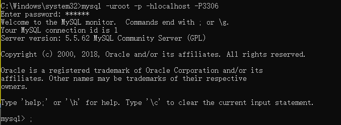

## MySQL介绍

### 数据库的好处

- 持久化数据到本地
- 可以实现结构化查询，方便管理

### 数据库的概念

#### DB

数据库（database）：存储数据的“仓库”。它保存了一系列有组织的数据

#### DBMS

数据库管理系统（Database Management System ）。数据库是通过DBMS创建和操作的容器

#### SQL

结构化查询语句（Structure Query Language）：专门用来与数据库通信的语言

> SQL的优点：
>
> > 不是某个特定的数据库提供商专有的语言，几乎所有的DBMS都支持SQL
> >
> > 简单易学
> >
> > 虽然简单，但实际上是一种强有力的语言，灵活使用其语言元素，可以进行非常复杂和高级的数据库操作

### 数据库的特点

- 将数据放到表中，表再放到库中
- 一个数据库中可以有多张表，每一个表都有一个名字，用来标识自己。表名具有唯一性
- 表具有一些特性，这个特性定义了数据在表中如何存储，类似java中“类”的设计
- 表由列组成，我们也称为字段。所有的表都由一个或列组成的，每一列类似java中的“属性”
- 表中的数据是按行存储的，每一行类似java中的“对象”

#### DBMS分为两类

- 基于共享文件系统的DBMS（Access）
- 基于客户机-服务器的DBMS（MySQL、Oracle、SqlServer）

#### MySQL的启动与停止

```tex
net start mysql  # 启动mysql
net stop  mysql  # 关闭mysql 
```

#### MySQL的服务端的登录和退出

```TE
mysql -uroot -p -hlocalhost -P3306
```




### MySQL的常见命令

- ```show databases;```：获取到当前存在哪些库
- ```muse test;```：进入到一个具体的库中
- ```show tables;```：查看一个库中所有的表（前提的是已经进入到了一个具体的库中了）；也可以使用```show tables from test;```直接查看test这个库中所有表，但是使用这样的方式并不会切换库
- ```select database();```：获取当前进入的是哪个库
- ```create table stuinfo (id int, name varchar(20));```：创建一张表
- ```desc stuinfo;```：获取一个表的结构
- ```select * from stuinfo;```：获取一个表中所有的数据
- ```insert into stuinfo (id,name) values (1,"shelter");```：向一个表中插入数据
- ```update stuinfo set name = "escid" where id = 1;```：更新一张表中的某一个字段
- ```select version();```：获取mysql的版本信息

### MySQL的语法规范

- 不区分大小写，但建议关键字大写，表名、列表小写
- 每条命令最好用分号结尾
- 每条命令根据需要，可以进行缩进或换行
- 注释
  - 单行注释：```# 注释文字``` 或 ```-- 注释文字``` ，这里注意 -- 后面是有一个空格的
  - 多行注释：```/* 注释文字 */ ```

### DQL语言的学习

#### 基础查询

> 语法：select 查询列表 from 表名;
>
> 特点：
>
> 1、查询列表可以是：表中的字段、常量值、表达式、函数
>
> 2、查询的结果是一个虚拟的表格

- 查询表中的单个字段
  - ```SELECT last_name FROM employees;```
- 查询表中的多个字段
  - ```SELECT last_name,salary,email FROM employees;```
- 查询表中的所有字段
  - ```SELECT * FROM employees```
- 查询常量值
  - ```SELECT 100;```
  - ```SELECT 'JOHN';```
- 查询表达式
  - ```SELECT 100 * 98;```
- 查询函数
  - ```SELECT VERSION();```
- 起别名（便于理解；如果要查询的字段有重名的情况，使用别名可以区分开来）
  - ```SELECT 100%98 AS RESULT;```
  - ```SELECT last_name 姓,first_name 名FROM employees;```，使用这个方式可以省略中间的AS
  - 如果在使用别名的时候，别名中间存在有特殊符号或者别名中存在有关键字，这个时候可以将别名加上单/双引号（MySQL推荐使用双引号）
- 去重
  - ```SELECT DISTINCT department_id FROM employees;```
- \+ 号的作用（在MySQL中间的\+仅仅只有一个功能：运算符）
  - ```SELECT 100+90 AS out_data;```
  - ```SELECT '123'+90;```：如果一方为字符型，则试图将字符型转换数值型，如果转换成功，则继续做加法运算，如果转换失败，则将字符型转为0，再进行加法运算
  - ```SELECT NULL+10;```：只要其中一方为NULL，则结果肯定为NULL
  - 在MySQL中想要实现多个字段查询结果的拼接，可以使用CONCAT函数：```SELECT CONCAT(str1,str2,str3);```
- 查询对NULL进行默认值处理
  - ```SELECT IFNULL(age,20) FROM employees;```：在进行查找的时候，如果字段为NULL，则会设定为一个默认的20

#### 条件查询

> 语法：select 查询列表 from 表名 where 筛选条件
>
> 特点：
>
> 1、按条件表达式筛选，条件运算符：>	<	=	!=	<>
>
> 2、按逻辑表达式筛选，逻辑运算符：&&	||	!	但是在MySQL中推荐使用的是and、or、not
>
> > 作用：用于连接条件表达式
> >
> > && 和 and：两个条件都为true，结果为true，否则为false
> >
> > || 和 or：只有一个条件为true，结果为true，否则为false
> >
> > ! 或 not：如果连接的条件为本身为false，结果为true，否则为false
>
> 3、模糊查询：like、between  and、in、is null
>
> > like 一般和通配符搭配使用，% 表示任意多个字符
> >
> > 使用 between and 可以提高语句的简洁度（包含临界值；两个临界值的顺序不能颠倒）
> >
> > in 判断某字段的值是否属于in列表中的一项（使用in提高语句简洁度、in列表的值类型必须一致或兼容）
>
> **安全等于  <=>**

- 按条件表达式筛选
  - ```SELECT * FROM employees WHERE salary > 10000;```
  - ```SELECT last_name,department_id FROM employees WHERE department_id <> 90;```
- 按逻辑表达式筛选
  - ```SELECT last_name,salary,commission_pct FROM employees WHERE salary >=10000 AND salary <= 20000;```
  - ```SELECT * FROM employees WHERE department_id < 90 OR department_id > 110 OR salary > 15000;```
- 模糊查询
  - ```SELECT * FROM employees WHERE last_name LIKE '%a%';```，这里的 % 代表的是通配符(包含0个字符)，_ 任意单个字符
  - ```SELECT last_name FROM employees WHERE last_name LIKE '__e_a%';```
  - ```SELECT last_name FROM employees WHERE last_name LIKE '_\_%';```，这里的 \ 是一个转义符
  - ```SELECT last_name FROM employees WHERE last_name LIKE '_$_%' ESCAPE '$';```，这里使用ESCAPE申明$不需要进行转义
  - ```SELECT  * FROM employees WHERE employee_id BETWEEN 100 AND 120;```
  - ```SELECT * FROM employees WHERE job_id IN('IT_PROT','AD_VP','AD_PRES')```，在使用in的时候，不能在中间使用%
  - ```SELECT * FROM employees WHERE a IS NULL; ```，对应的就是 IS NOT NULL，这里也是可以使用```<=> NULL```

#### 排序查询

> 语法：select 查询列表 from 表 [where 筛选条件] order by 排序列表 asc|desc
>
> 特点：
>
> > asc代表的是升序，desc代表的是降序，如果不写，默认是升序
> >
> > order by 子句中可以支持单个字段、多个字段、表达式、函数、别名
> >
> > order by 子句一般是放在查询语句的最后面，limit子句除外

- 查询结果从高到低进行排序
  - ```SELECT * FROM employees ORDER BY salary DESC;```
- 查询结果从低到高进行排序
  - ```SELECT * FROM employees ORDER BY salary ASC```，如果后面没有跟上ASC，则表示默认就是升序排列
- 查询时候存在筛选条件，并且结果按照另一个字段进行排序
  - ```SELECT * FROM employees WHERE department_id >= 90 ORDER BY hiredate asc;```
- 按表达式排序
  - ```SELECT *,salary*12*(1+IFNULL(commission_pct,0)) AS 年薪 FROM employees ORDER BY salary*12*(1+IFNULL(commission_pct,0)) DESC;```
- 按别名排序
  - ```SELECT *,salary*12*(1+IFNULL(commission_pct,0)) AS 年薪 FROM employees ORDER BY 年薪 DESC;```
- 按函数排序
  - ```SELECT LENGTH(last_name) AS 字节长度,last_name,salary FROM employees ORDER BY LENGTH(last_name) DESC;```
- 按多个字段排序
  - ```SELECT * FROM employees ORDER BY salary ASC,employ_id DESC;```

#### 常见函数

> 概念：类似Java中的方法，将一组逻辑语句封装在方法体中，对外暴露方法名
>
> 好处：1、隐藏了具体的实现细节；2、提高代码的重用性
>
> 调用：select 函数名(实参列表) [from 表]
>
> 特点：
>
> 1、叫什么（函数名）
>
> 2、干什么（函数的功能）
>
> 分类：
>
> 单行函数：如 concat、length、ifnull
>
> 分组函数：主要用于做统计使用，又称为统计函数、聚合函数、组函数

##### 字符函数

- length 获取参数值的字节个数
  - ```SELECT LENGTH('john')```，这里得到的结果是4
  - ```SELECT LENGTH('张三丰hahaha')```，这里得到的结果是15，一个中文占据3个字节，当然，这个是根据字符集来进行判断的
- concat 拼接字符串
  - ```SELECT CONCAT('aaa',',','cccc')```，这样得到的结果是```aaa,cccc```
- upper 和 lower
  - ```SELECT UPPER('beijing')```得到的结果是```BEIJING```，同理使用lower就能够将大写编程小写
- substr、substring，索引是从1开始的
  - ```SELECT SUBSTR('我爱北京天安门',5)```，通过这样的方式就能够将中间的```天安门```进行获取
  - ```SELECT SUBSTR('我爱北京天安门',3,2)```，这里给定的两个参数，第一个参数表示从哪个位置开始截取，第二个参数表示截取多长的字符，这里注意是字符，并不是字节
- instr用于获取子串在全字符串中的第一次出现的起始索引，如果没有则返回0
  - ```SELECT INSTR('hello world','world');```
- trim用于将获取的内容左右的空格去掉，如果想要去掉指定的内容，则需要将内容进行申明
  - ```SELECT TRIM('  hello world   ');``` 
  - ```SELECT TRIM('#' FROM'#######hello#####world#########');```  得到的结果就是 hello#####world，这里除了可以使用到单个字符，也可以用到一个字符串
- lpad、rpad
  - ```SELECT LPAD('hello',10,'*') AS out_put;```，这里使用左填充，将 * 填充在 hello 的左边，并且填充完成之后的总长度是10
  - ```SELECT RPAD('hello',10,'*') AS out_put;```，这里使用右填充
- replace 替换
  - ```SELECT REPLACE('hello world','world','china') AS out_put;```

##### 数学函数

- round 四舍五入
  - ```SELECT ROUND(1.65);``` 得到的就是2
  - ```SELECT ROUND(1.689,2);``` round 后面支持第二个参数，表示保留小数点后面几位，这里指定保留的是小数点后面两位，结果为1.69
- ceil 向上取整，返回>=该参数的最小整数
  - ```SELECT CEIL(1.52);```得到的结果是2
- floor 向下取整，返回<=该参数的最大整数
  - ```SELECT FLOOR(1.98);```
- truncate 截断
  - ```SELECT TRUNCATE(1.65,1);```得到的返回结果是1.6，这里表示的是将一个小数后面截断几位
- mod 取余
  - ```SELECT MOD(10,3);```这里取余得到的结果就是1

##### 日期函数

- now 获取当前系统日期+时间
  - ```SELECT NOW();``
- curdate 返回当前系统日期，不包含时间
  - ```SELECT CURDATE();```
- curtime 返回当前系统时间，不包含日期
  - ```SELECT CURTIME();```
- 可以获取指定的部分：年、月、日、小时、分钟、秒
  - ```SELECT YEAR(NOW());``` 获取当前的年份
  - ```SELECT MONTH(NOW());``` 获取当前的月份
  - ```SELECT MONTHNAME(NOW());``` 获取当前月份的名字
- datediff：获取两个日期相差的天数
  - ```SELECT DATEDIFF('2020-6-13','2020-6-2');```
- str_to_date：将日期格式的字符串转换成指定格式的日期
  - ```SELECT STR_TO_DATE('13-6-2020','%d-%m-%Y');```
- date_format：将日期转为字符
  - ```SELECT DATE_FORMAT(NOW(),'%d-%m-%Y');```

##### 其他函数

```mysql
SELECT VERSION();  # 获取当前数据库的版本
SELECT DATABASE();  # 获取当前所处的数据库
SELECT USER();  # 获取当前登陆的用户
```

##### 流程控制函数

- if 函数：if  else  的效果

  - ```SELECT IF(10>5,'true','false');``` mysql中间的if其实和三目运算符差不多的意思，如果第一个条件成立，则返回第二个参数的结果，否则返回第三个参数的结果

- case 函数的使用一：switch case 的效果

- > 语法：
  >
  > case 要判断的字段或表达式
  >
  > when 常量1 then 要显示的值1或语句1;
  >
  > when 常量2 then 要显示的值2或语句2;
  >
  > ...
  >
  > else 要显示的值n或语句n;
  >
  > end

  - ```mysql
    SELECT
    	salary 原始工资,
    	department_id
    CASE
    	department_id 
    	WHEN 30 THEN
    	salary * 1.1 
    	WHEN 40 THEN
    	salary * 1.2 
    	WHEN 50 THEN
    	salary * 1.3 ELSE salary 
    	END AS 新工资 
    FROM
    	employees;
    ```

- case 函数的使用二：类似于 多重 if

- > 语法：
  >
  > case
  >
  > when 条件1 then 要显示的值1或语句1
  >
  > when 条件2 then 要显示的值2或语句2
  >
  > ...
  >
  > else 要显示的值n或语句n
  >
  > end

  - ```mysql
    SELECT
    	salary
    CASE
    	
    	WHEN salary > 20000 THEN
    	'A' 
    	WHEN salary > 15000 THEN
    	'B' 
    	WHEN salary > 10000 THEN
    	'C' ELSE 'D' 
    	END AS '工资级别' 
    FROM
    employees;
    ```

##### 分组函数

> 功能：用作统计使用，又称为聚合函数或统计函数或组函数
>
> 分类：
>
> sum：求和；avg：平均值；max：最大值；min：最小值；count：计算个数

- 简单的使用

  - ```SELECT SUM(salary) FROM employees;```
  - ```SELECT AVG(salary) FROM employees;```
  - ```SELECT MIN(salary) FROM employees;```
  - ```SELECT MAX(salary) FROM employees;```
  - ```SELECT COUNT(salary) FROM employees;```

- 参数支持哪些类型

  - SUM 和 AVG 仅适合处理数值型的参数，其他的类型不会报错，但是已经没有意义了
  - MAX、MIN、COUNT 可以处理任何类型

- 是否忽略NULL值

  - 在使用这些分组函数的时候都是已经忽略了NULL值的

- 可以和 distinct 搭配去重的运算

  - ```SELECT SUM(DISTINCT salary) FROM employees;```

- count 函数的详细介绍

  - ```SELECT COUNT(salary) FROM employees;``` 在使用这样的方式进行统计的时候，会忽略NULL行

  - ```SELECT COUNT(*) FROM employees;``` 通常使用这样的方式来统计一个数据库中的总行数，只要一行中有一个不是NULL就会被统计上

  - ```SELECT COUNT(1) FROM employees;``` 这里除了1也能是其他的常量值，相当于在数据表中加了一列都是1的内容，然后统计这一列，其实这个和count(\*)的结果是一样的

  - 效率：MYISAM 存储引擎下，count(\*) 的效率最高，因为这个存储引擎中，直接就有一个计数器，直接返回数字，效率很高；INNODB 存储引擎下，count(\*)和count(1)的效率差不多，比count(字段)要高

    INNODB 存储引擎下，count(*)和count(1)的效率差不多，比count(字段)要高

- 和分组函数一同查询的字段有限制
  - 和分组函数一同查询的字段要求是 gourp by 后的字段

##### 分组查询

> 引入：需要获取每个部门的平均工资
>
> 语法：
>
> select 分组函数,列(要求出现在group by的后面)
>
> from 表
>
> [where 筛选条件]
>
> group by 分组的列表
>
> [order by 子句]
>
> ***注意***：查询列表比较特殊，要求是 分组函数 和 group by 后出现的字段

- 查询每个工种的最高工资（简单分组查询）

  - ```SELECT MAX(salary),job_id FROM employees GROUP BY job_id;```

- 查询每个位置上的部门个数（简单分组查询）

  - ```SELECT COUNT(*),location_id FROM employees GROUP BY location_id;```

- 查询邮箱中包含a字符的，每个部门的工资

  - ```SELECT AVG(salary),department_id FROM employees WHERE email LIKE '%a%' GROUP BY department_id```

- 查询有奖金的每个领导手下的最高工资

  - ```SELECT MAX(salary),manager_id FROM employees WHERE commission_pct IS NOT NULL GROUP BY manager_id;```

- 查询哪个部门的员工个数 > 2(添加分组后的筛选)

- > 首先查询每一个部门的员工个数；根据查询的个数进行筛选，查询哪个部门的员工人员 > 2

  - ```SELECT COUNT(*),department_id FROM employees GROUP BY department_id;``` 这里首先获取到每个部门的员工个数
  - ```SELECT COUNT(*),department_id FROM employees GROUP BY department_id HAVING COUNT(*) > 2;```  这里基于前面获取到的每个部门员工个数的前提下得到员工个数 > 2的

- 查询每个工种有奖金的员工的最高工资 > 12000的工种编号和最高工资

  - 查询每个工种有奖金的员工的最高工资
    - ```SELECT MAX(salary),job_id FROM employees WHERE commission_pct IS NOT NULL GROUP BY job_id;```
  - 根据上面的结果继续筛选，最高工资大于12000
    - ```SELECT MAX(salary),job_id FROM employees WHERE commission_pct IS NOT NULL GROUP BY job_id HAVING MAX(salary) > 12000;```

- 查询领导编号 > 102的每个领导手下的最低工资 > 5000 的领导编号是哪个，以及其工资

  - 查询每个领导手下的员工固定最低工资
    - ```SELECT MIN(salary),manager_id FROM employees GROUP BY manager_id;```
  - 添加筛选条件：编号 > 102
    - ```SELECT MIN(salary),manager_id FROM employees WHERE manager_id > 102 GROUP BY manager_id;```
  - 添加筛选条件：最低工资 > 5000
    - ```SELECT MIN(salary),manager_id FROM employees WHERE manager_id > 102 GROUP BY manager_id HAVING MIN(salary) > 5000;```

> 分组查询小结：
>
> 一、分组查询中的筛选条件分成两类
>
> |  筛选条件  |     数据源     |        位置         | 关键字 |
> | :--------: | :------------: | :-----------------: | :----: |
> | 分组前筛选 |     原始表     | group by 子句的前面 | where  |
> | 分组后筛选 | 分组后的结果集 | group by 子句的后面 | having |
>
> 分组函数做条件肯定是放在having子句中
>
> 能用分组前筛选的，尽量选择分组前筛选，这是一个性能的问题

- 按表达式或函数进行分组（group by）
  - 前面介绍的 group by 后面基本就是某一个字段，其实 group by 后面也是能够放一个表达式或函数的
    - 按员工姓名额长度分组，查询每一组员工的个数，筛选员工个数 > 5 的有哪些
      - 查询每个长度的员工个数：```SELECT COUNT(*),LENGTH(last_name) AS len_name FROM employees GROUP BY LENGTH(last_name);```
      - 添加筛选条件：```SELECT COUNT(*),LENGTH(last_name) AS len_name FROM employees GROUP BY LENGTH(last_name) HAVING COUNT(*) > 5;```
- 按多个字段进行分组（group by）
  - 查询每个部门每个工种的员工的平均工资
    - ```SELECT AVG(salary),department_id,job_id FROM employees GROUP BY department_id,job_id;```
- 添加排序
  - 查询每个部门每个工种的员工的平均工资，并且按平均工资的高低显示
    - ```SELECT AVG(salary),department_id,job_id FROM employees GROUP BY department_id,job_id ORDER BY AVG(salary);```

> 分组查询小结：
>
> 二、group by 子句支持单个字段分组，多个字段分组（多个字段用逗号隔开，没有顺序要求），表达式或函数
>
> 三、也可以添加排序（排序放在整个分组查询的最后）


