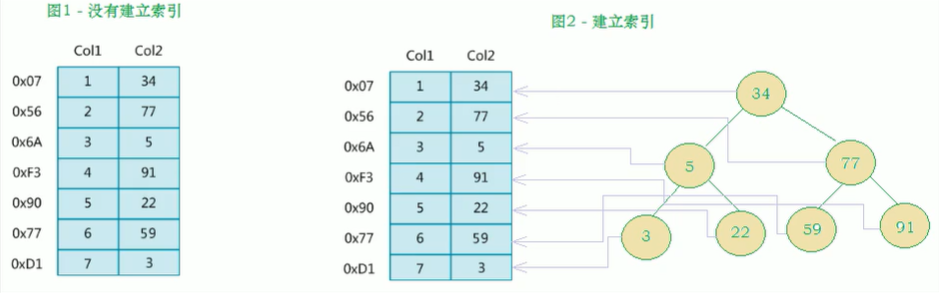
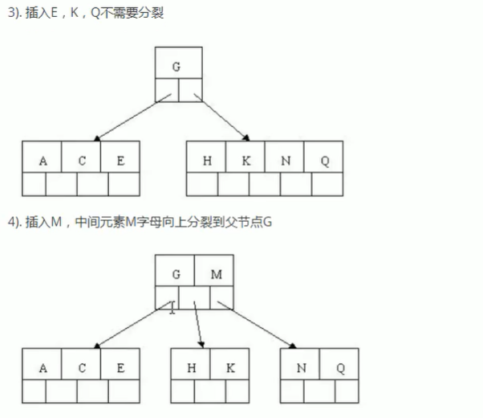
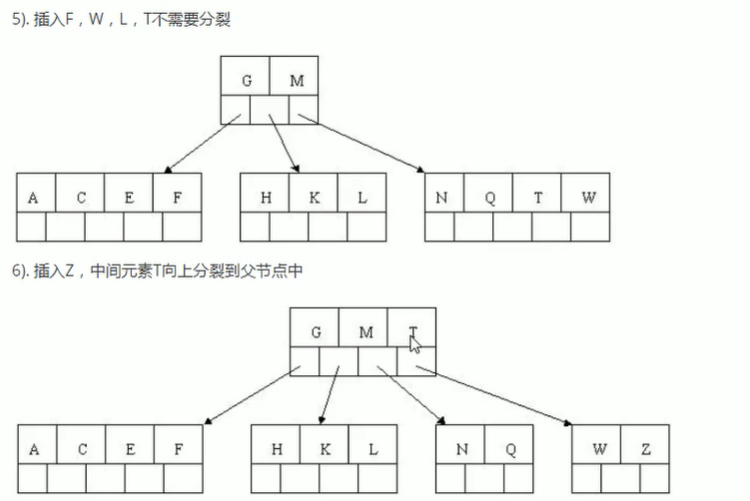
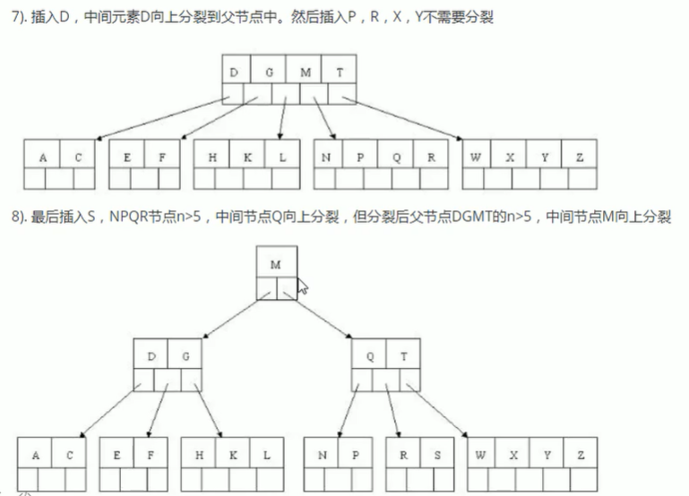
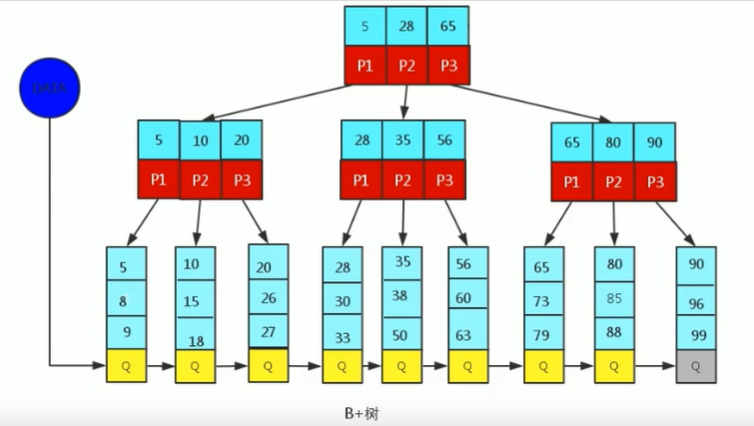
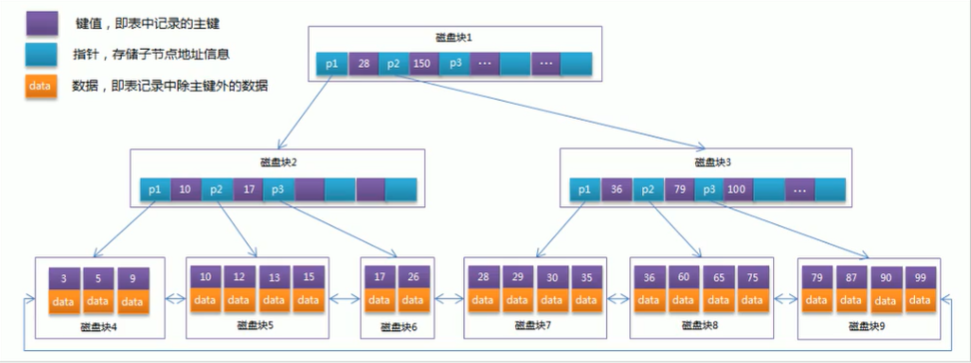
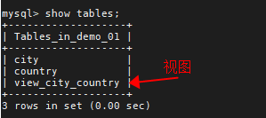
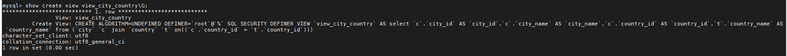
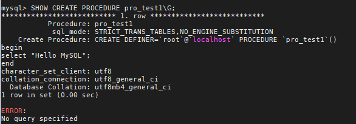

# 1、Linux上安装mysql

首先查看是否已经安装了mysql，将系统自带的mysql进行一个卸载

```tex
[root@localhost ~]# rpm -qa | grep -i mysql
mysql-libs-5.1.73-8.el6_8.x86_64
[root@localhost ~]# rpm -e mysql-libs-5.1.73-8.el6_8.x86_64 --nodeps
[root@localhost ~]# rpm -qa | grep -i mysql
```

将通过官网下载的包上传到服务器上面，并进行安装，下载链接`https://dev.mysql.com/downloads/mysql/5.6.html#downloads`

```tex
[root@localhost tmp]# tar -xvf MySQL-5.6.49-1.el6.x86_64.rpm-bundle.tar -C mysql/
MySQL-client-5.6.49-1.el6.x86_64.rpm
MySQL-devel-5.6.49-1.el6.x86_64.rpm
MySQL-embedded-5.6.49-1.el6.x86_64.rpm
MySQL-server-5.6.49-1.el6.x86_64.rpm
MySQL-shared-compat-5.6.49-1.el6.x86_64.rpm
MySQL-shared-5.6.49-1.el6.x86_64.rpm
MySQL-test-5.6.49-1.el6.x86_64.rpm
[root@localhost tmp]# cd mysql/
[root@localhost mysql]# ll
总用量 235424
-rw-r--r--. 1 7155 31415 21584380 6月   3 13:36 MySQL-client-5.6.49-1.el6.x86_64.rpm
-rw-r--r--. 1 7155 31415  3550852 6月   3 13:36 MySQL-devel-5.6.49-1.el6.x86_64.rpm
-rw-r--r--. 1 7155 31415 91143428 6月   3 13:36 MySQL-embedded-5.6.49-1.el6.x86_64.rpm
-rw-r--r--. 1 7155 31415 65467136 6月   3 13:36 MySQL-server-5.6.49-1.el6.x86_64.rpm
-rw-r--r--. 1 7155 31415  2318272 6月   3 13:36 MySQL-shared-5.6.49-1.el6.x86_64.rpm
-rw-r--r--. 1 7155 31415  3969728 6月   3 13:36 MySQL-shared-compat-5.6.49-1.el6.x86_64.rpm
-rw-r--r--. 1 7155 31415 53027392 6月   3 13:36 MySQL-test-5.6.49-1.el6.x86_64.rpm
```

此时还需要安装mysql的第三方依赖库

```tex
yum -y install libaio.so.1 libgcc_s.so.1 libstdc++.so.6 libncurses.so.5 --setopt=protected_multilib=false
yum update libstdc++-4.4.7-4.el6.x86_64
yum install -y perl-Module-Install.noarch  # 这个很重要，需要安装
yum -y install libnuma*  # 这个很重要，需要安装
```

安装mysql-client

```tex
[root@localhost mysql]# rpm -ivh MySQL-client-5.6.49-1.el6.x86_64.rpm
warning: MySQL-client-5.6.49-1.el6.x86_64.rpm: Header V3 DSA/SHA1 Signature, key ID 5072e1f5: NOKEY
Preparing...                ########################################### [100%]
   1:MySQL-client           ########################################### [100%]
```

安装mysql-server

```tex
[root@localhost mysql]# rpm -ivh MySQL-server-5.6.49-1.el6.x86_64.rpm
warning: MySQL-server-5.6.49-1.el6.x86_64.rpm: Header V3 DSA/SHA1 Signature, key ID 5072e1f5: NOKEY
Preparing...                ########################################### [100%]
   1:MySQL-server           ########################################### [100%]
warning: user mysql does not exist - using root
warning: group mysql does not exist - using root
warning: user mysql does not exist - using root
warning: group mysql does not exist - using root
2020-07-13 19:41:18 0 [Warning] TIMESTAMP with implicit DEFAULT value is deprecated. Please use --explicit_defaults_for_timestamp server option (see documentation for more details).
2020-07-13 19:41:18 0 [Note] Ignoring --secure-file-priv value as server is running with --bootstrap.
2020-07-13 19:41:18 0 [Note] /usr/sbin/mysqld (mysqld 5.6.49) starting as process 1607 ...
2020-07-13 19:41:18 1607 [Note] InnoDB: Using atomics to ref count buffer pool pages
2020-07-13 19:41:18 1607 [Note] InnoDB: The InnoDB memory heap is disabled
2020-07-13 19:41:18 1607 [Note] InnoDB: Mutexes and rw_locks use GCC atomic builtins
2020-07-13 19:41:18 1607 [Note] InnoDB: Memory barrier is not used
2020-07-13 19:41:18 1607 [Note] InnoDB: Compressed tables use zlib 1.2.11
2020-07-13 19:41:18 1607 [Note] InnoDB: Using Linux native AIO
2020-07-13 19:41:18 1607 [Note] InnoDB: Using CPU crc32 instructions
2020-07-13 19:41:18 1607 [Note] InnoDB: Initializing buffer pool, size = 128.0M
2020-07-13 19:41:18 1607 [Note] InnoDB: Completed initialization of buffer pool
2020-07-13 19:41:18 1607 [Note] InnoDB: The first specified data file ./ibdata1 did not exist: a new database to be created!
2020-07-13 19:41:18 1607 [Note] InnoDB: Setting file ./ibdata1 size to 12 MB
2020-07-13 19:41:18 1607 [Note] InnoDB: Database physically writes the file full: wait...
2020-07-13 19:41:18 1607 [Note] InnoDB: Setting log file ./ib_logfile101 size to 48 MB
2020-07-13 19:41:18 1607 [Note] InnoDB: Setting log file ./ib_logfile1 size to 48 MB
2020-07-13 19:41:18 1607 [Note] InnoDB: Renaming log file ./ib_logfile101 to ./ib_logfile0
2020-07-13 19:41:18 1607 [Warning] InnoDB: New log files created, LSN=45781
2020-07-13 19:41:18 1607 [Note] InnoDB: Doublewrite buffer not found: creating new
2020-07-13 19:41:18 1607 [Note] InnoDB: Doublewrite buffer created
2020-07-13 19:41:18 1607 [Note] InnoDB: 128 rollback segment(s) are active.
2020-07-13 19:41:18 1607 [Warning] InnoDB: Creating foreign key constraint system tables.
2020-07-13 19:41:18 1607 [Note] InnoDB: Foreign key constraint system tables created
2020-07-13 19:41:18 1607 [Note] InnoDB: Creating tablespace and datafile system tables.
2020-07-13 19:41:18 1607 [Note] InnoDB: Tablespace and datafile system tables created.
2020-07-13 19:41:18 1607 [Note] InnoDB: Waiting for purge to start
2020-07-13 19:41:18 1607 [Note] InnoDB: 5.6.49 started; log sequence number 0
2020-07-13 19:41:18 1607 [Note] RSA private key file not found: /var/lib/mysql//private_key.pem. Some authentication plugins will not work.
2020-07-13 19:41:18 1607 [Note] RSA public key file not found: /var/lib/mysql//public_key.pem. Some authentication plugins will not work.
A random root password has been set. You will find it in '/root/.mysql_secret'.
2020-07-13 19:41:19 1607 [Note] Binlog end
2020-07-13 19:41:19 1607 [Note] InnoDB: FTS optimize thread exiting.
2020-07-13 19:41:19 1607 [Note] InnoDB: Starting shutdown...
2020-07-13 19:41:20 1607 [Note] InnoDB: Shutdown completed; log sequence number 1625977


2020-07-13 19:41:20 0 [Warning] TIMESTAMP with implicit DEFAULT value is deprecated. Please use --explicit_defaults_for_timestamp server option (see documentation for more details).
2020-07-13 19:41:20 0 [Note] Ignoring --secure-file-priv value as server is running with --bootstrap.
2020-07-13 19:41:20 0 [Note] /usr/sbin/mysqld (mysqld 5.6.49) starting as process 1629 ...
2020-07-13 19:41:20 1629 [Note] InnoDB: Using atomics to ref count buffer pool pages
2020-07-13 19:41:20 1629 [Note] InnoDB: The InnoDB memory heap is disabled
2020-07-13 19:41:20 1629 [Note] InnoDB: Mutexes and rw_locks use GCC atomic builtins
2020-07-13 19:41:20 1629 [Note] InnoDB: Memory barrier is not used
2020-07-13 19:41:20 1629 [Note] InnoDB: Compressed tables use zlib 1.2.11
2020-07-13 19:41:20 1629 [Note] InnoDB: Using Linux native AIO
2020-07-13 19:41:20 1629 [Note] InnoDB: Using CPU crc32 instructions
2020-07-13 19:41:20 1629 [Note] InnoDB: Initializing buffer pool, size = 128.0M
2020-07-13 19:41:20 1629 [Note] InnoDB: Completed initialization of buffer pool
2020-07-13 19:41:20 1629 [Note] InnoDB: Highest supported file format is Barracuda.
2020-07-13 19:41:20 1629 [Note] InnoDB: 128 rollback segment(s) are active.
2020-07-13 19:41:20 1629 [Note] InnoDB: Waiting for purge to start
2020-07-13 19:41:20 1629 [Note] InnoDB: 5.6.49 started; log sequence number 1625977
2020-07-13 19:41:20 1629 [Note] RSA private key file not found: /var/lib/mysql//private_key.pem. Some authentication plugins will not work.
2020-07-13 19:41:20 1629 [Note] RSA public key file not found: /var/lib/mysql//public_key.pem. Some authentication plugins will not work.
2020-07-13 19:41:21 1629 [Note] Binlog end
2020-07-13 19:41:21 1629 [Note] InnoDB: FTS optimize thread exiting.
2020-07-13 19:41:21 1629 [Note] InnoDB: Starting shutdown...
2020-07-13 19:41:22 1629 [Note] InnoDB: Shutdown completed; log sequence number 1625987


A RANDOM PASSWORD HAS BEEN SET FOR THE MySQL root USER !
You will find that password in '/root/.mysql_secret'.

You must change that password on your first connect,
no other statement but 'SET PASSWORD' will be accepted.
See the manual for the semantics of the 'password expired' flag.

Also, the account for the anonymous user has been removed.

In addition, you can run:

  /usr/bin/mysql_secure_installation

which will also give you the option of removing the test database.
This is strongly recommended for production servers.

See the manual for more instructions.

Please report any problems at http://bugs.mysql.com/

The latest information about MySQL is available on the web at

  http://www.mysql.com

Support MySQL by buying support/licenses at http://shop.mysql.com

New default config file was created as /usr/my.cnf and
will be used by default by the server when you start it.
You may edit this file to change server settings
```


# 2、mysql的启动和登录

启动mysql

```tex
[root@localhost ~]# service mysql start
Starting MySQL.Logging to '/var/lib/mysql/localhost.localdomain.err'.
... SUCCESS!
[root@localhost ~]# netstat -nptl
Active Internet connections (only servers)
Proto Recv-Q Send-Q Local Address               Foreign Address             State       PID/Program name
tcp        0      0 0.0.0.0:22                  0.0.0.0:*                   LISTEN      1473/sshd
tcp        0      0 127.0.0.1:25                0.0.0.0:*                   LISTEN      1266/master
tcp        0      0 :::3306                     :::*                        LISTEN      1770/mysqld
tcp        0      0 :::22                       :::*                        LISTEN      1473/sshd
tcp        0      0 ::1:25                      :::*                        LISTEN      1266/master
```

在上面可以看到，mysql已经正常启动了，端口为3306

下面就可以登陆到mysql上面了，这里的登录密码在进行安装的时候有一个root随机的密码已经生成

```tex
[root@localhost ~]# cat /root/.mysql_secret
# The random password set for the root user at Mon Jul 13 19:41:19 2020 (local time): yP7CbCv6cse3I73B
```

此时使用这个随机密码就能够正常登录到mysql中间了，可以使用这个随机密码登录到mysql中间，并为root用户重新设定新的密码

```tex
[root@localhost ~]# mysql -uroot -p
Enter password:
Welcome to the MySQL monitor.  Commands end with ; or \g.
Your MySQL connection id is 1
Server version: 5.6.49

Copyright (c) 2000, 2020, Oracle and/or its affiliates. All rights reserved.

Oracle is a registered trademark of Oracle Corporation and/or its
affiliates. Other names may be trademarks of their respective
owners.

Type 'help;' or '\h' for help. Type '\c' to clear the current input statement.

mysql> set password = password('mysql*()');
Query OK, 0 rows affected (0.00 sec)
```

虽然上面的方式已经可以通过本地进行连接了，但是测试通过远程连接工具navicat还是不能够正常连接，需要进行授权

```tex
mysql> grant all privileges on *.* to 'root'@'%' identified by 'mysql*()';
Query OK, 0 rows affected (0.00 sec)
mysql> flush privileges;
Query OK, 0 rows affected (0.00 sec)
```

如果此时还是连接不上数据库，就需要看下linux服务器的防火墙是否开了，如果开启的状态，则需要将防火墙进行关闭


# 3、索引

## 3.1、索引概述

**索引**是帮助mysql高效获取数据的**数据结构**，在数据之外，数据库系统还维护着满足特定查找算法的数据结构，这些数据结构以某种方式引向（指向）数据，这样就可以在这些数据结构上实现高级查找算法，这种数据结构就是索引



一般来说索引本身也很大，不可能全部存储在内存中，因此索引往往以索引文件的形式存储在磁盘中。索引是数据库中用来提高性能的最常用的工具


## 3.2、索引的优势和劣势

**优势：**

- 类似于书籍的目录索引，提高数据索引的效率，降低数据库的IO成本
- 通过索引对数据进行排序，降低数据排序的成本，降低CPU的消耗

**劣势：**

- 实际上索引也是一张表，该表中保存了主键与索引字段，并指向实体类的记录，所以索引列也是要占用空间的
- 索然索引大大提升了查询效率，同时却也降低了更新表的速度，如对表进行INSERT、UPDATE、DELETE。因为更新表时，mysql不仅要保存数据，还要保存一下索引文件每次更新添加了索引列的字段，都会调整因为更新所带来的键值变化后的索引信息


## 3.3、索引结构

索引是在mysql的存储引擎层中实现的，而不是在服务层实现的。所以每种存储引擎的索引都不一定完全相同的，也不是所有的存储引擎都支持所有的索引类型的，mysql目前提供4中索引：

- BTREE索引：最常见的索引类型，大部分索引都支持B树索引
- HASH索引：只有Memory引擎支持，使用场景简单
- R-tree索引（空间索引）：空间索引是MyISAM引擎的一种特殊索引类型，主要用于地理空间数据索引，通常使用较少
- Full-text索引（全文索引）：全文索引也是MyISAM引擎的一种特殊索引类型，主要用于全文索引，InnoDB从5.6版本开始支持全文索引


我们平常所说的索引，如果没有特别指明，就是B+树（多路搜索树，并不一定是二叉的）结构组织的索引。其中聚集索引、复合索引、前缀索引、唯一索引默认都是B+Tree树索引，统称为索引

### 3.3.1、BTREE 结构

BTREE又叫多路平衡搜索树，一颗m叉的BTREE特性如下：

- 树的每个节点最多包含m个孩子
- 除根节点和叶子节点外，每个节点至少有[ceil(m/2)]个孩子
- 若根节点不是叶子节点，则至少有两个孩子
- 所有的叶子节点都处在同一层
- 每个非叶子节点由n个key与n+1个指针组成，其中[ceil(m/2)-1] <= n <= m-1

以5叉BTree为例，key的数量：公式推导[ceil(m/2)-1] <= n <= m-1，所以 2 <= n <= 4。***当n等于4时，中间节点分裂到父节点，两边节点分裂***

下面以插入 C N G A H E K Q M F W L T Z D P R X Y S 数据为例








到此，该BTREE树就已经构建完成了，BTREE树和二叉树相比，查询数据的效率更高，因为对于相同的数据量来说，BTREE的层级结构比二叉树小，因此搜索速度快


### 3.3.2、B+TREE 结构

B+Tree为BTree树的变种，B+Tree与BTree的区别为：

- n叉B+Tree最多含有n个key，而BTree最多含有n-1个key
- B+Tree的叶子节点保存所有key信息，依key大小顺序排列
- 所有非叶子节点都可以看作是key的索引部分



在上面的图中，需要关注，在所有的非叶子节点中间，都是用来进行索引的，只有在叶子节点中才保留了所有key的信息

由于B+Tree只有叶子节点保存key信息，查询任何key都要从root走到叶子，所以B+Tree的查询效率更加稳定


### 3.3.3、MySQL中的B+TREE

MySQL索引数据结构对经典的B+TREE进行了优化，在原B+TREE的基础上，增加一个指向相邻叶子节点的链表指针，就形成了带有顺序指针的B+TREE，提高区间访问的性能（用于范围搜索）




## 3.4、索引分类

1）**单值索引**：即一个索引只包含一个列，一个表可以有多个单值索引

2）**唯一索引**：索引列的值必须唯一，但允许有空值

3）**复合索引**：即一个索引包含多个列


## 3.5、索引语法

索引在创建表的时候，可以同时创建，也可以随时增加新的索引

准备环境

```mysql
mysql> create database demo_01 default charset=utf8mb4;  # 创建一个库
Query OK, 1 row affected (0.01 sec)

CREATE TABLE `city` (
  `city_id` int(11) NOT NULL AUTO_INCREMENT,
  `city_name` varchar(50) NOT NULL,
  `country_id` int(11) NOT NULL,
  PRIMARY KEY (`city_id`)
) ENGINE=InnoDB DEFAULT CHARSET=utf8

CREATE TABLE `country` (
  `country_id` int(11) NOT NULL AUTO_INCREMENT,
  `country_name` varchar(100) NOT NULL,
  PRIMARY KEY (`country_id`)
) ENGINE=InnoDB DEFAULT CHARSET=utf8

INSERT INTO `city` (`city_id`, `city_name`, `country_id`) VALUES (1,'西安',1);
INSERT INTO `city` (`city_id`, `city_name`, `country_id`) VALUES (2,'NewYork',2);
INSERT INTO `city` (`city_id`, `city_name`, `country_id`) VALUES (3,'北京',1);
INSERT INTO `city` (`city_id`, `city_name`, `country_id`) VALUES (4,'上海',1);

INSERT INTO `country` (`country_id`, `country_name`) VALUES (1, 'China');
INSERT INTO `country` (`country_id`, `country_name`) VALUES (2, 'America');
INSERT INTO `country` (`country_id`, `country_name`) VALUES (3, 'Japan');
INSERT INTO `country` (`country_id`, `country_name`) VALUES (4, 'UK');
```


### 3.5.1、创建索引

```mysql
CREATE [UNIQUE|FULLTEXT|SPATIAL] INDEX index_name
[USING index_type]
ON table_name(field_name)

CREATE INDEX idx_city_name ON city(city_name);
```


### 3.5.2、查看索引

```mysql
SHOW INDEX FROM city;
```


### 3.5.3、删除索引

```mysql
DROP INDEX idx_city_name ON city;
```


### 3.5.4、ALTER 命令

```mysql
1）ALTER TABLE tb_name ADD PRIMARY KEY(column_list);  # 该语句添加一个主键，这意味着索引值必须是唯一的，且不能为NULL
2）ALTER TABLE tb_name ADD UNIQUE index_name(column_list);  # 这条语句创建索引的值必须是唯一的（除了NULL外，NULL可能会出现多次）
3）ALTER TABLE tb_name ADD index index_name(column_list);  # 添加普通索引，索引值可以出现多次
4）ALTER TABLE tb_name ADD fulltext index_name(column_list);  # 该语句指定了索引为FULLTEXT，用于全文索引

```


## 3.6、索引设计原则

索引的设计可以遵循一些已有的原则，创建索引的时候请尽量考虑符合这些原则，便于提升索引的使用效率，更高效的使用索引

- 对查询频次高，且数据量比较大的表建立索引
- 索引字段的选择，最佳候选列应当从where子句的条件中选取，如果where子句中的组合比较多，那么应当挑选最常用、过滤效果最好的列的组合
- 使用唯一索引，区分度越高，使用索引的效率越高
- 索引可以有效的提升查询数据的效率，但索引数量不是多多益善，索引越多，维护索引的代价自然也就水涨船高。对于插入、更新、删除等DML操作比较频繁的表来说，索引过多，会引入相当高的维护代价，降低DML操作的效率，增加相应操作的时间消耗。另外索引过多的话，MySQL也会犯选择困难症，虽然最终会找到一个可用的索引，但无疑提高了选择的代价
- 利用最作前缀，N个列组合而成的组合索引，那么相当于是创建了N个索引，如果查询时where子句中使用了组成该索引的前几个字段，那么这条查询sql可以利用组合索引来提升查询效率

```mysql
创建复合索引
	CREATE INDEX idx_name_email_status ON tb_name(`name`,`email`,`status`)
	
就相当于
	对 name 创建索引
	对 name email 创建索引
	对 name email status 创建索引
```


# 4、视图

## 4.1、视图概述

视图（view）是一种虚拟存在的表。视图并不在数据库中实际存在，行和列数据来自定义视图的查询中使用的表，并且是在使用视图时动态生成的。通俗的讲，视图就是一条select语句执行后返回的结果集。所以我们在创建视图的时候，主要的工作就落在创建这条sql查询语句上

视图相对于普通的表的优势主要包括以下几项：

- 简单：使用视图的用户完全不需要关心后面对应的表的结构、关联条件和筛选条件，对用户来说已经是过滤好的复合条件的结果集。
- 安全：使用视图的用户只能访问他们被允许查询的结果集，对表的权限管理并不能限制到某个行某个列，但是通过视图就可以简单的实现
- 数据独立：一旦视图的结构确定了，可以屏蔽表结构变化对用户的影响，源表增加列对视图没有影响；源表修改列名，则可以通过修改视图来解决，不会造成对访问者的影响


## 4.2、创建或修改视图

```mysql
# 通过下面的方式创建一个视图
CREATE
OR REPLACE VIEW view_city_country AS SELECT
	c.*, t.country_name
FROM
	city c
INNER JOIN country t ON c.country_id = t.country_id;
```


如上就创建好了一个视图，下面看下修改视图

```mysql
ALTER VIEW view_city_country AS SELECT * FROM city;
```

```tex
在创建和修改视图的时候，还存在以下的选项
	WITH [CASCADED | LOCAL] CHECK OPTION 决定了是否允许更新数据是记录不在满足视图的条件
	
	LOCAL：只要满足本视图条件就可以更新
	CASCADED：必须满足所有针对该视图的所有视图的条件才可以更新，默认值
```


## 4.3、查看视图

从MySQL 5.1 版本开始，使用 SHOW TABLES 命令的时候不仅显示表的名字，同时也会显示视图的名字，而不存在单独显示视图的 SHOW VIEWS 命令



如果想要查看视图的创建，则可以使用 SHOW CREATE VIEW view_name




## 4.4、删除视图

```mysql
DROP VIEW IF EXISTS view_city_country;
```


# 5、存储过程和函数

## 5.1、存储过程和函数概述

存储过程和函数是 事先经过编译并存储在数据库中的一段SQL语句的集合，调用存储过程和函数可以简化应用开发人员的很多工作，减少数据在数据库和应用服务器之间的传输，对于提高数据处理的效率是有好处的

存储过程和函数的区别在于函数必须有返回值，而存储过程没有

**函数：是一个有返回值的过程**

**过程：是一个没有返回值的函数**

***小结***

```tex
查询数据库中的存储过程和函数
       select `name` from mysql.proc where db = 'xx' and `type` = 'PROCEDURE'   //存储过程
       select `name` from mysql.proc where db = 'xx' and `type` = 'FUNCTION'   //函数

       show procedure status; //存储过程
       show function status;     //函数

查看存储过程或函数的创建代码
　　show create procedure proc_name;
　　show create function func_name;
```


## 5.2、创建存储过程

创建的时候使用到的 PROCEDURE

```mysql
mysql> delimiter $
mysql> create procedure pro_test1()
    -> begin
    -> select "Hello MySQL";
    -> end $
Query OK, 0 rows affected (0.00 sec)

mysql> delimiter ;
```

**注意：**DELIMITER，该关键字用来申明SQL语句的分隔符，告诉MySQL解释器，该段命令是否已经结束了，MySQL是否可以执行了。默认情况下，delimiter是分号，在命令行客户端中，如果有一行命令以分号结束，那么回车后，mysql将会执行该命令


## 5.3、调用存储过程

在调用存储过程的时候直接使用call命令即可

```mysql
mysql> call pro_test1();
+-------------+
| Hello MySQL |
+-------------+
| Hello MySQL |
+-------------+
1 row in set (0.00 sec)

Query OK, 0 rows affected (0.00 sec)
```


## 5.4、查询存储过程

```mysql
# 查询 db_name 数据库中的所有的存储过程
SELECT name FROM mysql.proc WHERE db='demo_01';

# 查询存储过程的状态信息
SHOW PROCEDURE STATUS;

# 查询某个存储过程的定义
SHOW CREATE PROCEDURE pro_test1;
```




## 5.5、删除存储过程

```mysql
DROP PROCEDURE IF EXISTS pro_test1;
```


## 5.6、语法

存储过程是可以编程的，意味着可以使用变量，表达式，控制结构，来完成比较复杂的功能

### 5.6.1、变量

**DECLARE**

通过DECLARE可以定义一个局部变量，该变量的作用范围只能在 BEGIN ... END 中

```mysql
DECLARE var_name[,...] type [DEFAULT value]
```

示例

```mysql
delimiter $
create procedure pro_test2()
begin
  declare num int default 5;
  select num + 10;
end $
delimiter ;
```


**SET**

直接赋值使用SET，可以赋常量或赋表达式，具体语法如下：

```mysql
SET var_name = expr [, var_name = expr] ...
```

示例：

```mysql
delimiter $
create procedure pro_test3()
begin
  declare name varchar(20);
  set name = 'shelter';
  select name;
end $
delimiter ;
```

除了上面的 DECLARE 和 SET 外，还可以使用 SELECT ... INTO 的方式

```mysql
mysql> delimiter $
mysql> create procedure pro_test4()
    -> begin
    -> declare num int;
    -> select count(*) into num from city;
    -> select concat("city表中的记录数为：",num);
    -> end $
Query OK, 0 rows affected (0.00 sec)

mysql> delimiter ;

mysql> call pro_test4();
+--------------------------------------------+
| concat("city表中的记录数为：",num)         |
+--------------------------------------------+
| city表中的记录数为：4                      |
+--------------------------------------------+
1 row in set (0.00 sec)

Query OK, 0 rows affected (0.00 sec)
```


### 5.6.2、if 条件判断

语法结构：

```tex
if search_condition then statement_list
    [elseif search_condition then statement_list]
    [else statement_list]
end if;
```

需求：

```tex
根据定义的升高，判断当前升高所属的身材类型
	180及以上     身材高挑
	170 - 180    标准身材
	170以下	    一般身材
```

```mysql
mysql> delimiter $
mysql> create procedure pro_test6()
    -> begin
    ->   declare height int default 175;
    ->   declare description varchar(20) default '';
    ->   if height >= 180 then
    ->     set description = '身材高挑';
    ->   elseif height >= 170 and height < 180 then
    ->     set description = '标准身材';
    ->   else
    ->     set description = '一般身材';
    ->   end if;
    ->   select concat('身高',height,'对应的身材类型为:',description);
    -> end$
Query OK, 0 rows affected (0.00 sec)

mysql> delimiter ;
mysql> call pro_test6();
+-----------------------------------------------------------------+
| concat('身高',height,'对应的身材类型为:',description)           |
+-----------------------------------------------------------------+
| 身高175对应的身材类型为:标准身材                                |
+-----------------------------------------------------------------+
1 row in set (0.00 sec)

Query OK, 0 rows affected (0.00 sec)
```


### 5.6.3、传递参数

语法格式：

```tex
CREATE PROCEDURE procedure_name([in/out/inout] 参数名 参数类型)
...

IN    该参数可以作为输入，也就是需要调用方传入值，默认
OUT   该参数作为输出，也就是该参数可以作为返回值
INOUT 既可以作为输入参数，也可以作为输出参数
```

**IN - 输入**

需求 ：

```tex
根据传递的身高，判定当前身高的所属的身材类型
```

示例：

```mysql
mysql> delimiter $
mysql> create procedure pro_test7(in height int)
    -> begin
    ->   declare description varchar(20) default '';
    ->   if height >= 180 then
    ->     set description = '身材高挑';
    ->   elseif height >= 170 and height < 180 then
    ->     set description = '标准身材';
    ->   else
    ->     set description = '一般身材';
    ->   end if;
    ->   select concat('身高',height,'对应的身材类型为:',description);
    -> end$
Query OK, 0 rows affected (0.00 sec)

mysql> delimiter ;
mysql> call pro_test7(190);
+-----------------------------------------------------------------+
| concat('身高',height,'对应的身材类型为:',description)           |
+-----------------------------------------------------------------+
| 身高190对应的身材类型为:身材高挑                                |
+-----------------------------------------------------------------+
1 row in set (0.00 sec)

Query OK, 0 rows affected (0.00 sec)
```

**OUT - 输出**

需求：

```mysql
根据传入的身高变量，获取当前身高所属的身材类型
```

示例：

```mysql
mysql> delimiter $
mysql> create procedure pro_test8(in height int, out description varchar(10))
    -> begin
    ->   if height >= 180 then
    ->     set description = '身材高挑';
    ->   elseif height >= 170 and height < 180 then
    ->     set description = '标准身材';
    ->   else
    ->     set description = '一般身材';
    ->   end if;
    -> end$
Query OK, 0 rows affected (0.00 sec)

mysql> delimiter ;
mysql> call pro_test8(170,@description);
Query OK, 0 rows affected (0.00 sec)

mysql> select @description;
+--------------+
| @description |
+--------------+
| 标准身材     |
+--------------+
1 row in set (0.00 sec)
```

**小知识：**@description，这种变量要在变量名前面加上一个 @ 符号，叫做用户会话变量，代表整个绘画过程中都是有作用的，这个类似于全局变量一样，@@global.sort_buffer_size，这种在变量前面 @@ 符号，叫做系统变量


### 5.6.4、case 结构

语法结构：

```tex
方式一：
CASE case_value
  WHEN when_value THEN statement_list
  [WHEN when_value THEN statement_list] ...
  [ELSE statement_list]
END CASE;
  
方式二：
CASE
  WHEN search_condition THEN statement_list
  [WHEN search_condition THEN statement_list] ...
  [ELSE statement_list]
END CASE;
```

需求：

```tex
给定一个月份，然后计算出所在的季度
```

示例：

```mysql
mysql> delimiter $
mysql> create procedure pro_test9(in mon int)
    -> begin
    ->   declare result varchar(10);
    ->   case
    ->     when mon >= 1 and mon <= 3 then
    ->   set result = '第一季度';
    -> when mon >= 4 and mon <= 6 then
    ->   set result = '第二季度';
    -> when mon >= 7 and mon <= 9 then
    ->   set result = '第三季度';
    -> else
    ->   set result = '第四季度';
    ->   end case;
    ->   select concat('传递的月份为: ',mon,',计算出来的结果为: ',result) as content;
    -> end$
Query OK, 0 rows affected (0.00 sec)

mysql> delimiter ;
mysql> call pro_test9(9);
+--------------------------------------------------------------+
| content                                                      |
+--------------------------------------------------------------+
| 传递的月份为: 9,计算出来的结果为: 第三季度                   |
+--------------------------------------------------------------+
1 row in set (0.00 sec)

Query OK, 0 rows affected (0.00 sec)
```


### 5.6.5、while 循环

语法结构：

```tex
while search_condition do
    statement_list
end while;
```

需求：

```tex
计算从1加到n的值
```

示例：

```mysql
mysql> delimiter $
mysql> create procedure pro_test10(in n int)
    -> begin
    ->   declare total int default 0;
    ->   declare num int default 1;
    ->   while num <= n do
    ->     set total = total + num;
    -> set num = num + 1;
    ->   end while;
    ->   select total;
    -> end $
Query OK, 0 rows affected (0.01 sec)

mysql> delimiter ;
mysql> call pro_test10(10);
+-------+
| total |
+-------+
|    55 |
+-------+
1 row in set (0.00 sec)

Query OK, 0 rows affected (0.00 sec)
```


### 5.6.6、repeat 循环

有条件的循环控制结构，当条件满足的时候推出循环。while是满足条件才进行，repeat是满足条件就退出循环

语法结构：

```tex
repeat
  statement_list
  until search_condition
end repeat;
```

需求：

```tex
计算从1加到n的值
```

示例：

```mysql
mysql> delimiter $
mysql> create procedure pro_test11(in n int)
    -> begin
    ->   declare total int default 0;
    ->   repeat
    ->     set total = total + n;
    -> set n = n - 1;
    -> until n = 0
    ->   end repeat;
    ->   select total;
    -> end $
Query OK, 0 rows affected (0.00 sec)
mysql> call pro_test11(100);
+-------+
| total |
+-------+
|  5050 |
+-------+
1 row in set (0.00 sec)
```


### 5.6.7、loop 循环

loop实现简单的循环，退出循环的条件需要使用其他的语句定义，通常可以用LEAVE语句实现，具体语法如下：

```tex
loop
  statement_list
end loop
```

如果不在statement_list中增加退出循环语句，那么loop语句可以用来实现简单的死循环

```mysql
mysql> delimiter $
mysql> create procedure pro_test12(in n int)
    -> begin
    ->   declare total int default 0;
    ->   c:loop
    ->     set total = total + n;
    -> set n = n - 1;
    -> if n <= 0 then
    ->   leave c;
    -> end if;
    ->   end loop c;
    ->   select total;
    -> end $
Query OK, 0 rows affected (0.00 sec)

mysql> delimiter ;
mysql> call pro_test12(100);
+-------+
| total |
+-------+
|  5050 |
+-------+
1 row in set (0.00 sec)
```

在上面的存储过程中，用到了leave，因为loop中间没有标识推出的标识的时候，会进入一个死循环，需要通过leave进行退出，同时这里在定义loop的时候，是为其定义了别名c的


### 5.6.8、leave 语句

用来标注的流程构造中退出，通常和 begin...end 或者循环一起使用，如上面所示


### 5.6.9、游标/光标

游标是用来存储查询结果集的数据类型，在存储过程和函数中可以使用光标对结果集进行循环的处理。光标的使用包括光标的申明、open、fetch和close，其语法分别如下

申明光标：

```tex
declare cursor_name cursor for select_statement
```

open光标：

```tex
open cursor_name
```

fetch光标：

```tex
fetch cursor_name into var_name [,var_name] ...
```

close光标：

```tex
close cursor_name
```

示例：

初始化脚本：

```mysql
CREATE TABLE emp (
	id INT (11) NOT NULL auto_increment,
	name VARCHAR (50) NOT NULL COMMENT '姓名',
	age INT (11) COMMENT '年龄',
	salary INT (11) COMMENT '薪水',
	PRIMARY KEY (id)
) ENGINE = INNODB DEFAULT charset = utf8;

INSERT INTO emp(id,name,age,salary) VALUES (null,'金毛狮王',55,3800),(null,'白眉鹰王',60,40000),(null,'孙悟空',38,2800),(null,'东海龙王',42,1800);
```

需求：

```tex
查询emp表中数据，并逐行获取进行展示
```

```mysql
mysql> delimiter $
mysql> create procedure pro_test13()
    -> begin
    ->   declare e_id int(11);
    ->   declare e_name varchar(50);
    ->   declare e_age int(11);
    ->   declare e_salary int(11);
    ->   declare emp_result cursor for select * from emp;
    ->
    ->   open emp_result;
    ->
    ->   fetch emp_result into e_id,e_name,e_age,e_salary;
    ->   select concat('id=',e_id,',name=',e_name,',age=',e_age,',salary=',e_salary);
    ->
    ->   fetch emp_result into e_id,e_name,e_age,e_salary;
    ->   select concat('id=',e_id,',name=',e_name,',age=',e_age,',salary=',e_salary);
    ->
    ->   close emp_result;
    -> end$
Query OK, 0 rows affected (0.00 sec)

mysql> delimiter ;
mysql> call pro_test13();
+----------------------------------------------------------------------+
| concat('id=',e_id,',name=',e_name,',age=',e_age,',salary=',e_salary) |
+----------------------------------------------------------------------+
| id=1,name=金毛狮王,age=55,salary=3800                                |
+----------------------------------------------------------------------+
1 row in set (0.00 sec)

+----------------------------------------------------------------------+
| concat('id=',e_id,',name=',e_name,',age=',e_age,',salary=',e_salary) |
+----------------------------------------------------------------------+
| id=2,name=白眉鹰王,age=60,salary=40000                               |
+----------------------------------------------------------------------+
1 row in set (0.00 sec)

Query OK, 0 rows affected (0.00 sec)
```

通过上面的方式仅仅只能够获取到两行的数据，却并不能获取到所有的数据，如果想要获取到所有的数据，可以使用循环的方式获取到所有的数据

通过循环结构，获取游标中的数据：

```mysql
mysql> delimiter $
mysql> create procedure pro_test15()
    -> begin
    ->   declare e_id int(11);
    ->   declare e_name varchar(50);
    ->   declare e_age int(11);
    ->   declare e_salary int(11);
    ->   declare has_data int default 1;
    ->
    ->   declare emp_result cursor for select * from emp;
    ->   declare exit handler for not found set has_data = 0;
    ->
    ->   open emp_result;
    ->
    ->   repeat
    ->
    ->   fetch emp_result into e_id,e_name,e_age,e_salary;
    ->   select concat('id=',e_id,',name=',e_name,',age=',e_age,',salary=',e_salary);
    ->   until has_data = 0
    ->
    ->   end repeat;
    ->
    ->   close emp_result;
    ->
    ->
    -> end$
Query OK, 0 rows affected (0.00 sec)

mysql> delimiter ;
mysql> call pro_test15();
+----------------------------------------------------------------------+
| concat('id=',e_id,',name=',e_name,',age=',e_age,',salary=',e_salary) |
+----------------------------------------------------------------------+
| id=1,name=金毛狮王,age=55,salary=3800                                |
+----------------------------------------------------------------------+
1 row in set (0.00 sec)

+----------------------------------------------------------------------+
| concat('id=',e_id,',name=',e_name,',age=',e_age,',salary=',e_salary) |
+----------------------------------------------------------------------+
| id=2,name=白眉鹰王,age=60,salary=40000                               |
+----------------------------------------------------------------------+
1 row in set (0.00 sec)

+----------------------------------------------------------------------+
| concat('id=',e_id,',name=',e_name,',age=',e_age,',salary=',e_salary) |
+----------------------------------------------------------------------+
| id=3,name=孙悟空,age=38,salary=2800                                  |
+----------------------------------------------------------------------+
1 row in set (0.00 sec)

+----------------------------------------------------------------------+
| concat('id=',e_id,',name=',e_name,',age=',e_age,',salary=',e_salary) |
+----------------------------------------------------------------------+
| id=4,name=东海龙王,age=42,salary=1800                                |
+----------------------------------------------------------------------+
1 row in set (0.00 sec)

Query OK, 0 rows affected (0.00 sec)
```

在上使用循环获取游标中的数据的时候，需要注意 declare exit handler for not found set has_data = 0; 这个需要和游标的申明放在一起，而不能将两者分开


## 5.7、存储函数

因为存储过程中间可以定义out，所以存储函数能做的事情，存储过程也是可以做的

语法结构：

```tex
create function function_name([param type])
return type
begin
  ...
end$
```

需求：

```tex
定义一个存储函数，获取满足条件city的总记录数
```

示例：

```my
mysql> delimiter $
mysql> create function fun1(countryId int)
    -> returns int
    -> begin
    ->   declare cnum int;
    ->   select count(*) into cnum from city where country_id = countryId;
    ->   return cnum;
    -> end$
Query OK, 0 rows affected (0.00 sec)
mysql> select fun1(1);
+---------+
| fun1(1) |
+---------+
|       3 |
+---------+
1 row in set (0.00 sec)
```


# 6、触发器

## 6.1、介绍

触发器是与表有关的数据库对象，指在insert/update/delete之前或之后，触发并执行触发器中定义的sql语句集合。触发器的这种特性可以协助应用在数据库端确保数据的完整性，日志记录，数据校验等操作

使用别名OLD和NEW来引用触发器中发生变化的记录内容，这与其他的数据库是相似的。现在触发器还只支持行级触发，不支持语句级触发

| 触发器类型      | NEW 和 OLD 的使用                                      |
| --------------- | ------------------------------------------------------ |
| insert 型触发器 | NEW 表示将要或者新增的数据                             |
| update 型触发器 | OLD 表示修改之前的数据，NEW 表示将要或已经修改后的数据 |
| delete 型触发器 | OLD 表示将要或已经删除的数据                           |


## 6.2、创建触发器

语法结构：

```tex
create trigger trigger_name
before/after insert/update/delete
on tb_name
[for each row]  -- 行级触发器
begin
    trigger_stmt;
end;
```

需求：

```tex
通过触发器记录emp表数据变更日志，包含增加，修改，删除
```

首先创建一张日志表：

```mysql
create table emp_logs(
  id int(11) not null auto_increment,
  operation varchar(20) not null comment '操作类型,insert/update/delete',
  operate_time datetime not null comment '操作时间',
  operate_id int(11) not null comment '操作表的ID',
  operate_params varchar(500) comment '操作参数',
  primary key(id)
)engine=innodb default charset=utf8;
```

创建触发器：

针对 insert 创建触发器

```mysql
delimiter $
create trigger emp_insert_trigger
after insert
on emp
for each row
begin
  insert into emp_logs(operation,operate_time,operate_id,operate_params) 
  values 
  ('insert',now(),new.id,concat('插入后id:',new.id,',name:',new.name,',age:',new.age,',salary:',new.salary));
end$
delimiter ;

# 此时测试插入一条数据
mysql> INSERT INTO emp(id,name,age,salary) VALUES (null,'测试insert触发器',55,3800);
Query OK, 1 row affected (0.01 sec)
# 查看触发器执行后的结果内容
mysql> select * from emp_logs;
+----+-----------+---------------------+------------+-------------------------------------------------------------+
| id | operation | operate_time        | operate_id | operate_params                                              |
+----+-----------+---------------------+------------+-------------------------------------------------------------+
|  1 | insert    | 2020-07-15 19:59:48 |          5 | 插入后id:5,name:测试insert触发器,age:55,salary:3800         |
+----+-----------+---------------------+------------+-------------------------------------------------------------+
1 row in set (0.00 sec)
# 如上，可以看到，在执行insert操作之后，就会自动触发这个触发器
```

针对 update 创建触发器

```mysql
delimiter $
create trigger emp_update_trigger
after update
on emp
for each row
begin
  insert into emp_logs(operation,operate_time,operate_id,operate_params) 
  values 
  ('update',now(),new.id,concat('修改前id:',old.id,',name:',old.name,',age:',old.age,',salary:',old.salary,'修改后id:',new.id,',name:',new.name,',age:',new.age,',salary:',new.salary));
end$
delimiter ;
mysql> update emp set name = '测试更新' where id = 4;
Query OK, 1 row affected (0.00 sec)
Rows matched: 1  Changed: 1  Warnings: 0

mysql> select * from emp_logs;
+----+-----------+---------------------+------------+------------------------------------------------------------------------------------------------------+
| id | operation | operate_time        | operate_id | operate_params                                                                                       |
+----+-----------+---------------------+------------+------------------------------------------------------------------------------------------------------+
|  1 | insert    | 2020-07-15 19:59:48 |          5 | 插入后id:5,name:测试insert触发器,age:55,salary:3800                                                  |
|  2 | update    | 2020-07-15 20:11:08 |          4 | 修改前id:4,name:东海龙王,age:42,salary:1800修改后id:4,name:测试更新,age:42,salary:1800               |
+----+-----------+---------------------+------------+------------------------------------------------------------------------------------------------------+
2 rows in set (0.00 sec)
```

针对 delete 创建触发器

```mysql
delimiter $
create trigger emp_delete_trigger
after delete
on emp
for each row
begin
  insert into emp_logs(operation,operate_time,operate_id,operate_params) 
  values 
  ('delete',now(),old.id,concat('删除前id:',old.id,',name:',old.name,',age:',old.age,',salary:',old.salary));
end$
delimiter ;
mysql> delete from emp where id = 5;
Query OK, 1 row affected (0.01 sec)
mysql> select * from emp_logs;
+----+-----------+---------------------+------------+------------------------------------------------------------------------------------------------------+
| id | operation | operate_time        | operate_id | operate_params                                                                                       |
+----+-----------+---------------------+------------+------------------------------------------------------------------------------------------------------+
|  1 | insert    | 2020-07-15 19:59:48 |          5 | 插入后id:5,name:测试insert触发器,age:55,salary:3800                                                  |
|  2 | update    | 2020-07-15 20:11:08 |          4 | 修改前id:4,name:东海龙王,age:42,salary:1800修改后id:4,name:测试更新,age:42,salary:1800               |
|  3 | delete    | 2020-07-15 20:14:47 |          5 | 删除前id:5,name:测试insert触发器,age:55,salary:3800                                                  |
+----+-----------+---------------------+------------+------------------------------------------------------------------------------------------------------+
3 rows in set (0.00 sec)
```


## 6.3、删除触发器

语法结构：

```mysql
drop trigger [schema_name.]trigger_name
```

如果没有指定schema_name，默认为当前数据库


## 6.4、查看触发器

可以通过执行 SHOW TRIGGERS 命令查看触发器的状态、语法等信息

语法结构：

```mysql
show triggers
```


