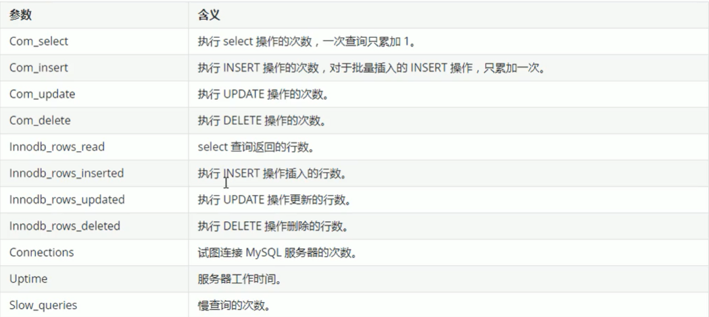
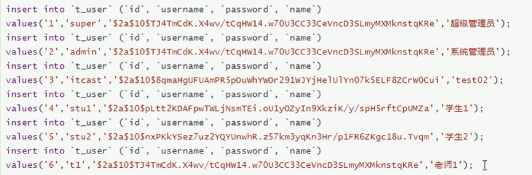
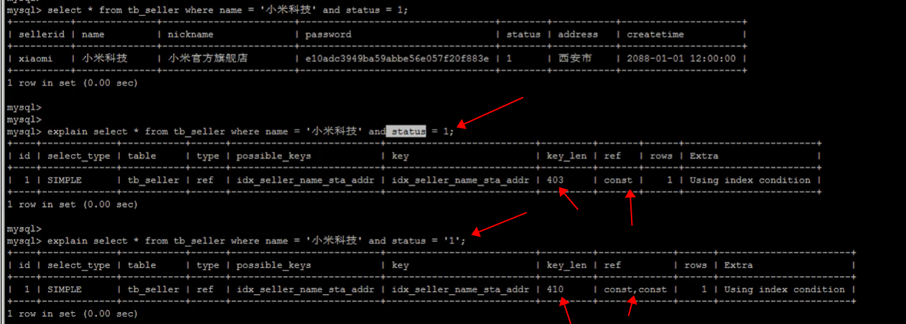
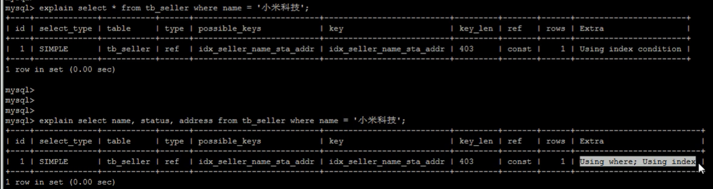
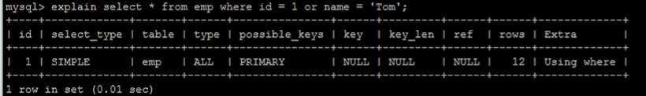

# 1、MySQL的体系结构概览


整个MySQL由以下组成

- Connection Pool：连接池组件
- Management Services & Utilities：管理服务和工具组件
- SQL Interface：SQL接口组件
- Parser：查询分析器组件
- Optimizer：优化器组件
- Cache & Buffers：缓冲池组件
- Pluggable Storage Engines：存储引擎
- File System：文件系统


与其他数据库相比，MySQL有点与众不同，它的架构可以在多种不同场景中应用并发挥良好的性能。主要体现在存储引擎上，插件式的存储引擎架构，将查询处理和其他的系统任务以及数据的存储提取分离。这种架构可以根据业务的需求和实际需要选择适合的存储引擎


## 1.1、连接层

最上层是一些客户端和链接服务，包含本地sock通信和大多数基于客户端/服务端工具实现的类似于TCP/IP的通信。主要完成一些类似于连接处理、授权认证、及相关的安全方案。在该层上引入线程池的概念，为通过认证安全的接入的客户端提供线程。同样在该层上可以实现基于SSL的安全链接。服务器也会为安全接入的每个客户端验证它所具有的操作权限


## 1.2、服务层

第二层架构主要完成大多数的核心服务功能，如SQL接口，并完成缓存的查询，SQL的优化和分析，部分内置函数的执行。所有跨存储引擎的功能也在这一层实现，如 过程、函数等。在该层，服务器会解析查询并创建相应的内部解析树，并对其完成相应的优化如确定表的查询顺序，是否利用索引等，最后生成相应的执行操作，如果是select语句，服务器还会查询内部的缓存，如果缓存空间足够大，这样在解决大量读操作的环境中能够很好的提升系统的性能


## 1.3、引擎层

存储引擎层，存储引擎真正的负责了MySQL中数据的存储和提取，服务器通过API和存储引擎进行通信，不同的存储引擎具有不同的功能，这样我们可以根据自己的需要，来选取适合的存储引擎


## 1.4、存储层

数据存储层，主要是将数据存储在文件系统之上，并完成与存储引擎的交互


# 2、存储引擎

## 2.1、存储引擎概述

和大多数数据库不同，MySQL中有一个存储引擎的概念，针对不同的存储需求可以选择最优的存储引擎

存储引擎就是存储数据，建立索引，更新查询数据等等技术的实现方式。**存储引擎是基于表的，而不是基于库的**。所以存储引擎也可被称为**表类型**

Oracle，SQL server等数据库只有一种存储引擎，MySQL提供了插件式的存储引擎架构，所以MySQL存在多种存储引擎，可以根据需要使用相应的引擎，或者编写存储引擎

MySQL5.0支持的存储引擎有：InnoDB、MyISAM、BDB、MEMORY、MERGE、EXAMPLE、NDB Cluster、ARCHIVE、CSV、BLACKHOLE、FEDERATED等，其中InnoDB和BDB提供事务安全表，其他存储引擎是非事务安全表

可以通过 show engines，来查询当前数据库支持的存储引擎


创建表时如果不指定存储引擎，那么系统就会使用默认的存储引擎，MySQL5.5之前默认使用的是MyISAM，5.5之后就改为InnoDB

查看MySQL数据库默认的存储引擎，可以使用 show variables like '%storage_engine%';


## 2.2、各种存储引擎特性

下面重点介绍几种常用的存储引擎，并对比各个存储引擎之间的区别


### 2.2.1、InnoDB

InnoDB存储引擎是MySQL的默认存储引擎。InnoDB存储引擎提供了具有提交、回滚、崩溃恢复能力的事务安全。但是对比MyISAM的存储引擎，InnoDB写的处理效率会低一些，并且会占用更多的磁盘空间以保留数据和索引

InnoDB的存储引擎不同于其他存储引擎的特点

**事务控制**

```mysql
CREATE TABLE goods_innodb(
  id INT NOT NULL auto_increment,
  name VARCHAR(20) NOT NULL,
  PRIMARY KEY(id)
)ENGINE=innodb DEFAULT charset=utf8
```

```mysql
mysql> start transaction;
Query OK, 0 rows affected (0.00 sec)

mysql> insert into goods_innodb(id,name) values(null,'bbbb');
Query OK, 1 row affected (0.00 sec)

mysql> commit;
Query OK, 0 rows affected (0.00 sec)
```

在上面，首先通过 start transaction; 开启一个事务，后面可以执行多个sql，但是这个事务还是处于未提交的状态，如果此时要进行提交的话，还需要执行 commit 才能将当前的这条事务进行提交操作（此时其他的客户端上来才能看到真实的数据）


**外键约束**

MySQL支持外键的存储引擎只有InnoDB，在创建外键的时候，要求父表必须有对应的索引，子表在创建外键的时候，也会自动的创建对应的索引

下面两张表中，country_innodb是父表，country_id为主键索引，city_innodb表是子表，country_id字段是外键，对应于country_innodb表的主键country_id

```mysql
CREATE TABLE country_innodb(
  country_id INT NOT NULL auto_increment,
  country_name VARCHAR(20) NOT NULL,
  PRIMARY KEY(country_id)
)ENGINE=innodb DEFAULT charset=utf8;

CREATE TABLE city_innodb(
  city_id INT NOT NULL auto_increment,
  city_name VARCHAR(20) NOT NULL,
  country_id INT NOT NULL,
  PRIMARY KEY(city_id),
  key idx_fk_country_id(country_id),
  CONSTRAINT `fk_city_country` FOREIGN KEY(country_id) REFERENCES country_innodb(country_id) ON DELETE RESTRICT ON UPDATE CASCADE
)ENGINE=innodb DEFAULT charset=utf8;
```

在上面的SQL中，需要进行注意的内容如下：

***ON DELETE RESTRICT：删除主表数据时，如果有关联记录，不删除***

***ON UPDATE CASCADE：更新主表时，如果子表有关联记录，更新子表记录***

在创建索引时，可以指定在删除、更新父表时，对子表进行的相应操作，包括 RESTRICT、CASCADE、SET NULL 和 NO ACTION

RESTRICT 和 NO ACTION 相同，是指限制在子表的有关联记录的情况下，父表不能更新

CASCADE表示父表在更新或删除时，更新或删除子表对应的记录

针对上面的创建的两个表，子表的外键指定的是 ON DELETE RESTRICT ON UPDATE CASCADE 方式的，那么主表删除记录的时候，如果子表有对应记录，则不进行删除，主表在更新记录的时候，如果子表有相关的记录，则子表对应更新


可以看到，此时删除主表中间的相关信息时候，直接会进行报错


**存储方式**

InnoDB存储表和索引有以下方式：

1、使用共享表空间存储，这种方式创建的表的表结构保存在.frm文件中，数据和索引保存在 innodb_data_home_dir 和 innodb_data_file_path 定义的空间中，可以是多个文件

2、定义多表空间存储，这种方式创建的表的表结构仍然存在.frm文件中，但是每个表的数据和索引单独保存在 .idb 中


### 2.2.2、MyISAM

MyISAM不支持事务、也不支持外键，其优势是访问速度快，对事务的完整性没有要求或者以select、insert为主的应用基本上都可以使用这个引擎来创建表，有以下两个比较重要的点：

**不支持事务**

```mysql
CREATE TABLE goods_myisam(
  id INT NOT NULL auto_increment,
  name VARCHAR(20) NOT NULL,
  PRIMARY KEY(id)
)ENGINE=myisam DEFAULT charset=utf8;
```


通过测试，在MyISAM存储引擎中，是没有事务控制的


**文件存储方式**

每个MyISAM在磁盘上存储成3个文件，其文件名和表名相同，但拓展名分别是：

.frm（存储表定义）

.MYD（MYData，存储数据）

.MYI（MYIndex，存储引擎）


### 2.2.3、MEMORY

Memory存储引擎将表的数据存放在内存中，每个Memory表实际对应一个磁盘文件，格式是.frm，该文件中只存储表的结构，而其数据文件，都是存储在内存中，这样有利于数据的快速处理，提高整个表的效率，Memory类型的表访问非常的块，因为它的数据都是存放在内存中的，并且默认是HASH索引，但是服务一旦关闭，表中的数据就会丢失


### 2.2.4、MERGE

MERGE存储引擎是一组MyISAM表的组合，这些MyISAM表必须结构完全相同，MERGE表本身并没有存储数据，对MERGE类型的表可以进行查询、更新、删除操作，这些操作实际上是对内部的MyISAM表进行的

对于MERGE类型表的插入操作，是通过 INSERT_METHOD 子句定义插入的表，可以有3个不同的值，使用FIRST和LAST值使得插入操作被相应的作用在第一或者最后一个表上，不定义这个子句或者定义为NO，表示不能对这个MERGE表执行插入操作


## 2.3、存储引擎的选择

在选择存储引擎的时候，应该根据应用系统的特点选择合适的存储引擎。对于复杂的应用系统，还可以根据实际情况选择多种存储引擎进行组合，以下是几种常用的存储引擎的使用环境

- InnoDB：是MySQL的默认存储引擎，用于事务处理应用程序，支持外键。如果应用对事务的完整性有比较高的要求，在并发条件下要求数据的一致性，数据操作除了插入和查询外，还包含很多的更新、删除操作，那么InnoDB存储引擎是比较合适的选择，InnoDB存储引擎除了有效的降低由于删除和更新导致的锁定，还可以确保事务的完整提交和回滚，对于类似与计费系统或者财务系统等对数据正确性要求比较高的系统，InnoDB是最适合的选择
- MyISAM：如果应用是以读操作和插入操作为主，只有很少的更新和删除操作，并且对事务的完整性、并发性要求不是很高，那么选择这个存储引擎是非常适合的


# 3、优化SQL步骤

在应用的开发过程中，由于初期数据量小，开发人员写SQL语句时更重视功能上的实现，但是当应用系统上线后，随着生产数据量的急剧增长，很多SQL语句开始逐渐显露出性能问题，对生产的影响也越来越大，此时这个问题的SQL就成为整个系统的瓶颈，因此我们必须要对它们进行优化，

## 3.1、查看sql的执行频率

MySQL客户端连接成功后，通过 show [session|global] status 命令可以提供服务器状态信息，通过这个命令，可以看到当前数据库提供的服务的状态信息


如果要查询是InnoDB表的状态，可以使用 show global status like 'Innodb_rows_%'; 进行查询


我们通常比较关系以下参数




## 3.2、定位低效率执行SQL

可以通过以下两种方式定位执行效率较低的sql语句

- 慢查询日志：通过慢查询日志定位那些执行效率较低的SQL语句，用 --log-slow-queries[=file_name] 选项启动时，mysqld写一个包含所有执行执行超过 long_query_time 秒的SQL语句的日志文件
- show processlist：慢查询日志在查询结束之后才有记录，所以在应用反应执行效率出现问题的时候查询慢查询日志不一定能定位问题，可以通过 show processlist命令查看当前MySQL在进行的进程，包括线程的状态、是否锁表等，可以实时的查看SQL的执行情况，同时对一些锁表操作进行优化


```tex
1）id列：用户登录MySQL时，系统分配的“connection id”，可以使用函数connection_id()查看自己的id
2）user列：显示当前用户，如果不是root，这个命令就只能显示用户权限范围的sql语句
3）host列：显示这个语句是从哪个IP的哪个端口发起的，可以用来追踪出现问题的用户
4）db列：显示这个进程目前连接的是哪个数据库
5）command列：显示当前连接执行的命令，一般取值为休眠（sleep）、查询（query）、连接（connect）等
6）time列：显示这个状态持续的时间，单位是秒
7）state列：显示使用当前连接的sql语句的状态，很重要的列，state描述的是语句执行中的某一个状态，一个sql语句，已查询为主，可能需要经过copying to tmp table、sorting result、sending data等操作才能完成
8）info列，显示这条sql语句，是判断问题语句的一个重要依据
```


## 3.3、explain分析执行计划

通过以上步骤查询到效率低的sql语句之后，可以通过explain或者desc命令获取mysql如何执行select语句的信息，包括在select语句执行过程中表如何连接和连接的顺序

查询SQL语句的执行计划


### 3.3.1、环境准备


创建第一张表


创建第二张表


创建第三张表


开始插入数据




查看表数据


### 3.3.2、explain 之 id

id字段是select查询的序列号，是一组数字，表示是查询中执行select子句或者操作表的顺序，id的情况有三种

1）id相同表示加载表的顺序是从上到下


2）id不同id值越大，优先级越高，越先被执行


3）id有相同，也有不同，同时存在，id相同的可以认为是一组，从上往下顺序执行；在所有的组中，id的值越大，优先级越高，越先执行


### 3.3.3、explain 之 select_type

表示select的类型，常见的取值，如下表所示


上面的几种类型中，从上到下，效率是越来越慢的


### 3.3.4、explain 之 table

展示这一行的数据是关于哪张表的


### 3.3.5、explain 之 type

type显示的是访问类型，是较为重要的一个指标，可取值为


### 3.3.6、explain 之 key

```tex
possible_keys：显示可能应用在这张表的索引，一个或多个
key：实际使用的索引，如果为NULL，则没有使用索引
key_len：表示索引中使用的字节数，该值为索引字段最大可能长度，并非实际使用长度，在不损失精确性的前提下，长度越短越好
```


### 3.3.7、explain 之 rows

在查询的时候，扫描的行数


### 3.3.8、explain 之 Extra

其他的额外的执行计划信息，在该列展示


如果出现了前面两个，则是可以进行优化的，如果出现了第三个，则是需要进行保持的

在出现 using filesort 的时候，基本就是使用了 order by 字段名，但是这里的字段并不是一个索引，这样就会出现文件排序，这样的效率是很低的，是需要进行优化的，例如我们可以为这个字段建立索引

在出现 using temporary 的时候，基本就是使用了 group by 字段名，但是这个字段并不是一个索引，这样就会出现


## 3.4、show profile 分析SQL

MySQL在5.0.37版本开始增加了对 show profile 和 show profile 。show profile 能够在做SQL优化时帮助我们了解时间耗费都去哪儿了

通过 have_profiling 参数，能够看到当前MySQL是否支持profile


通过上面可以看到，MySQL支持profile，但是默认情况下，是关闭的状态；通过 set profiling = 1; 就能够开启profile


通过执行上面的这个命令，就能够获取一段时间里面不同的SQL执行的耗时

如果要想查看到 Query_ID 为5对应的SQL执行的耗时情况，可以使用 show profile for query 5; 来进行获取


通过上面可以看到，耗时最长的就是 Sending data 阶段，这里需要说明下，这里的 Sending data 状态表示MySQL线程开始访问数据并把结果返回客户端这段过程，而不仅仅是返回结果给客户端的过程，由于在 Sending data 状态下，MySQL线程往往需要做大量的磁盘读取操作，所以经常是整个查询中耗时最长的状态

在获取到最耗时间的线程状态后，MySQL支持进一步选择all、cpu、block io、context switch、page faults等明细类型类查看MySQL在使用什么资源上耗费了过高的时间，例如：选择查看cpu的耗费时间


## 3.5、trace 分析优化器执行计划

MySQL5.6提供了对SQL的跟踪trace，通过trace文件能够进一步了解为什么优化器选择A计划，而不是选择B计划

打开trace，设置格式为json，并设置trace最大能够使用的内存大小，避免解析过程中因为默认内存过小而不能够完整显示

```mysql
set optimizer_trace="enabled=on",end_markers_in_json=on;  # 开启trace，并设置格式为json
set optimizer_trace_max_mem_size=1000000;  # 设定trace最大能够使用的内存大小
```

此时就能够正常的执行SQL语句了，以下面的为例


完成上面的内容之后，就能够来看trace的内容了

```mysql
select * from information_schema.optimizer_trace\G;
```


 

# 4、索引的使用

索引是数据库优化最常用也是最重要的手段之一，通过索引通常可以帮助用户解决大多数的MySQL的性能优化问题

## 4.1、验证索引提升查询效率

这里有一个tb_item表，中间存有300万条数据

**A、根据ID查询**


可以看到，查询的速度很快，接近0s，主要的原因是因为id为主键，有索引，对于我们要进行查询的对象，如果想要提升查询的效率，可以使用添加索引的方式


## 4.2、索引的使用

### 4.2.1、环境准备

首先创建这样的一张表的环境


有了这个表之后，还需要为这个表创建索引


可以看到，这里创建的是联合索引


### 4.2.2、避免索引失效

**1）全值匹配，对索引的所有列都指定具体值**


通过上面的explain命令就能够看到，这里的查询就用到了索引，也可以看到扫描的行数只有1行，这样的情况下，检索的时间就会非常的短了


**2）最左前缀法则**

如果索引了多列，要遵守最左前缀法则。指的是查询从索引的最左前列开始，并且不跳过索引中的列

匹配最左前缀法则，走索引：


可以看到，以上两种查询方式都是走了索引，都非常的快

如果此时并没有将最左边的name加入检索的范围，如下


此时可以看到，这条查询语句并没有走索引，这样效率就会相对较低

这里需要注意一点，这里的最左前缀法则并不对where后面字段的先后顺序有要求，如下


可以看到，此时将name放在了where的最后面，但是查询的时候依然是走了索引的

下面还有最后一种情况，这样的情况下也是存在有问题的


这里貌似看起来是走了索引的，但是这里需要注意，它走的索引仅仅是name这个字段的索引，因为这里跳跃了一个status的索引，索引没有办法获取到address的索引


**3）范围查询右边的列，不能使用索引**


**4）不要再索引上进行运算操作，否则索引将失效**


可以看到，name字段本身是有索引的，但是如果这里对name字段进行取子串的操作，此时索引就不存在了


**5）字符串不加单引号，索引将失效**



在上面的例子中，status定义的是一个字符串的类型，虽说平时进行检索的时候，如果不加上单引号，貌似也是能够进行查询的，但是这样的结果就是没有了对应字段的索引（底层对字段进行了计算操作，索引消失），此时我们加上单引号，可以看到，执行的过程中就有了对应的的索引了


**6）尽量使用覆盖索引，避免使用select \* **

尽量使用覆盖索引（只访问索引的查询（索引列完全包含索引列）），减少 select *



在上面的查询中间，可以看到最后的 Extra ，第一个结果是 Using index condition，在上面的语句中虽然使用到了索引name字段，但是查询的内容中并没有其他字段的信息，所以获取到name='小米科技' 之后，还需要进行一个回调查询；但是在第二种查询中，查询的对象是 name,status,address ，这三个字段都是在索引中间的，所以并不需要进行回调查询


**7）用 or 分隔开的条件，如果 or 前的条件中的列有索引，而后面的列中没有索引，那么涉及的索引都不会被用到**

示例：name字段是索引，而nickname不是索引列，中间是or进行连接是不走索引的


**8）以%开头的like模糊查询，索引失效**

如果仅仅是尾部模糊匹配，索引不会失效。如果是头部模糊匹配，索引失效


上面的第三种查询其实在我们工作中还是会遇到很多的，这个时候其实可以使用覆盖查询解决这个问题


如上图，查询的时候不要使用 \* 来进行查询，而用表的索引来进行查询，这样索引就不会失效了


**9）如果MySQL评估使用索引比全表更慢，则不使用索引**


在上面两个SQL语句中，可以看到，相同的两个SQL，当更换了address的条件，一条SQL走了索引，另外一条SQL就没有走索引


**10）IS NULL , IS NOT NULL 有时索引失效**


**11）in 走索引，not in 索引失效**


这个例子其实在我们写SQL的时候一样，尽量使用in，尽量不要使用not in


**12）单列索引和复合索引**

尽量使用复合索引，而少使用单列索引

创建复合索引

```mysql
CREATE 	INDEX idx_name_sta_address ON tb_seller(name,status,address)

就相当于创建了三个索引：
    name
    name + status
    name + status + address
```


创建单列索引

```mysql
CREATE INDEX idx_seller_name ON tb_seller(name)
CREATE INDEX idx_seller_status ON tb_seller(status)
CREATE INDEX idx_seller_address ON tb_seller(address)
```

数据库会选择一个最优的索引（辨识度最高索引）来使用，并不会使用全部索引


## 4.3、查看索引使用情况

```mysql
show status like 'Handler_read%'
show global status like 'Handler_read%'
```


# 5、SQL 优化

## 5.1、大批量插入数据

对于InnoDB类型的表，有以下几种方式可以提高导入的效率

**1）主键顺序插入**

因为InnoDB类型的表是按照主键的顺序保存的，所以将导入的数据按照主键的顺序排列，可以有效的提高导入数据的效率。如果InnoDB表没有主键，那么系统会自动默认创建一个内部列作为主键，所以如果可以给表创建一个主键，将可以利用这点，来提高导入数据的效率


可以看到，这里的sql1.log中的数据是有序的


上面这里使用load方式将数据进行导入，耗时是19.37秒

下面将sql2.log的数据进行导入，这个文件中的数据是无序的，下面看下导入的时间情况


可以看到，导入的时间明显比上面的时间长，用了1分51.42秒


**2）关闭唯一性校验**

在导入数据前执行 set unique_checks = 0，关闭唯一性校验，在导入之后执行 set unique_checks = 1，恢复唯一性校验，可以提高导入的效率


**3）手动提交事务**

如果应用使用自动提交的方式，建议在都如前执行 set autocommit = 0，关闭自动提交，导入结束后再执行 set autocommit = 1，打开自动提交，也可以提高导入效率


## 5.2、优化 insert 语句

当进行数据的insert操作的时候，可以考虑用以下几个优化方案

- 如果需要同时对一张表插入很多行数据时，应该尽量使用多个值表的insert语句，这种方式将大大的缩减客户端与服务器之间的连接，关闭等消耗，使得效率比分开执行的单个insert语句快


- 在事务中进行数据插入


- 数据有序插入


## 5.3、order by 语句的优化

### 5.3.1、两种排序方式

1）第一种是通过对返回数据进行排序，也就是通常说的 filesort排序，所有不是通过索引直接返回排序结构的排序都叫 filesort 排序


2）第二种通过有序索引顺序扫描直接返回有序数据，这种情况即为 using index，不需要额外排序，操作效率高


多字段排序


在上面的例子中可以看到，在使用多字段排序的时候，多个字段要么都是升序，要么都是降序，最好不要有一个升序一个降序的

同时，在使用多字段排序的时候，字段的先后顺序应该和定义索引的先后顺序保持一致


了解了MySQL的排序方式，优化目标就清晰了；尽量减少额外的排序，通过索引直接返回有序数据。where条件和order by 使用相同的索引，并且order by 的顺序和顺序顺序相同，并且order by 的字段都是升序，或者都为降序。否则需要额外的操作，这样就出现了 FileSort


### 5.3.2、FileSort 的优化

通过创建适合的索引，能够减少FileSort的出现，但是在某些情况下，条件限制不能让FileSort消失，那就需要加快FileSort的排序操作，对于FileSort，MySQL有两种排序算法

1、两次扫描算法：MySQL 4.1之前，使用该方式排序，首先根据条件取出排序字段和指针信息，然后在排序区 sort buffer 中排序，如果 sort buffer 不够，则在临时表 temporary table 中存储排序结果，完成排序之后，再根据指针回表读取记录，该操作可能会导致大量随机I/O操作

2、一次扫描算法：一次性读取所有满足条件的所有字段，然后再排序区 sort buffer 中排序后直接输出排序集。排序时内存消耗较大，但是排序效率比两次扫描算法高

MySQL通过比较系统变量 max_length_for_sort_data 的大小和Query语句取出的字段总大小，来判定使用哪种算法，如果max_length_sort_data 更大，那么使用第二种优化之后的算法，否则用第一种

可以适当的提高 sort_buffer_size 和 max_length_for_sort_data 系统变量，来增加排序区的大小，提高排序的效率


## 5.4、优化 group by 语句

由于 group by 实际上也同样会进行排序操作，而且与 order by 相比，group by 主要只是多了排序之后的分组操作。当然，如果再分组的时候还使用了其他的一些聚合函数，那么还需要一些聚合函数的计算，所以，在 group by 的实现过程中，与 order by 一样也可以利用到索引

如果查询包含 group by 但是用户想要避免排序结果的消耗，则可以执行order by null 禁止排序，如下


可以看到Extra中的内容，使用的两种方式都是比较耗时的

如果仅仅只是想进行分组，并不需要进行排序的话，则可以采用如下的方式


可以看到，此时就没有 using filesort 的排序操作了

但是此时的效率还是不够好，此时为 group by 后面的内容添加索引效果就会好很多


如上，添加了一个联合索引，此时再进行检索的时候，Extra中间的内容就是 Using index 了


## 5.5、子查询优化

MySQL4.1版本之后，开始支持SQL的子查询。这个技术可以使用SELECT语句来创建一个单列的查询结果，然后把这个结果作为过滤条件用到另一个查询中，使用子查询可以一次性的完成很多逻辑上需要多个步骤才能完成的SQL操作，同时也可以避免事务或者表锁死，并且写起来也很容易，但是，有些情况下，子查询是可以被高效的连接（JOIN）替代


在上面这样的查询中，其实可以改为联表查询


## 5.6、优化 or 条件

对于包含OR的查询子句，如果要利用索引，则OR之间的每个条件都必须用到索引，而且**不能使用到复合索引**；如果没有索引，则应该考虑加上索引



在上面的查询中，可以看到，id为主键是存在索引的，但是name字段是没有索引的，之间使用or进行连接之后，查询的时候就没有索引了

下面来看下复合索引的情况


这里的age和salary是建立了复合索引的，但是可以看到，这里使用or进行连接的时候，是没有索引的

其实or并不是最好的方式，更多的时候，我们是推荐使用union来替代or的


## 5.7、优化分页查询

一般分页查询时，通过创建覆盖索引能够比较好的提高性能，一个常见有非常头疼的问题就是 limit 2000000,10，此时需要MySQL排序前2000010记录，仅仅返回 2000000-2000010 的记录，其他的查询丢弃，查询排序的代价非常大

这里注意：在进行分页查询的时候，也是会对数据进行排序的，这样导致的结果就是越到后面的查询，查询的效率就会越来越低


我们可以看下这个查询的过程


### 5.7.1、优化思路一

在索引上完成排序分页的操作，最后根据主键关联回原表查询所需要的其他列内容


此时来看下查询的过程


可以看到，使用这样的方式查询的时候，使用到了索引，这样的查询效率是要优于前面的那种方式的


### 5.7.2、优化思路二

该方案适用于主键自增的列，可以把Limit查询转换为某个位置位置的查询


如上，我们这里将之前的写法改了以下，查询效率就高出了非常多


## 5.8、使用SQL提示

SQL提示，是优化数据库的一个重要手段，简单来说，就是在SQL语句中加入一些人为的提示来达到优化操作的目的

### 5.8.1、use index

在查询语句中表名的后面，添加 use index 来提供希望MySQL取参考的索引列表，就可以让MySQL不再考虑其他可用的索引


### 5.8.2、ignore index

如果用户只是单纯的想让MySQL忽略一个或者多个索引，则可以使用ignore index 


​	

### 5.8.3、force index

为强制MySQL使用一个特定的索引，可以在查询中使用 force index 


