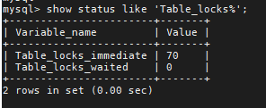
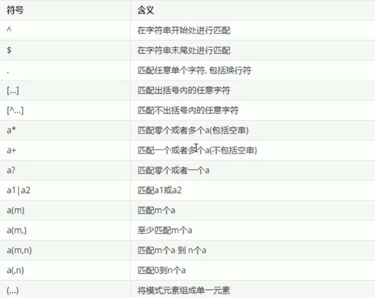

# 1、应用优化

前面章节中，介绍了很多数据库的优化措施。但是在实际的生产环境中，由于数据库本身的性能局限，就必须要对前台的应用进行一些优化，来降低数据库的访问压力

## 1.1、使用连接池

对于访问数据库来说，建立连接的代价是非常昂贵的，因为我们频繁的创建关闭连接，是比较耗费资源的，我们有必要建立数据库连接池，以提高访问的性能


## 1.2、减少对MySQL的访问

### 1.2.1、避免对数据进行重复索引

在编写代码时，需要能够理清对数据库的逻辑访问，能够一次连接就获取到结果的，就不要两次连接，这样可以大大减少对数据库无用的重复请求


### 1.2.2、增加cache层

在应用中，我们可以在应用中增加 缓存 层来达到减轻数据库负担的目的。缓存层有很多种，也有很多的实现方式，只要能够达到降低数据库的负担又能满足应用需求就可以

因此可以部分数据从数据库中抽取出来放到应用端以文本方式存储，或者使用框架（Mybatis，Hibernate）提供一级/二级缓存，或者使用redis数据库来缓存数据


## 1.3、负载均衡

负载均衡是应用中使用非常普遍的一种优化方式，它的机制就是利用某种均衡算法，将固定的负载量分不到不同的服务器上，以此来降低单台服务器的负载，达到优化的效果

### 1.3.1、利用MySQL复制分流查询

通过MySQL的主从复制，实现读写分离，使增删改操作走主节点、查询操作走从节点，从而可以降低单台服务器的读写压力


### 1.3.2、采用分布式数据库架构

分布式数据库架构适合大数据量、负载高的情况，它有良好的拓展性和高可用性，通过在多台服务器之间分布数据，可以实现多台服务器之间的负载均衡，提高访问效率


# 2、MySQL中查询缓存优化

## 2.1、概述

开启MySQL的查询缓存，当执行完全相同的SQL语句的时候，服务器就会直接从缓存中读取结果，当数据被修改，之前的缓存就失效，修改比较频繁的表不适合做查询缓存


## 2.2、操作流程


1、客户端发起一条查询给服务器

2、服务器先会检查查询缓存，如果命中了缓存，则立即返回存储在缓存中的结果，否则进入到写一个阶段

3、服务器进行SQL解析、预处理，再由优化器生成对应的执行计划

4、MySQL会根据优化器生成的执行计划，调用存储引擎的api来执行查询

5、将结果返回给客户端


## 2.3、查询缓存配置

1、查看当前的MySQL数据库是否支持查询缓存

```mysql
show variables like 'have_query_cache';
```


2、查看当前MySQL是否开启了查询缓存

```mysql
show variables like 'query_cache_type';
```


3、查看查询缓存的占用大小，单位是字节

```mysql
show variables like 'query_cache_size';
```


4、查看查询缓存的的状态变量

```mysql
show status like 'Qcache%';
```


对于上面的变量，含义如下


## 2.4、开启查询缓存

MySQL的查询缓存默认是关闭的，需要手动配置参数 query_cache_type 来开启查询缓存，query_cache_type 该参数的可能值有三个


在/usr/my.cnf配置中，增加以下配置


配置完毕后，重启服务即可生效

此时通过SQL语句来进行检测，如下


可以看到，第一次查询的时候还是执行了真实的查询的，第二次查询的时候，就直接读的缓存的结果了


## 2.5、查询缓存的 select 选项

可以在select语句中指定两个与查询缓存相关的选项

SQL_CACHE：如果查询结果是可缓存的，并且 query_cache_type 系统变量的值为 ON 或 DEMAND，则缓存查询结果

SQL_NO_CACHE：服务器不使用查询缓存，它既不检查查询缓存，也不检查结果是否已缓存，也不缓存查询结果

```mysql
SELECT SQL_CACHE id,name FROM customer;
SELECT SQL_NO_CACHE id,name FROM customer;
```


## 2.6、查询缓存失败的情况

1）SQL语句不一致的情况，想要命中查询缓存，查询的SQL语句必须一致

```mysql
SQL1: SELECT COUNT(*) FROM tb_item;
SQL2: select COUNT(*) FROM tb_item;
```

上面两个SQL看起来是一样的，其实不一样，存在有大小写的差别

2）当查询语句中使用一些不确定的函数时，则不会缓存

```mysql
SQL1: select * from tb_item where updatetime < now() limit 1;
SQL2: select user();
SQL3: select database();
```

3）不适用任何表查询语句

```mysql
select 'a';
```

4）查询mysql、information_schema或performance_schema数据库表时，不会走查询缓存

```mysql
select * from information_schema.engines;
```

5）在存储的函数，触发器或事件的主体内执行的查询

6）如果表更改


# 3、MySQL 内存管理及优化

## 3.1、内存优化规则

1、将尽量多的内存分配给MySQL做缓存，但是给操作系统和其他程序预留足够内存

2、MyISAM存储引擎的数据文件读取依赖于操作系统自身的IO缓存，因此，如果有MyISAM表，就要预留更多的内存给操作系统做IO缓存

3、排序区、连接区等缓存是分配给每个数据库会话（session）专用的，其默认值的设置要根据最大连接数合理分配，如果设置太大，不但浪费资源，并且在并发连接较高时会导致物理内存耗尽


## 3.2、MyISAM 内存优化

MyISAM存储引擎使用 key_buffer 缓存索引块，加速 MyISAM索引的读写速度，对于MyISAM表的数据块，MySQL没有特别的缓存机制，完全依赖于操作系统的IO缓存


**key_buffer_size**

key_buffer_size 决定 MyISAM 索引缓存区的大小，直接影响到 MyISAM 表的存取效率，可以在MySQL 参数文件中设置 key_buffer_size 的值，对于一般 MyISAM 数据库，建议至少将 1/4 可用内存分配给 key_buffer_size

在 /usr/my.cnf 中做如下配置

```mysql
key_buffer_size = 512M
```

 

**read_buffer_size**

如果需要经常顺序扫描MyISAM表，可以通过增大read_buffer_size的值来改善性能，但需要注意的是read_buffer_size是每个session独占的，如果默认值设置太大，就会造成内存浪费


**read_rnd_buffer_size**

对于需要做排序的MyISAM表的查询，如带有 order by 子句的sql，适当增加 read_rnd_buffer_size 的值，可以改善此类的sql性能，但需要注意的是 read_rnd_buffer_size 是每个 session 独占的，如果默认值设置太大，就会造成内存浪费


## 3.3、InnoDB 内存优化

InnoDB用一块内存区做IO缓存池，该缓存池不仅用来缓存InnoDB的索引块，而且也用来缓存InnoDB的数据块


**innodb_buffer_pool_size**

该变量决定了innodb存储引擎表数据和索引数据的最大缓存区大小。在保证操作系统及其他程序有足够内存可用的情况下，innodb_buffer_pool_size 的值越大，缓存命中率越高，访问 innodb 表需要的磁盘IO就越小，性能也就越高

```mysql
innodb_buffer_pool_size = 512M
```


**innodb_log_buffer_size**

决定了innodb重做日志缓存的大小，对于可能产生大量更新记录的大事务，增加 innodb_log_buffer_size 的大小，可以避免 innodb 在事务提交前就执行不必要的日志写入磁盘操作

```mysql
innodb_log_buffer_size = 10M
```


# 4、MySQL 并发参数调整

在实现上来说，MySQL Server 是多线程结构，包括后台线程和客户服务线程。多线程可以有效利用服务器资源，提高数据库的并发性能，在MySQL中控制并发连接和线程的主要参数包括 max_connections 、back_log、thread_cache_size、table_open_cache

## 4.1、max_connections

采用 max_connections 控制允许连接到MySQL数据库的最大数量，默认值是151。如果状态变量 connection_errors_max_connections 不为零，并且一直增长，则说明不断有连接请求因数据库连接数已达到允许最大值而失败，这是可以考虑增大 max_connections 的值

MySQL最大支持的连接数，取决于很多因素，包括给定操作系统平台的线程库的质量、内存大小、每个连接的负荷、cpu的处理速度，期望的响应时间等。在Linux平台下，性能好的服务器，支持500-1000个连接不是难事，需要根据服务器的性能进行评估


## 4.2、back_log

back_log 参数控制MySQL监听tcp端口时设置的积压请求栈的大小，如果MySQL的连接数达到 max_connections 时，新来的请求将会被存在堆栈中，以等待某一连接释放资源，该堆栈的数量即为back_log，如果等待连接的数量超过back_log，将不被授予连接资源，将会报错，5.6.6版本之前默认值为50，之后的版本默认为50 + (max_connections / 5)，但最大不能超过900

如果需要数据库在较短时间内处理大量连接请求，可以考虑适当增大back_log的值


## 4.3、table_open_cache

该参数用来控制所有SQL语句执行线程可打开表缓存的数量，而在执行SQL语句时，每一个SQL执行线程至少要打开1个表缓存，该参数的值应该根据设置的最大连接数 max_connections 以及每个连接执行关联查询中涉及的表的最大数量来定


## 4.4、thread_cache_size

为了加快连接数据库的速度，MySQL会缓存一定数量的客户服务线程已备重用，通过参数 thread_cache_size 可控制MySQL缓存客户服务线程的数量


## 4.5、innodb_lock_wait_timeout

该参数是用来设置InnoDB事务等待行锁的时间，默认值是50ms，可以根据需要进行动态设置。对于需要快速反馈的业务系统来说，可以将行锁的等待时间调小，以避免事务长时间挂起；对于后台运行的批量处理程序来说，可以将行锁的等待时间调大，以避免发生大的回滚操作


# 5、MySQL 锁问题

## 5.1、锁概述

锁是计算机协调多个进程或线程并发访问某一资源的机制（避免争抢）

在数据库中，除传统的计算资源（如cpu、ram、i/o等）的争用外，数据也是一种供许多用户共享的资源。如何保证数据并发访问的一致性、有效性是所有数据库必须解决的一个问题，锁冲突也是影响数据库并发访问性能的一个重要因素。从这个角度来说，锁对数据库而言显得尤其重要，也更加复杂

在数据库中，除传统的计算资源（如cpu、ram、i/o等）的争用外，数据也是一种供许多用户共享的资源。如何保证数据并发访问的一致性、有效性是所有数据库必须解决的一个问题，锁冲突也是影响数据库并发访问性能的一个重要因素。从这个角度来说，锁对数据库而言显得尤其重要，也更加复杂


## 5.2、锁分类

从对数据操作的粒度分：

1、表锁：操作时，会锁定整个表

2、行锁：操作时，会锁定当前操作行

从对数据操作的类型分：

1、读锁（共享锁）：针对同一份数据，多个读操作可以同时进行而不互相影响

2、写锁（排他锁）：当前操作没有完成之前，它会阻断其他写锁和读锁


## 5.3、MySQL 锁

相对于其他数据库而言，MySQL的锁机制比较简单，其最显著的特点是不同的存储引擎支持不同的锁机制


MySQL这3中锁的特性可大致归纳如下：


从上述特点可见，很难笼统的说哪个锁更好，只能就具体应用的特点来说哪种锁更合适！仅从锁的角度来说：表级锁更适合于查询为主，只有少量按索引条件更新数据的应用，如web应用；而行级锁则更适合有大量按索引条件并发更新少量不同数据，同时又有并查询的应用，如一些在线事务处理（OLTP）系统


## 5.4、MyISAM 表锁

MyISAM存储引擎只支持表锁，这也是MySQL开始几个版本中唯一支持的锁类型

### 5.4.1、如何加表锁

MyISAM在执行查询语句（select）前，会自动给涉及的所有表加读锁，在执行更新操作（update、delete、insert等）前，会自动给涉及的表加写锁，这个过程并不需要用户干预，因此，用户一般不需要直接用到 lock table 命令给MyISAM表显式加锁

```mysql
加读锁：lock table table_name read;
加写锁：lock table table_name write;

解锁：unlock tables
```


### 5.4.2、读锁案例

**准备环境**


**读锁演示**


此时需要注意，在客户端1中，已经为 tb_book 表加了读锁，如果此时没有释放这个锁的话，是不能够操作其他的表的


除了上面这种查询其他表的操作不被允许，此时执行 update 也是同样会报错的


### 5.4.3、写锁案例

**写锁演示**


### 5.4.4、结论

锁模式的相互兼容性如表所示


由上表可见：

- 对MyISAM表的读操作，不会阻塞其他用户对同一个表的读请求，但会阻塞对同一个表的写操作
- 对MyISAM表的写操作，则会阻塞其他用户对同一个表的读和写操作

简而言之，就是读锁会阻塞写，但是不会阻塞读。而写锁，既会阻塞读，又会阻塞写

此外，MyISAM的读写锁调度是写优先，这也是MyISAM不适合做写为主的表的存储引擎的原因。因为写锁后，其他线程不能做任何操作，大量的更新会使查询很难得到锁，从而造成永久阻塞


### 5.4.5、查看锁的争用情况

```mysql
show open tables;
```


In_use：表当前被查询使用的次数。如果该数为零，则表是打开的，当时当前没有被使用

Name_locked：表名称是否被锁定，名称锁定用于取消表或对表进行重命名等操作


```mysql
show status like 'Table_locks%';
```



Table_locks_immediate：指的是能够理解获取表级锁的次数，每立即获取锁，值加1

Table_locks_waited：指的是不能立即获取表级锁而需要等待的次数，每等待一次，该值加1，此值高说明存在较为严重的表级锁争抢用的情况


## 5.5、InnoDB 行锁

### 5.5.1、行锁介绍

行锁特点：偏向InnoDB存储引擎，开销大，加锁满；会出现死锁；锁定粒度最小，发生锁冲突的概率最低，并发度也高，InnoDB与MyISAM的最大不同的两点：一是支持事务，二是采用了行级锁


### 5.5.2、背景知识

**事务及其ACID属性**

事务是由一组SQL语句组成的逻辑处理单元

事务具有以下4个特征，简称为ACID属性


**并发事务处理带来的问题**


**事务隔离级别**

为了解决上述提到的事务并发问题，数据库提供一定的事务隔离机制来解决这个问题，数据库的事务隔离越严格，并发副作用越小，但付出的代价也就越大，因为事务隔离实质上就是使用事务在一定程度上“串行化”进行，这显然与“并发”是矛盾的

数据库的隔离级别是4个，由低到高依次为 Read uncommitted、Read committed、Repeatable read、Serializable，这四个级别可以逐个解决脏写、脏读、不可重复读、幻读这几类问题


备注：× 表示不会出现


### 5.5.3、案例准备工作


### 5.5.4、行锁的基本演示


在上面的演示中，首先 set autocommit = 0 （关闭自动提交），这样后面的SQL语句会成为一个事务，直到 commit 命令的执行，可以看到，session-1中间在执行update操作的时候，给该行加锁了，session-2此时执行update的时候会hang住，除非此时session-1执行commit，右边的session-2才能够更新成功

这里需要注意一个小知识点：

```mysql
mysql中set autocommit=0与start transaction区别
set autocommit=0指事务非自动提交，自此句执行以后，每个SQL语句或者语句块所在的事务都需要显示"commit"才能提交事务。

1、不管autocommit 是1还是0 
     START TRANSACTION 后，只有当commit数据才会生效，ROLLBACK后就会回滚。

2、当autocommit 为 0 时
    不管有没有START TRANSACTION。
    只有当commit数据才会生效，ROLLBACK后就会回滚。

3、如果autocommit 为1 ，并且没有START TRANSACTION 。
    调用ROLLBACK是没有用的。即便设置了SAVEPOINT。
```

上面说到，MySQL的InnoDB默认支持的是行锁，哪此时操作的是不同行的内容呢？


可以看到，此时两个事务之间相互不干扰，InnoDB使用的是行锁


### 5.5.5、无索引行锁升级为表锁

如果不通过索引条件检索数据，那么InnoDB将对表中的所有记录加锁，实际效果跟表锁一样


在上面的例子可以看到，操作的并不是同一行的数据，但是确实发生了阻塞的情况，这个其实是索引的问题，其实这里name字段是有单列索引的，但是name的数据类型是varchar类型，但是在执行更新的时候，用的是int，这样name字段的索引就失效了，此时InnoDB会将行锁升级为表锁


### 5.5.6、间隙锁危害

当我们用范围条件，而不是使用相当条件检索数据，并请求共享或排他锁时，InnoDB会给符合条件的已有数据进行加锁；对于键值在条件范围内但并不存在的记录，叫做“间隙（GAP）”，InnoDB也会对这个“间隙”加锁，这种锁机制就是所谓的“间隙锁”（Next-key 锁）


### 5.5.7、InnoDB 行锁争用情况

```mysql
show status like 'innodb_row_lock%';
```


### 5.5.8、总结

InnoDB存储引擎由于实现了行级锁定，虽然在锁定机制的实现方面带来了性能损耗可能比表锁更高一些，但是整体在并发处理能力上方面要远远高于MyISAM表锁的，当系统并发量较高的时候，InnoDB的整体性能和MyISAM相比会有比较明显的优势

但是InnoDB的行级锁同样也有其脆弱的一面，当我们使用不当的时候，可能会让InnoDB的整体性能表现不仅不能比MyISAM高，甚至可能会更差


优化建议：

- 尽可能让所有数据检索都能通过索引来完成，避免无索引行锁升级为表锁
- 合理设计索引，尽量缩小锁的范围
- 尽可能减少索引条件，及索引范围，避免间隙锁
- 尽量控制事务大小，减少锁定资源和时间长度
- 尽可能使用低级别事务隔离（但是需要业务层面满足需求）


# 6、常用 SQL 技巧

## 6.1、SQL 执行顺序

**编写顺序**


**执行顺序**


## 6.2、正则表达式

正则表达式（Regular Expression）是指一个用来描述或者匹配一系列符合某个句法规则的字符串的单个字符串


上面仅仅是一个简单的演示




## 6.3、MySQL常用函数

**数字函数**


**字符串函数**


**日期函数**


**聚合函数**


