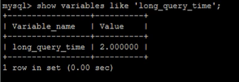

# 1、MySQL中常用工具

## 1.1、mysql

该mysql不是指MySQL服务，而是指mysql的客户端工具

语法

```tex
mysql [options] [database]
```

### 1.1.1、连接选项


### 1.1.2、执行选项

```mysql
-e, --execute=name 执行sql语句并退出
```

此选项可以在mysql客户端执行SQL语句，而不用连接到MySQL数据库再执行，对于一些批处理脚本，这种方式尤其方便

```mysql
mysql -uroot -p123 db01 -e "select * from tb_took"
```


## 1.2、mysqladmin

mysqladmin 是一个执行管理操作的客户端程序。可以用它来检查服务器的配置和当前状态、创建并删除数据库等

可以通过：mysqladmin --help 指令查看帮助文档


通过上面的命令就能够创建一个库了


通过上面的命令就能够删除一个库了


通过上面的指令就能够查看mysql的版本信息


## 1.3、mysqlbinlog

由于服务器生成的二进制日志文件以二进制格式保存，所以如果想要检查这些文本的文本格式，就会用到mysqlbinlog日志管理工具

语法：


## 1.4、mysqldump

mysqldump客户端工具用来备份数据库或在不同数据库之间进行数据迁移。备份内容包含创建表，及插入表的SQL语句

语法：


### 1.4.1、连接选项


### 1.4.2、输出内容选项


## 1.5、mysqlimport/source

mysqlimport 是客户端数据导入工具，用来导入mysqldump -T 参数后导出的文本文件


## 1.6、mysqlshow

mysqlshow 客户端对象查找工具，用来很快的查找存在哪些数据库、数据库中的表、表中的列或索引


# 2、MySQL 日志

在任何一种数据库中，都会有各种各样的日志，记录着数据库工作的方方面面，以帮助数据库管理员追踪数据库曾经发生过的各种事件，MySQL也不例外，在MySQL中，有4中不同的日志，分别是错误日志、二进制日志(binlog日志)、查询日志和慢查询日志，这些日志记录着数据库在不同方面的踪迹

## 2.1、错误日志

错误日志是MySQL中最重要的日志之一，它记录着当mysqld启动和停止时，以及服务器在运行过程中发生任何严重错误时的相关信息。当数据库出现任何故障导致无法正常使用时，可以首先查看这个日志

该日志默认是开启的，默认存放位置为mysql的数据目录(/var/lib/mysql)，默认的日志文件名为 hostname.err（hostname 是主机名）


## 2.2、二进制日志

### 2.2.1、概述

二进制日志（binlog）记录了所有的DDL（数据定义语言）语句和DML（数据操作语句），但是不包括数据查询语句。此日志对于灾难时的数据恢复起着及其重要的作用，MySQL的主从复制，就是通过该binlog实现的

二进制日志，默认情况下是没有开启的，需要到MySQL的配置文件中开启，并配置MySQL日志的格式

配置文件位置：/use/my.cnf

日志存放位置：配置时，给定文件名但是没有指定路径，日志默认写入数据库的数据目录


### 2.2.2、日志格式

**STATEMENT**

该日志格式在日志文件中记录的都是SQL语句（statement），每一条对数据进行修改的SQL都会记录在日志文件中，通过MySQL提供的mysqlbinlog工具，可以清晰的查看每条语句的文本。主从复制的时候，从库（slave）会将日志解析为原文本，并在从库重新执行一次


**ROW**

该日志格式在日志文件中记录的是每一行的数据变更，而不是记录SQL语句。比如，执行SQL语句：“update tb_book set status = 1”，如果是 STATEMENT 日志格式，在日志中会记录一行SQL文件；如果是 ROW，由于是对全表进行更新，也就是每一行记录都会发生变更，ROW 格式的日志会记录每一行的数据变更


**MIXED**

这是目前MySQL默认的日志格式，既混合了 STATEMENT 和 ROW 两种格式，默认情况下采用 STATEMENT ，但是在一些特殊情况下采用ROW来进行记录，MIXED 格式能尽量利用两种模式的优点，而避开它们的缺点


### 2.2.3、日志读取

由于日志以二进制方式存储，不能直接读取，需要用到mysqlbinlog工具来查看，语法如下：

```tex
mysqlbinlog log-file
```


**查看 STATEMENT 格式日志**


**查看 ROW 格式日志**

配置：


插入数据：


如果日志格式是 ROW ，直接查看数据，是查看不懂的；可以在mysqlbinlog 后面加上参数 -vv


### 2.2.4、日志删除

对于比较繁忙的系统，由于每天生成日志量大，这些日志如果长时间不清除，将会占用大量的磁盘空间。下面讲解几种删除日志的常见方法

**方式一：**

通过 Reset Master 指令删除全部 binlog 日志，删除之后，日志编号，将从 xxxx.000001 重新开始


**方式二：**

```mysql
purge master logs to 'mysqlbin.xxxxxx'
```

使用该命令将删除 xxxxxx 编号之前的所有日志


**方式三：**

```mysql
purge master logs before 'yyyy-mm-dd hh24:mi:ss'
```

该命令将删除日志 'yyyy-mm-dd hh24:mi:ss' 之前产生的所有日志


**方式四：**

设置参数 --expire_logs_days = # ，此参数的含义是设置日志的过期天数，过了指定的天数后日志将会被自动删除，这样将有利于减少 DBA 管理日志的工作量

配置如下：


## 2.3、查询日志

查询日志中记录了客户端的所有操作语句，而二进制日志中间不包含查询数据的SQL语句

默认情况下，查询日志是未开启的，可以设置以下配置


在mysql的配置文件 /usr/my.cnf 中配置如下内容


## 2.4、慢查询日志

慢查询日志记录了所有执行时间超过参数 long_query_time 设置值并且扫描记录数不小于 max_examined_row_limit 的所有的SQL语句的日志。long_query_time 默认为10秒，最小为0秒，精度可以到微秒

### 2.4.1、文件位置和格式

慢查询日志默认是关闭的，可以通过两个参数来控制慢查询日志


```mysql
show variables like 'long_query_time';
# 通过这条 SQL 能够看设置好的时间限制
```



当执行的sql时间超过了设定的 long_query_time 的时间，该条sql就会被记录在慢查询日志中间


### 2.4.2、日志的读取

和错误日志、查询日志一样，慢查询日志记录的格式也是纯文本,可以被直接读取

除了可以直接进行查看外，还可以借助 mysqldumpslow 工具来进行查看


# 3、MySQL 复制

## 3.1、复制概述

复制是将主数据库的 DDL 和 DML 操作通过**二进制日志**传到从库服务器中，然后在从库中对这些日志重新执行（也叫重做），从而使得从库和主库的数据保持同步

MySQL支持一台主库同时向多台从库进行复制，从库同时也可以作为其他从服务器的主库，实现链状复制


## 3.2、复制原理

MySQL的主从复制原理如下


## 3.3、复制优势

MySQL复制的优点主要包含以下三个方面：

- 主库出现问题，可以快速切换到从库提供服务
- 可以在主库上执行查询操作，从主库中更新，实现读写分离，降低主库的访问压力
- 可以在从库中执行备份，以避免备份期间影响主库的服务


