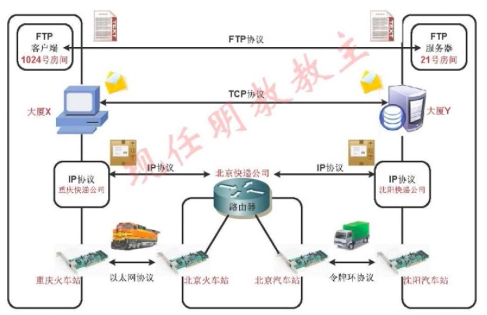

# 概述：分层

## 概述

- 链路层：处理与电缆（或其他任何传输媒介）的物理接口细节（设备驱动程序及接口卡）

- 网络层：处理分组在网络中的活动，例如分组选路（ip，icmp和igmp）

- 传输层：为两台主机上的应用程序提供端到端的通讯（tcp和udp）

- 应用层：处理特定的应用程序细节（如telnet、ftp、e-mail等）

> 1、大多数的网络应用程序都被设计成客户-服务器模式
>
> 2、双方都有对应的一个或多个协议进行通讯
>
> 3、应用程序通常是用户进程，而下三层一般在内核执行
>
> 4、应用层关心应用程序的细节，下三层处理通讯细节

## 通过路由器连接的两个网络

- 端系统
- 中间系统
- 应用层和传输层使用端到端协议
- 网络层提供的是逐跳协议
- 网络IP提供的是一种不可靠的服务，它只是尽可能快的把分组从源节点送到目的节点，但不提供可靠性保障
- TCP在不可靠的IP层上提供一个可靠的传输层
- 互联网的目的之一就是在应用程序中隐藏所有的物理细节

> 1、***应用层(FTP协议)***：首先来说说应用层，应用层就像特定城市特定大厦特定房间内的某一个用户，应用层之间的通讯就像两个不同用户之间发送的信，这个信是点对点的，从一个用户（某一个主机内特定程序）到另一个特定用户（另一主机内特定应用程序）。一个主机（大厦）可能有多个应用程序（客户），我们如何进行区分呢？实际生活我们使用房间号，在电脑内部区分不同应用程序使用端口号
>
> 2、***传输层(TCP)***：用户写好了信，需要给信套上信封，并且写好发件人所在大厦，和收件人所在大厦，实际生活中的大厦完全可以类比我们的计算机和服务器。传输层(TCP)就是两个不同主机之间传输信息的协议
>
> 3、***网络层(IP)***：邮件已经准备好了，它首先会被送到本市的快递公司，并且被打包，包裹上会写源是重庆快递公司，目标是沈阳快递公司，但是重庆快递公司发现它不能直接发货到沈阳，需要通过北京快递公司进行中转。所以需要目标是沈阳，但是他首先会将包裹发送到北京。某个城市的快递公司就像IP协议，要抵达目的IP，需要查询路由表，如果发现目的地址不是直连就需要找下一跳。通过了解快递公司的工作，我们了解到IP协议是逐跳工作的。每一跳（路由器）根据目的IP地址查询下一跳，并且最终转发到目的地
>
> 4、***链路层(以太网)***：重庆快递公司已经知道他需要把包裹发给北京快递公司了，现在就需要将包裹送到重庆火车站，搭上去往北京的火车，然后在北京火车站卸货。然后送到北京快递公司，北京快递公司再判断下一跳为沈阳快递公司，并且选择适当的传输方式，例如：汽车，最后通过这种传输方式送到目的地沈阳快递公司，链路层协议就像包裹的运输方式，我们可以选择以太网（火车），也可以选择令牌环（汽车）。并且链路层的协议是逐介质的，从一个网卡（重庆火车站）到另一个网卡（北京火车站）
>
> 所以你会发现一个数据包从源到目的，IP地址总是不变的（源是重庆快递公司，目的是沈阳快递公司），但是链路层协议却在不断改变，第一源跳是重庆火车站，目的是北京火车站，第二条的源是北京火车站，目的是沈阳火车站

