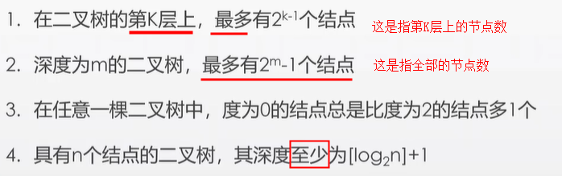
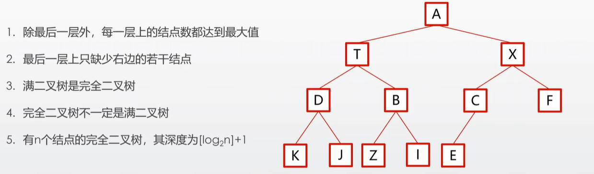

# 树

## 二叉树

一种特殊的**树**，一种非线性结构，树的所有术语依然可用：叶子、深度、度、子树、根

比树多一个限定：每个结点最多只有两棵树，**左子树和右子树**

每个结点的度最大是2

### 二叉树的基本性质

### 满二叉树

### 完全二叉树

### 二叉链表存储二叉树

 ### 二叉树的遍历

**不重复**地访问二叉树中所有结点

总是先左后右

根据访问根节点的次数不同，分为前序遍历、中序遍历和后序遍历

#### 前序遍历

1、如果二叉树为空，则结束

2、访问根节点

3、前序遍历左子树

4、前序遍历右子树

按照上面的描述进行遍历，得到的结果就是： A T B Z X C Y F

#### 中序遍历

1、如果二叉树为空，则结束

2、中序遍历左子树

3、访问根节点

4、中序遍历右子树

按照上面的描述进行遍历，得到的结果就是：T Z B A C Y X F

#### 后序遍历

1、如果二叉树为空，则结束

2、后序遍历左子树

3、后序遍历右子树

4、访问根节点

按照上面的描述进行遍历，得到的结果就是： Z B T Y C F X A

### 从序列恢复二叉树

1、仅有一个序列无法恢复，例如：前序序列 DBACFEG

2、可以通过前序序列和中序序列恢复二叉树

3、可以通过后序序列和中序序列恢复二叉树

4、不可以通过前序序列和后续序列恢复二叉树

例：前序序列 DBACFEG，中序序列 ABCDEFG

